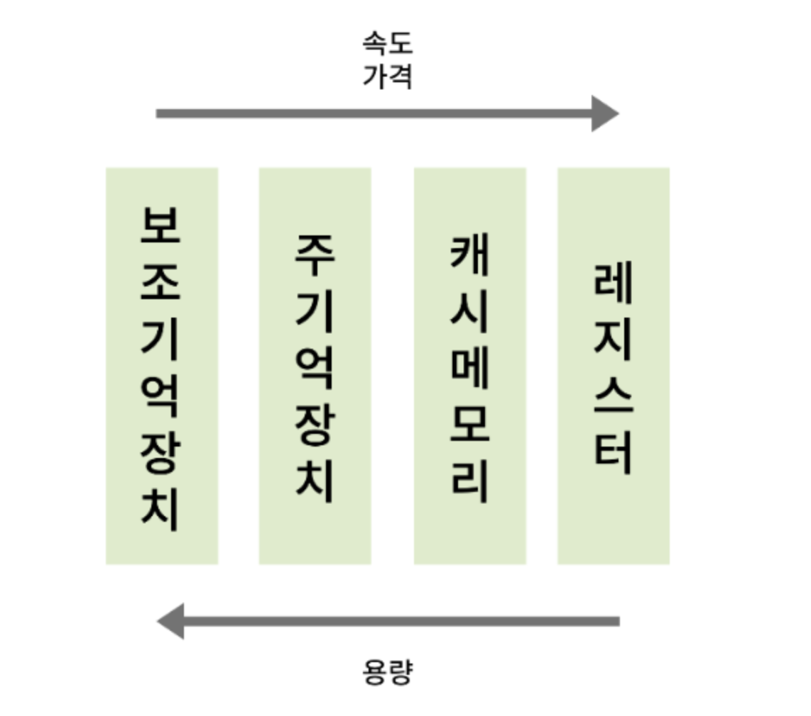
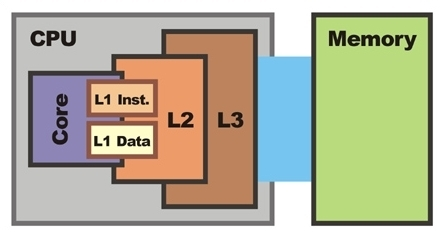

# Cache Memory

  

## 캐시 메모리 정의

**→ 컴퓨터 시스템의 성능을 향상시키기 위해 별도로 탑재된 캐시 전용 메모리.**

시간을 절약하기 위해 데이터를 임시로 저장하는 고속 기억 장치이다. 컴퓨터 메모리에 한계를 극복하기 위해 캐시가 등장하였다. 캐시 메모리는 데이터에 접근하는 속도를 높여 CPU를 효율적으로 사용할 수 있다.
   

## 캐시 메모리 구조

캐시의 용량과 성능이 증가하면서 ‘캐시의 캐시’로 사용되는 메모리가 추가 되었고, 이것을 순서대로 L1, L2, L3라고 한다.

### L1

- 가장 고성능, 고가의 작은 회로 사용
- CPU에 직접 데이터를 공급하기에 빠른 접근 지연 시간이 중요
- L1 캐시에서 데이터를 먼저 찾은 후에 L2 캐시로 이동

  

### L2

- L1 캐시에서 데이터를 가져가기 위한 캐시로 사용
- L1 캐시보다 용량이 크지만 느림

  

### L3

- CPU가 아닌 메인보드에 내장되는 경우 많음
- L3 캐시도 L2 캐시와 동일한 역할
- L2 캐시로 충분하면 사용되지 않음

   

## 캐시 메모리 작동 원리

### → **캐시의 데이터 지역성:**

`지역성`이란 기억장치 내의 정보를 균일하게 접근하는 것이 아닌 어느 한순간에 특정 부분을 집중적을 참조하는 특성을 의미하며, 캐시가 효율적으로 동작하려면 캐시의 적중률을 극대화시켜야 한다.

- **적중(Hit)** : CPU가 주기억장치 메모리에 접근하기 전에 캐시 메모리에서 원하는 데이터가 존재한 경우
  - 적중률(Hit Ratio) = 캐시 메모리 적중 횟수 / 전체 메모리 참조 횟수 \* 100
- **부적중(Miss)**: CPU가 요청한 데이터가 캐시 메모리에 없어 주기억장치에서 데이터를 찾은 경우
  - 부적중률(Miss Ratio) = 1 - 적중률
  - **Cold miss** : 해당 메모리 주소를 처음 불러서 나는 미스
  - **Conflict miss** : A와 B가 같은 캐시 메모리 주소에 할당되어 있어서 나는 미스
  - **Capacity miss** : 캐시 메모리의 공간이 부족해서 나는 미스

  

### 데이터 지역성 종류

데이터 지역성은 대표적으로 **시간적 지역성(Temporal Locality)**과 **공간지역(Spatial Locality)**로 나뉜다.  
 

**시간 지역성**

특정 데이터가 한 번 접근되었을 경우, 가까운 미래에 또 한 번 데이터에 접근할 가능성이 높은 경우

> for, while 같은 반복문에 사용되는 조건 변수처럼 한번 참조된 데이터는 잠시 후 또 참조될 가능성이 높습니다.

  

**공간 지역성**

특정 데이터와 가까운 주소가 순서대로 접근되었을 경우

> A[0], A[1]과 같은 연속 접근 시, 참조된 데이터 근처에 있는 데이터가 잠시 후 또 사용될 가능성이 높습니다.

   

**references**  
👉 https://velog.io/@33bini/%EC%BA%90%EC%8B%9C-%EB%A9%94%EB%AA%A8%EB%A6%ACCache-Memory
