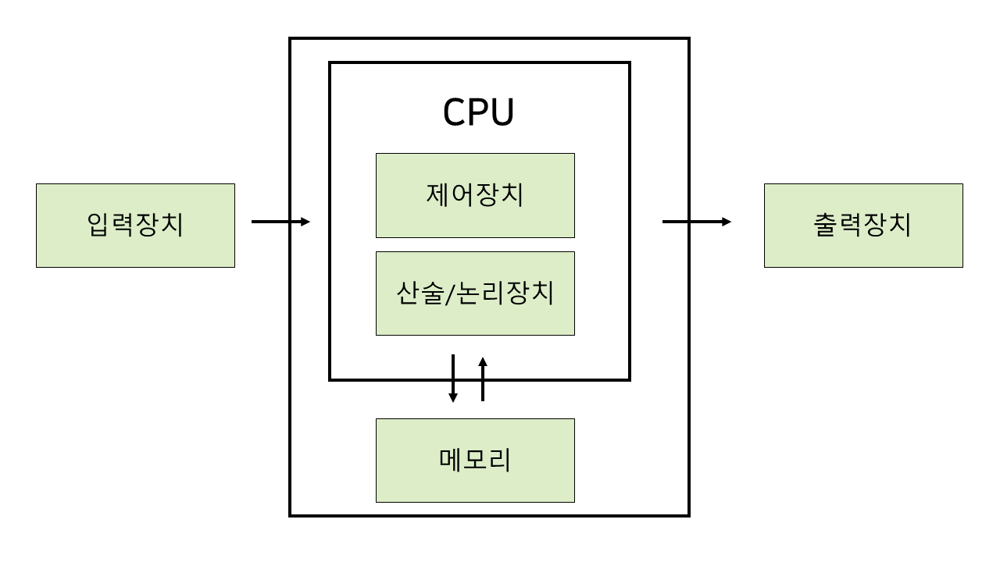

# 컴퓨터 구조 기초

  

## 폰 노이만 구조

### 정의

오늘날의 컴퓨터는 대부분 `폰 노이만 구조`를 따른다. 폰 노이만 구조는 크게 **CPU** - **Memory** - **Program**로 구성된다. CPU와 메모리를 분히라여 명령어를 따로 저장하는 프로그램 내장 방식이다.  
   

### 정의

### **`명령어 실행 사이클`**

1.  **명령어 가져오기 (IF, Instruction Fetch)**  
    : 기억장치로부터 명령어를 가져온다.

2.  **명령어 해석 (ID, Instruction Decode)**  
    : 앞서 가져온 명령어가 어떤 명령어인지 해석을 진행한다.

3.  **피연산자 인출(OF,Operands Fetch)**  
    : 명령의 실행에 필요한 정보를 기억장치에 접근해 가져온다.

4.  **명령어 실행 (EX, Instruction Execution)**  
    : 앞서 가져온 연산자와 데이터를 가지고 연산을 수행하고 저장한다.

5.  **인터럽트 체크**
    > 👉🏻 **작업을 수행하던 중 인터럽트가 발생했을 때의 처리과정**
    >
    > 1. 컴퓨터는 수행하던 일을 중지하고 현재 상태 (CPU 내부의 레지스터 값 등)를 보관한다.
    > 2. 발생한 인터럽트를 처리하기 위해 인터럽트 서비스 루틴(ISR)을 수행한다.
    > 3. 인터럽트가 처리되면 저장했던 이전 작업의 상태를 복구시켜 수행을 재개한다.
