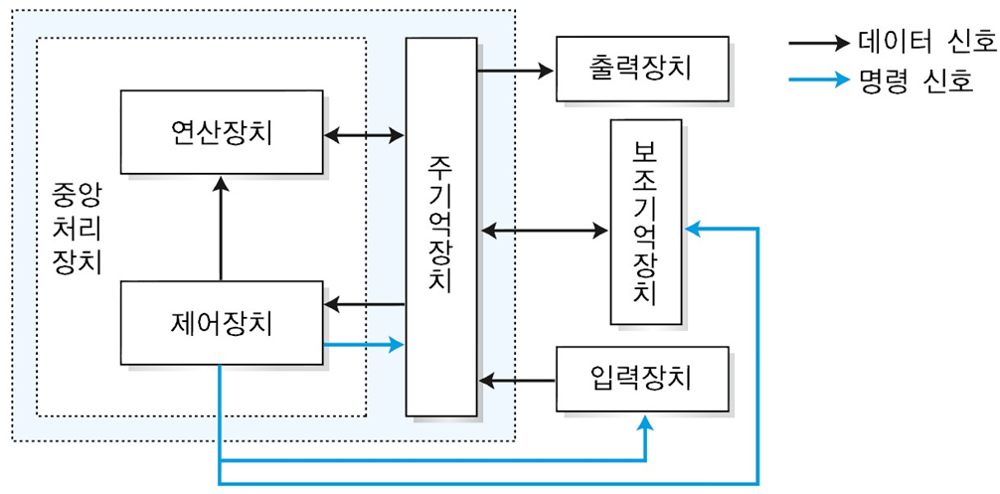

# 컴퓨터의 구성

  
  

## `하드웨어` : 기계적 장치

### 중앙처리장치(CPU)

: 컴퓨터 시스템 전체를 제어하는 장치로서, 입력장치에서 데이터를 입력 받아 처리한 후 출력장치와 기억장치로 데이터를 전달

- `연산장치(ALU)`: 산술 연산(사칙연산)과 논리연산(참과 거짓 판단)을 수행하는 장치
- `제어장치`: CPU 내부에서 일어나는 모든 작업 통제 및 관리
- `레지스터`: 연산 중간 값, 명령어 등 일시적으로 저장하는 임시 기억 장치  
    

### 기억장치(Memory)

- `주기억장치(내부 기억장치)`: 컴퓨터 시스템에서 수행되는 프로그램과 수행에 필요한 데이터를 기억하는 장치
  - RAM
- `보조기억장치(외부 기억장치)`: 반영구적으로 데이터를 저장하고 보존할 수 있는 장치
  - 하드 디스크, 플로피 디스크, CD-ROM, DVD
      

### 입출력장치(I/O)

- `입력장치`: 컴퓨터에서 처리할 데이터와 정보를 외부에서 입력해주는 역할
  - 마우스, 키보드, 마이크
- `출력장치`: 컴퓨터 내부에서 처리된 결과를 사용자에게 전달해주는 역할
  - 프린트, 스피커, 모니터
      

---

## `소프트웨어` : 하드웨어의 동작을 제시하고 지시하는 프로그램

### 시스템 소프트웨어

: 사용자가 컴퓨터를 효율적으로 사용하기 위해 여러 컴퓨터 시스템에서 공통적으로 필요한 프로그램

- 운영체제
- 컴파일러
    

### 응용 소프트웨어

: 응용 분야에서 특정 목적을 위해 사용하는 프로그램

- Power Point → 발표 자료를 만들 때
- Chrome → 인터넷 검색을 할 때
