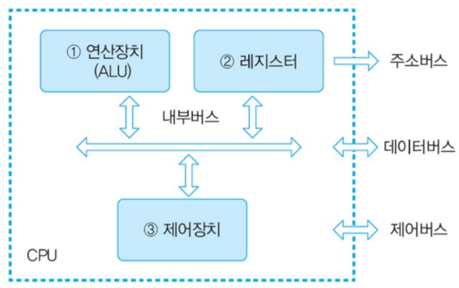

# CPU 작동 원리

  

## CPU 구성

### 연산장치(ALU)

산술 연산 & 논리 연산 수행하는 장치

### 제어장치(Control Unit)

명령어를 순서대로 실행할 수 있도록 제어하는 장치

### 레지스터(Register)

명령어 주소, 코드, 연산에 필요한 데이터, 연산 결과 등을 임시로 저장하는 고속 기억장치

   

## 동작 과정

1. 주기억장치가 입력장치에서 입력받은 데이터나, 보조기억장치에 저장된 프로그램을 읽어온다.
2. CPU가 프로그램을 실행하기 위해 주기억장치에 저장된 프로그램 명령어와 데이터를 읽어와 처리하고, 처리 결과를 다시 주기억장치에 저장한다.
3. 주기억장치가 처리 결과를 보조기억장치에 저장하거나 출력장치로 보낸다.
4. 제어 장치가 위 1 ~ 3 과정에서 명령어가 순서대로 실행되도록 각 장치를 제어한다.

   

## 명령어 세트

→ **CPU가 실행할 명령어의 집합**

- **연산 코드 (OpCode)** : 실행할 연산
- **피연산자 (Operand)** : 필요한 데이터 / 저장 위치

   

**references**  
👉 [https://velog.io/@zenon8485/비개발자를-위한-CS-지식-2.-CPU-의-작동-원리](https://velog.io/@zenon8485/%EB%B9%84%EA%B0%9C%EB%B0%9C%EC%9E%90%EB%A5%BC-%EC%9C%84%ED%95%9C-CS-%EC%A7%80%EC%8B%9D-2.-CPU-%EC%9D%98-%EC%9E%91%EB%8F%99-%EC%9B%90%EB%A6%AC)
