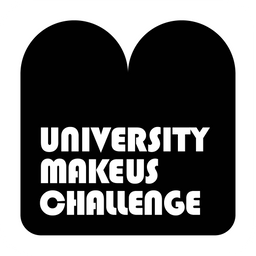

## 2022년 3월 회고
  

### 휴학🏫
  

3월, 평소같았으면 개강으로 정신 없어야 할 시기였지만 휴학을 하니 세상 모든 것이 아름다워 보였다.😆  
하지만 아름다움도 정말 잠시.. 공부를 위해 휴학을 한 만큼 마냥 쉴 수만은 없다 보니 개강한 것처럼 스케줄이 바빴다.  
휴학하면 꽃 보러 나들이도 가고,, 여행도 가고,, 나름대로 로망 아닌 로망들이 있었지만 현실은 기숙사 방 구석에서 맥북만 두들기고 있었다.ㅎㅎ  
그래도 학기 중과 다르게 내 시간을 온전히 다 가질 수 있는 것이 좋고, 앞으로 내가 하고 싶었던 것들로 이 시간들을 알차게 채워나가고 싶다!  
       

### UMC👨‍👩‍👧‍👦
  

학생회, 스터디, 교육봉사는 해봤지만 연합 동아리는 처음이어서 설렜다.  
휴학하는 동안 팀 프로젝트를 꼭 해보고 싶었는데 UMC를 통해 내가 바라던 것을 이룰 수 있게 되어 기뻤다.  
3월에는 OT와 3주 동안의 스터디를 진행해왔는데, 아직까지는 무리없이 잘 따라가고 있다.  
개발 공부를 하면서 기본은 쌓으면 쌓을수록 탄탄해지는구나 라는 것을 느껴 복습이라고 해서 소홀히 하지 않게 되었다.  
자바스크립트 기본을 공부하는 것은 이번이 3번째인데도, 간과하고 넘어갔던 부분들이 보여서 공부하며 새로운 깨달음을 얻는 것이 소소한 즐거움이 되었다.  
앞으로 4월에는 아이디어톤, 4월 챌린지(무려 4개!) 등 앞으로도 참여할 활동이 많으니 열심히 해야겠다.👩‍💻  
       

### 1일 1커밋🌱
  

개발 공부를 어떻게 시작해야 할지, 또 어떤 공부를 하면 좋을지 고민을 많이 했었다.  
과거의 나는 개발에 소질이 없는 사람이라 생각해왔고, (~~그렇다고 지금 소질이 생겼다는 이야기는 아니지만~~) 소질 없는 사람이 어떻게 재능있는 사람을 이길 수 있을까 라는 생각에 스스로 성장의 벽을 세웠다.  
늦은 것처럼 느껴져 초조했지만, 사람마다 속도가 다르다는 말을 새기며 내가 잘 할 수 있는 작은 일부터 시작하기로 했다.  
내가 지금 자신 있는 것은 성실함이었고, 그 마음으로 매일 잔디를 심고 꾸준히 개발 블로그 포스팅을 하는 것을 목표로 삼았다.  
정말 기초부터, 아주 쉽고 귀여운 알고리즘부터 풀어나가며 매일 커밋을 했더니 2달 동안 잔디가 꽤 많이 자랐다.  
아직 많이 부족하지만, 앞으로도 내 잔디밭이 무럭무럭 자랐으면 좋겠다.🌳  
       

### 정처기 실기 준비✍🏻
  

정처기 필기를 합격하고 나서 책이 올 때까지 꽤 오랜 시간이 걸려(~~좋은 핑계~~) 공부를 약 2주 정도 쉬었다.ㅎㅎ  
필기 시험까지 계속 달리다가 갑자기 푹 쉬어버리니 다시 집중하기까지 쉽지 않았다.  
필기 때 배웠던 내용이지만 벌써 가물가물해서 당황스럽기도 하고, 아는 내용이어도 서술형으로 설명하라 하니 막막하기도 하고..  
벌써부터 걱정이 태산이지만 아직 한 달의 시간이 있으니까! 붙을 각오로 열심히 부숴줘야겠다.👊  
뭔가 이 방대한 범위에서 20문제만 나온다니 많은 양을 공부하는 게 억울한(?) 느낌이지만 그래도 한 번에 붙기 위해 달려보자.🐎  
       

### 잘 하고 싶은 욕심🏆
  

살면서 처음으로 개발을 정말 잘 하고 싶다는 욕심이 생겼다.  
3월은 나에게 스스로 더 나아가고 싶고, 내가 정말 잘 할 수 있는 사람이고 싶다는 생각이 드는 중요한 달이었다.  
조급해하지 않고, 조금씩 꾸준히 성장하는 개발자가 되고 싶다.  
느리게 가더라도 뒤로는 가지 않는다는 말이 있듯이, 매순간 과거보다는 더 나은 사람이 되자.  
내가 힘차게 시작 할 수 있게 해준 이 ✨초심✨을 잊지 않고 늘 안고 살아야겠다.  
앞으로 나를 돌아보고 반성하며 더 발전하기 위해 매달 회고를 기록하려고 한다.❤️‍🔥  