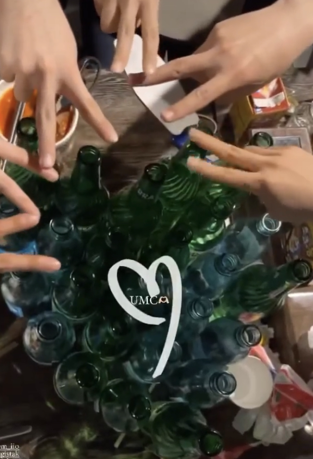
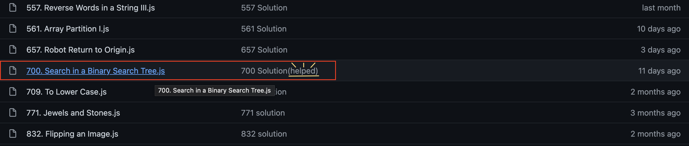
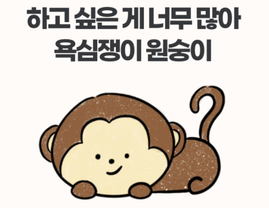
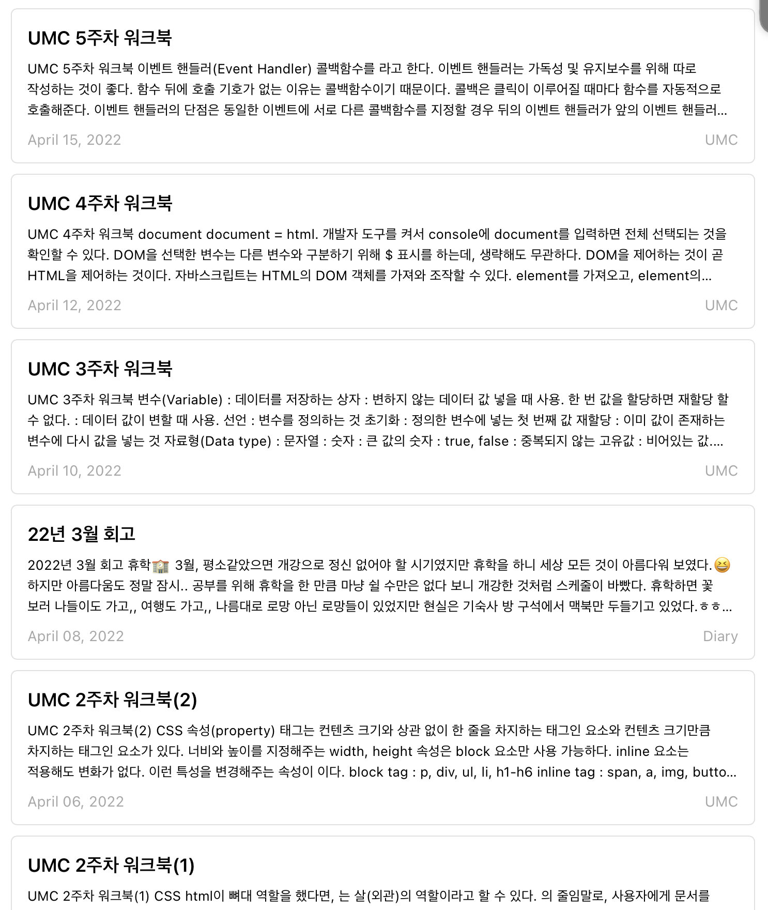

## 2022년 4월 회고
  

### 일상 복귀🤹🏻
  

사실 휴학생이라 대면 수업, 이런 면에서 큰 변화는 못 느꼈지만.. UMC 첫 회식도 하고, 점점 예전의 일상 모습을 찾는 것 같아서 좋았다.  
2년 동안 거의 모든 스터디를 비대면으로 하면서 느끼는 아쉬움이 컸었는데, 앞으로 사람들과 대면으로 함께 공부할 수 있다는 생각에 기대된다.  
나는 누가 시키지 않으면 공부 동기 부여가 잘 안 되는 사람이라, 스터디처럼 주기적으로 강제적인 부분이 있어야 공부를 하는 편인데 특히 대면일 때가 공부 강도가 더 높은 것 같다.  
비대면이라고 대충한다는 의미는 아니지만 그래도 만나서 스터디를 진행할 때 내가 더 제대로 공부하는 느낌이라고 할까,,  
그래서 2년만의 일상 복귀는 나한테 너무 반가운 소식!! 앞으로 회식도 더 자주 하면 좋겠다ㅎㅎㅎ 즐거웠습니다, UMC 회식💗  
    

### 자료구조🌲
  

알고리즘을 최대한 하루에 하나씩 꾸준히 풀고 있지만, 자료구조는 많이 약하다고 느꼈다.  
트리나 탐색 알고리즘을 풀 때마다 막히는 것이 항상 답답하고 스트레스였다.😔  
그렇다고 평생 피할 수도 없는 일, 이제는 맞닥뜨리고 부숴나가야지 라고 ~~드디어~~ 마음 먹었다.  
2학년 전공 수업으로 배운 과목이지만, 기억이 나지 않으니ㅎㅎㅎ 차근차근 쉬운 알고리즘부터 풀어나가면서 정복해보려고 한다.  
최근 트리 문제를 풀었을 때 막혔던 적이 있는데, 충분한 시간 동안 고민해본 후에도 풀이가 생각나지 않아 다른 사람의 코드를 보며 공부하는 시간을 가졌다.  
다른 사람의 풀이를 참고하며 하나의 방법과 알고리즘을 배워가는 것이 공부가 된다는 걸 느낀 좋은 실패 경험이었다.   
앞으로 자료구조도 하나씩 다 정복해야겠다!!🏋🏻‍♀️  
   

### 코딩의 소중함🧸

🏞 이미지 출처 : https://sortinghat.myroutine.kr/r/ENFP
   

정처기 공부를 하면서 개발 공부를 할 수 있는 시간이 비교적 많이 줄었다.  
나도 코딩하면서 개발 공부 하고 싶은데, 책 펴놓고 암기만 하려니 어지간히 답답한 게 아니었다.  
그래도 일주일만 있으면 실기가 끝나니, 얼른 정처기를 벗어던지고 싶다.  
하지만 한 번에 합격해야 내가 하고 싶어하는 개발 공부를 할 수 있다는 점ㅎㅎ  
그러니 앞으로 일주일 간은 빡세게 정처기 공부를 해서 다시는 만날 일이 없도록 해야겠다..  
나는 리액트도 하고 싶고, 타입스크립트도 하고 싶고, 아직 해보고 싶은 개발 공부가 많단 말이다.😠  
     

### 블로그🧚
  

4월 챌린지를 통해 이틀에 한 번 포스팅을 하면서 꾸준하게 블로그를 할 수 있었다.  
매주 UMC에서 스터디한 워크북을 포스팅했고, 포스팅을 꾸준히 하는 것도 챌린지를 통해 만들게 된 습관이다. (좋은 습관을 얻게 해준 UMC에게 감사를 찡긋😉)  
공부한 내용을 정리해서 포스팅 하는 일이 사실 쉽지는 않았고, 큰 맘 먹고 해야 되는 일처럼 느껴졌는데 챌린지를 통해 생각보다 할만하다는 걸 느끼게 됐다!  
대단한 내용이 아니더라도, 내가 공부하고 배운 것들을 복습하며 정리하는 것 자체만으로도 충분하다는 것을 알게 되었다.  
앞으로도 블로그를 열심히 운영하겠다는 다짐을 하며 4월 회고를 마친다ㅎㅎ🌿