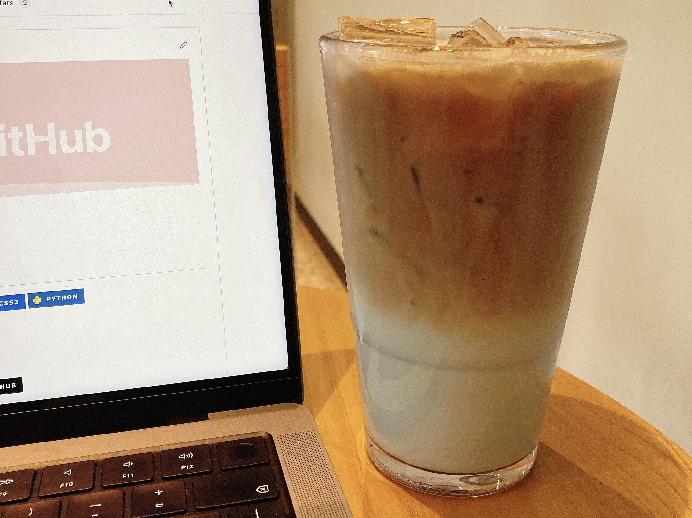
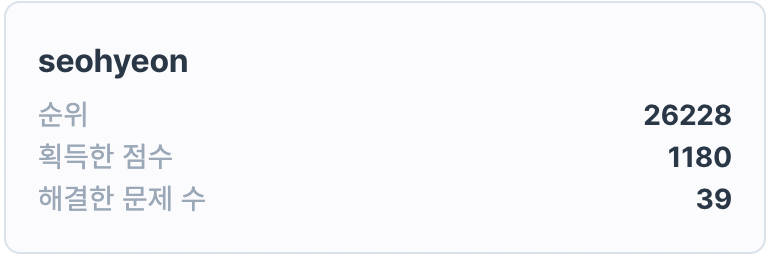
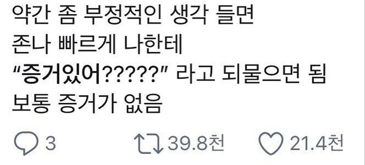

## 2022년 5월 회고
  

### 습관 다잡기🌞
  

휴학생이라 패턴이 무너질까 봐 걱정을 많이 했는데 걱정했던 것보단 나름 열심히, 그리고 꾸준히 공부하고 있는 것 같아 다행이라는 생각을 한다.  
잘못된 습관은 쌓이게 되면 참 무섭고, 좋은 습관은 사소하더라도 사람을 나아가게 만드는 것 같다.  
작은 습관들이 모여서 일상이 될 테니, 더 나아가는 내가 될 수 있도록 좋은 습관을 더 쌓기 위해 노력하고 있다.  
이렇게 매달 회고를 쓰며 돌아보는 시간을 갖는 건 또한 좋은 습관이라고 생각한다!  
아쉬운 부분들은 반성하고, 성장한 부분들은 곱씹으며 더 나은 사람이 되어가는 중이다.  
다음 달에는 조금 일찍 기상하는 습관을 가져보자🐣  
   

### 스터디 마무리🍦
  

10주 동안 진행되었던 UMC JavaScript 스터디가 끝이 났다!  
html & css 기초부터 백엔드와의 협업까지 자바스크립트의 전반적인 부분을 차근차근 공부할 수 있던 유익한 시간이었다.  
기초를 다시 제대로 쌓은 것 같아 든든했고, 앞으로 진행할 프로젝트나 여름방학 리액트 스터디의 단단한 기반이 되어줄 거라 믿는다!  
그리고 너무 좋은 팀원들을 만나, 10주 동안 즐겁고 알차게 스터디를 할 수 있어 행복했다.☺️  
   

### 프로그래머스 정복 도전🚀
  

알고리즘 공부를 leetcode로 시작했는데, leetcode 100문제 정도 풀었으니 이제 프로그래머스 풀어도 되겠지?! 싶은 생각이 들어 프로그래머스를 쉬운 것부터 차근차근 부숴나가고 있는 중이다.  
맨 처음 알고리즘 공부를 시작하려 했을 때의 프로그래머스는 정말 감도 안 올 만큼 어렵게 느껴졌었는데, 이제는 조금씩 풀 수 있게 되었다..!  
Lv1을 거의 다 풀고 나서 Lv2를 풀기 시작했는데, 체감 난이도가 확 상승해서 어려웠고 생각보다 잘 풀리지 않았다..  
그래도 꾸준하게 한다면 언젠가 프로그래머스 알고리즘을 다 정복할 수 있을 거란 생각으로 차근차근 해내가려 한다.🏋🏻‍♀️  
     

### 미니(?) 슬럼프🥊
  

날이 슬슬 더워져서 그러는지, 휴학 생활에 이제서야 적응해서 그런 건지 약간의 작은 슬럼프가 왔던 5월이다.  
해야 할 것과 하고 싶은 것들은 아직 너무 많은데, 올해가 벌써 절반 가까이 지났다는 생각에 계속 조바심이 났다.  
특히 알고리즘의 난이도가 올라가면서 잘 풀리지 않을 때마다 내가 잘 하고 있는 게 맞나 하는 회의감이 들곤 했다.  
1월부터 꾸준히 알고리즘을 풀려고 노력해왔고, 성장해나가고 있다고 생각했는데 그거 아니었나? 나는 여전히 제자리인가? 하는 생각이 문득 들어 무서웠다.  
그러다 우연히 부정적인 생각이 들면 나한테 증거 있어??라고 되물으면 증거가 없다는 글을 보고 나도 내 슬럼프에 증거가 있나 생각해 봤다.  
잘 생각해 보니 내가 못하고 있다는 증거는 없었고! 그러므로 나는 잘 하고 있는 게 맞는다는 것이지✌🏻  
흔히 성장 그래프는 우상향 직선 그래프가 아닌 계단 모양이라는 말이 있듯이, 내 성장도 지금 정체기에 있지만 곧 그 잠재력이 빛을 볼 날이 올 거라고 믿기로 했다!💡  