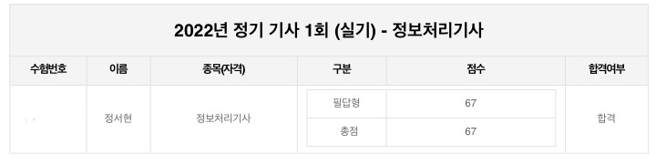
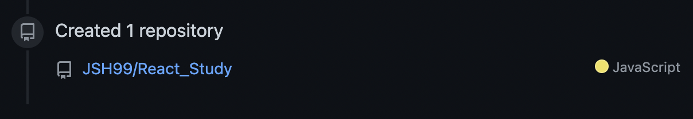
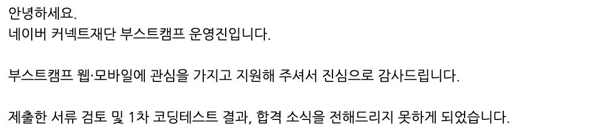

## 2022년 6월 회고
  

### 정처기 실기 합격🎖
  

2022년 5월 7일 정보처리기사 실기 시험을 봤었다.   
한 달 조금 넘는 시간 동안 총 12과목을 공부해야 했고, 아는 내용이어도 서술형으로 풀어 쓰는 건 정말 쉽지가 않았다..   
양이 많아서 어디서 나올지 예측이 안 돼서 너무 걱정이 됐던 실기 시험.😂  
사실 시험지를 받자마자 1번부터 처음 보는 내용이라 아, 떨어졌구나..하며 시험을 봤고, 가답안으로 채점을 해보니 딱 10 문제를 틀린 상황이었다..ㅎㅎ   
부분 점수가 있다는 이야기는 들었지만, 기준을 공개하지 않아 내가 붙은지 떨어진지 확신할 수 없는 상황이기에 결국 합격 발표까지 기다리는 수밖에 없었다.  
무려 한 달 넘게 기다려 결과를 조회한 결과..! 합격했다!🎉 합격 기준인 60점에 간당간당한 점수였지만 그래도 필기·실기 둘 다 한 번에 합격한 게 어디인가..!!   
나도 이제 정보처리기사 자격증 있는 사람이라고요.😎  
     

### 리액트 스터디🛫
  

UMC 지부 내에서 여름방학 동안 리액트 스터디를 하게 되었다!   
사실 작년에 리액트로 프로젝트를 해본 경험이 있었지만, 그때는 리액트가 뭔지도 잘 알지 못한 채로 맨땅에 헤딩했었기에… 제대로 공부하고 이해한 후에 잘 사용하고 싶어 스터디를 신청했다.   
그때는 리액트의 최대 장점인 component를 잘 활용하지 못했고, 재사용성이나 효율성이 정말 0인 코드를 짰었기에 아쉬움이 많이 남았었다.🥲   
그래서 처음부터 다시 공부하면서 베이스를 쌓고 꼭 제대로 다시 프로젝트를 하는 것이 목표이다!   
앞으로 2달 동안 리액트를 열심히 부술 예정이다, 덤벼 리액트🥊  
   

### 부스트캠프 불합격🍀
  

작년부터 하고 싶었던 부스트캠프 웹모바일 코스 7시에 지원했다.   
자소서와 서류를 열심히 작성했지만.. 결국 1차 코딩 테스트에서 불합격했다.   
문제를 풀면서 부족함을 많이 느껴서 떨어질 것을 예상했지만, 하고 싶었던 부트캠프였던 만큼 아무렇지 않지는 않았다,,  
누구는 한 달 공부하고 붙었다더라, 그냥 지원했는데 붙었다더라 이런 후기를 꽤 봤어서 그런지 내가 공부해왔던 기간들은 뭐였지 싶어 살짝쿵 현타가 왔다.🥲  
어쨌든 내 공부가 부족했으니 떨어졌던 것일 테니 앞으로 알고리즘을 더더더더더 열심히 공부해야겠다고 다짐을 할 수 있었다.   
며칠 간 부스트캠프를 준비하는 동안 밀렸던 블로그 포스팅도 하며 천천히 마음을 다잡았으니, 더 열심히 공부해서 내년에는 꼭 혼내줘야겠다.🤺