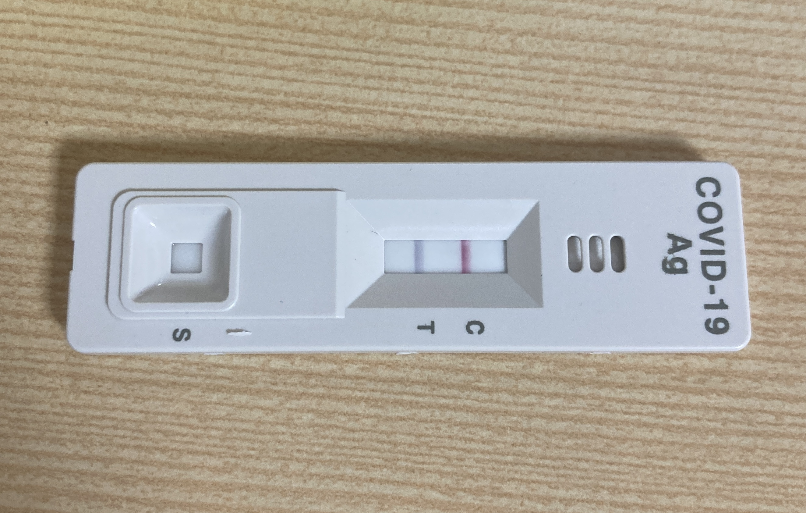
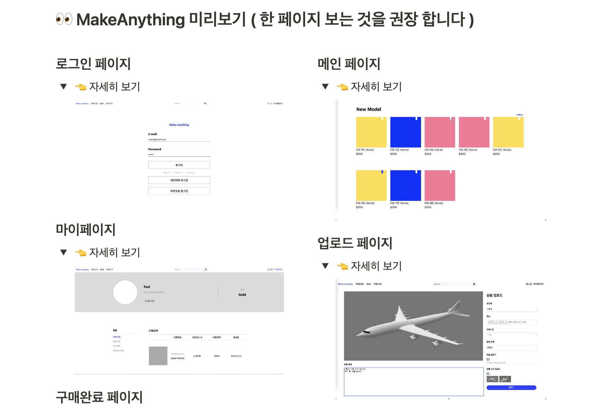
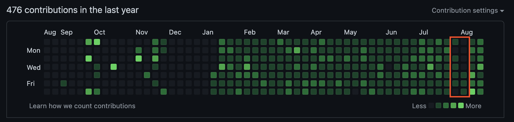

## 2022년 7~8월 회고
  

### 정신 없었던 여름🌊
  

원래 매달 월 말 회고를 작성하며 부족했던 부분들은 돌아보는 것을 목표했는데 7월은 회고를 작성하지 못했다…!   
블로그 포스팅도, 알고리즘 풀이도 못할 만큼 정신없는 여름이었다.. 많이 아프기도 했고.. (사진에서 스포)  
하지만 그만큼 그동안 해보지 못했던 경험들을 할 수 있어서 정말 정말 의미 있는 시간들이었다.   
특히 매년 힘든 일이 생겨서 무서워했던 계절인 여름을 잘 이겨내고 또 성장한 것 같은 기분이 들어 뿌듯했다.✌🏻   
이제 시간이 생겼으니 밀렸던 포스팅과 공부들을 다시 열심히 해야겠다!🏃🏻‍♀️  
     

### UMC 2기 프로젝트🖨
  

UMC 2기 프로젝트를 마쳤다! 여태 이론 공부나 알고리즘 풀이만 하다가 개발을 하니 역시 너무 재밌었다.   
리액트 스터디를 한 후 개발을 하니 도움이 많이 되기도 했고, 제대로 된 API 통신을 처음 해보며 오류를 많이 겪고 헤맨 만큼 공부가 많이 되었다.   
협업이 얼마나 즐거운지 경험해 봤기에 이번 프로젝트가 기대됐는데, 정말 소통🗣이 제일 중요하다는 것을 직접 깨달을 수 있었다.   
특히 깃허브 충돌도 겪으며 직접 해결해 나가는 과정이 많은 도움이 되었다. (내가 겪었던 브랜치 오류 관련 포스팅을 꼭 해야겠다!)   
기간 내에 완성하지 못하고 데모데이도 참여하지 못해 아쉽지만, 그만큼 많은 것을 배울 수 있었던 좋은 경험이었다.   
프로젝트를 진행해 보지 않았다면 배울 수 없었던 것들을 직접 부딪히며 얻어 갈 수 있어서 값진 시간들이었다.✨  
     

### UMC 3기 운영진💚
  

7월부터 UMC 2기 챌린저에 이어 3기 운영진을 맡게 되었다!!  
2기와 비교해서 커리큘럼 및 운영 방식이 많이 바뀌었고, 그래서 더 기대가 되는 3기이다.  
아쉽게도 3기에는 web 파트가 사라져 💫node.js 파트장💫을 맡게 되었다.   
학교 부원 모집 및 운영 커리큘럼 조정을 위해 회의해야 하는 사항도 많았고, 매주 서버 세미나도 듣고 피드백 TF팀 일도 해야 해서 생각보다 바빴다..!   
서버를 처음 배우다 보니 부지런히 공부해야 했지만, 이번 기회에 풀스택 개발자가 될 수도 있으니 오히려 좋아.  
UMC 3기 가보자고🔥  
     

### 코로나 격리🦠
  

코로나를 2년 만에 처음 걸려버렸다..! 외출을 안 하다가 딱 한 번 외식하러 갔을 때 걸려서 너무 억울했다,,  
목이 붓고 아파서 자가 진단 키트를 해봤는데 음성이 나오길래 감기인가 싶었는데..  
다음날 열이 38도를 넘어가며 기침이 나오기 시작했고, 약을 먹었는데도 너무 아파서 새벽 5시에 기숙사 프런트에 가서 해열제를 달라고 거의 울며 빌었다…  
밤새 아파서 잠을 내내 설치다가 일어나서 자가 진단 키트를 다시 해보니 바로 양성이 뜨더라..ㅎㅎ  
결국❗️ 너무 아파 공부나 개발은 전혀 못하고 집에서 요양을 했더라는 슬픈 이야기,,🤦🏻‍♀️   
프로젝트에 집중해야 하는 중요한 시기에 아프니 속상하기도 하고,, 새삼스레 건강이 최고구나 싶었다.  
코로나로 인해 열심히 심어왔던 잔디에 구멍(무려 5일 연속..)이 생기는 경험을 했으니 건강을 더 잘 챙기는 계기가 되었다🥲