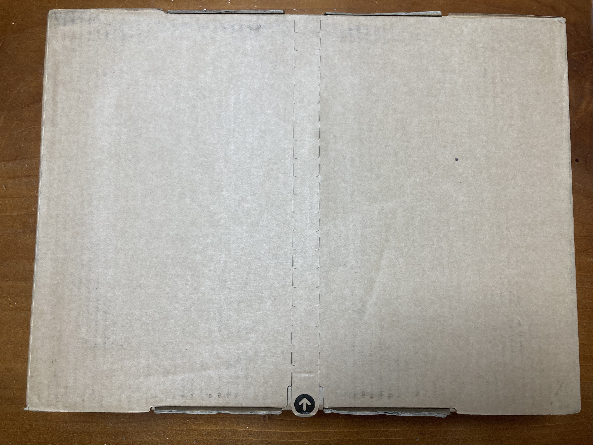

## Macbook Pro 14inches unboxing

### 구매 동기

꺄아아아ㅏ아아 드디어 내가 맥북을 사다니 소리 벗고 팬티 질러..!!  
사실 맥북을 구입하기 전까지 나한테 맥북은 디자인이 예쁜 노트북, 스타벅스 직장인 노트북 정도의 인식이었다.  
내가 ~~앱등이~~라지만 맥북까지 사게 될 일은 딱히 없을 거라고 생각했었다. (아이폰, 에어팟, 아이패드 정도는 다들 있잖아..?)  
사실 어떻게 생각해보면 인공지능학과 다니면서 목만 잘 꺾이는 문서 작업용 노트북을 쓴 게 더 미스테리인 것 같기도 하고... 🤔  
개발자가 될 거라고 생각 못 했던 시절 바라만 보던 맥북을,, 드디어 내가 사게 되었다..!!!  
개발을 하면서 성능 차이를 정말 많이 느꼈고, 윈도우 기반 노트북의 한계점을 온 몸으로 깨닫던 중이라 너무 반갑고 설렜다.  
처음에는 렘 추가, SSD 추가 한 에어를 살까 고민했지만, 이왕 사는 거 더 좋은 거를 사자는 마음에 덜컥 맥북 프로 m1 14인치를 지르게 된 것이다. (아빠 내가 돈 많이 벌어서 효도할게..💝)  
 

### 주문 및 배송

작년(2021) 교육할인 때는 아이패드 에어4 + 애플펜슬2를 배송으로 주문 했었는데, 예정일보다 훨씬 이르게 도착했었다.  
그때는 애플 여의도점이 없기도 했고, 패드가 급한 상황이 아니라 언젠간 오겠지라는 마음으로 여유롭게 기다릴 수 있었다.  
하지만 1일 1커밋을 실천하며 개발이 일상이 된 요즘은 정말 맥북이 너무 필요했다... ~~(지금 내 노트북은 빌드만 5분씩 걸린다구..~~😂~~)~~  
너무 들뜨고 설레는 마음에 교육할인이 시작하는 날 바로 주문을 했고, 그때는 픽업 가능 매장이 없어 그냥 배송으로 주문을 넣었다.  
주문하자마자 동시에 에어팟이 출고되어 3일만에 도착을 해버렸는데.. 맥북은 무려 한 달이 넘게 걸린다고 뜬 상태..  
설레는 마음으로 하루이틀 기다리다 지쳐 목이 빠질 때쯤이 되니... 가로수길과 여의도 둘 다 픽업이 가능한 상태가 되었다..  
아니 세상에.... 나 지금 한 달째 기다리고 있잖아요... 에어팟이 이미 배송 완료되어 주문 취소가 불가능했고, 주문 취소가 아니면 픽업으로 변경할 수 없기에 발만 동동 굴렀다...  
심지어 애플 여의도점은 집에서 차로 10분 거리에 있어서 더더 후회하며 다음에는 타이밍 맞춰 무.조.건. 픽업을 하겠다고 다짐을 하게 되었다지...😠  
 

### 언박싱

아무튼 서론이 많이 길었지만,,, 그렇게 목이 다섯 번쯤 빠진 후에 맥북 프로가 나에게로 왔다!!!!!!!! 너무 설레서 지구를 3000번쯤은 부순 언박싱 후기!🍎💻🍏  

처음 마주한 택배 상자!!!! 아니 너 왜 이제 왔어ㅠㅠㅠㅠㅠ 내가 얼마나 기다렸는데 왜 이제 왔냐고ㅠㅠㅠㅠ

크으 역시 이거지... 애플은 포장 뜯는 맛이 있지 역시....

읗어후어헝후어ㅓ허엏 빼꼼 보이는 저 빛나는 아이가 내 거 맞나요...?

비닐 포장 뜯기 전에 반짝반짝한 박스.. 맥북 프로... 그래... 너 프로구나....프로야...💘

역시 언박싱 맛집 애플... 이거 뜯을 때 쾌감 미쳐 정말ㅠ_ㅠ

비닐 뜯은 박스!! 이 뚜껑을 열 때 얼마나 설렜던지 정말

안녕 ㅠㅠㅠㅠㅠ 안녕 내 맥북아👋

노트북을 꺼내고 나면 나오는 구성품들! 충전 케이블과 어댑터, 설명서가 들어있다.

정사각형 모양에 가운데 애플 로고가 박힌 게 너무 귀엽🍎

맥세이프 충전기! 한 번도 사용해본 적이 없었는데, 자석이 챡- 달라붙는 느낌이 너무 좋았다ㅋㅋㅋㅋㅋㅋ

설명서와 함께 동봉되어 있는 애플 로고 스티커! 붙일 곳이 있는지는 모르겠지만... 귀여우니까 합격!

드디어 마지막 포장만 뜯으면 내 맥북을 만나는 순간...! 재조년도는 따끈따끈한 22년 1월!

헉 너무 예쁘다 스페이스 그레이..! 사과 로고에 비친 조명때문에 반반 사과가 되었다ㅎㅅㅎ

바닥에는 깔끔하게 맥북 프로가 써져있군!

왼쪽은 위에서부터 충전단자, c타입 두 개, 이어폰이 있다.

오른쪽에는 hdmi, c타입, sd 카드 삽입 슬롯이 있다. 처음에 sd카드 슬롯이 생각보다 넓어서 조금 놀랐다..ㅋㅋㅋㅋ

열자마자 나를 반겨주는 시작 화면! 개인적으로 프로 터치바를 사용해봤는데 너무너무 불편했어서 터치바가 사라진 건 매우 마음에 들었다!

가장 먼저 한국어로 나를 반겨주는 나의 맥북! 앞으로 잘 부탁한다❤️‍🔥

노트북 언박싱을 하고, 초기 세팅을 하느라 한참 바빴다.  
이것저것 설정하고 나서 따끈하게 바로 언박싱 후기부터 쓰고 싶어서 블로그 글부터 작성하고 있다ㅋㅎ  
하나하나 다 귀여워 보이는 콩깍지(?)가 언제 벗겨질지는 모르겠지만 앞으로 아껴줄게, 맥북아!😎  
~~(이 글 하나 올리기 위해 node를 몇 번을 설치했다 지우고 고생했지만 아직은 봐줄 수 있어..)~~