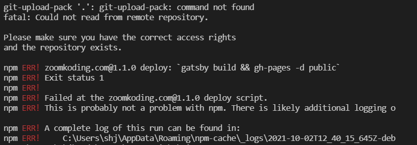

## npm run deploy 오류 해결

1일 1커밋을 목표로 하자고 포부를 밝혔으나..  
introducion post를 수정하고 commit, push, merge까지 다 잘 된 것을 확인 했는데 deploy가 되지 않아 당황했다.  

  

다음과 같은 오류가 떴다.  
에러 메세지를 읽어봐도 무슨 말인지 모르겠고.. 뭐지 하고 한참을 찾아봤는데..
Window VS code 터미널에서 git으로 배포할 때 **powershell**이 아닌 **bash**에서 해야 하는 거였다!!  

  

처음 Gatsby blog를 만들고 배포할 때도 같은 부분에서 한참 헤맸는데 이걸 또 헤매다니..  
다시는 배포할 때 실수하지 말자는 의미에서 글로 남겨 기억해야겠다.  

  

짜잔 ٩( ˃́▿˂̀ )۶  published가 잘 된 것을 확인했다.  
Mac에서는 이런 번거로움이 없다고 하는데.. 문득 Mac이 부러워지는 에러였다.