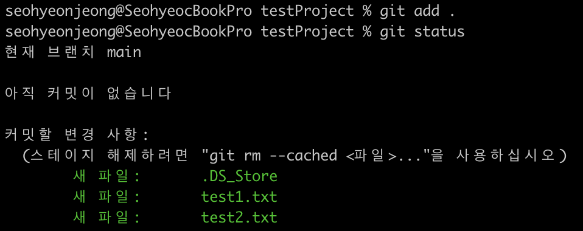

## Git & GitHub 실습 - 기초
<br><br>

### Git
- **소스코드 관리에 특화된 버전 관리 프로그램**  
  → 파일은 한 개로만 유지되면 좋겠는데 언제든지 특정버전으로 돌아가고 싶어!  
- 형상 관리 = 버전 관리 = 구성 관리  
<br><br><br>

### Server & Client
  

ex)   
크롬 브라우저(`클라이언트`) — 웹 페이지 줘!(`요청`) → 네이버(`서버`)  
네이버(`서버`) — 코드로 된 데이터(`응답`) → 크롬 브라우저(`클라이언트`)  

❓내 컴퓨터가 서버가 될 수 있을까?  
→ YES! 내 컴퓨터의 주소를 알려주고 접속했을 때 데이터를 주면 내 컴퓨터도 서버가 될 수 있다.  
<br><br><br>

### Git vs GitHub
- **`Git`** : 로컬(내 컴퓨터)에서 돌아가는 **버전 관리 프로그램**  
- **`GitHub`** : 원격(다른 사람 컴퓨터)에 버전들을 저장해놓는 **소스코드 버전 저장소**  
<br><br><br>  

### Git 설치
- **git 버전 확인**  

  터미널에서 다음 명령어 입력  
```bash
git --version
```
  
<br>

- **git defaultBranch**  

  기본 브랜치 `master`를 `main`으로 명칭 변경을 하여 생기는 오류를 방지하는 명령어. 설치 후 한 번만 실행해주면 된다.
```bash
git config --global init.defaultBranch main
```
<br>

- **option global**  

  앞으로 이 컴퓨터에서 git으로 관리하는 모든 프로젝트를 해당 내용으로 하겠다는 옵셔널 명령어 
```bash
git config --global user.name "Seohyeon Jeong" # 이름 설정
git config --global user.email "tjgus9966@naver.com" # 이메일 설정
git config --list # 입력한 정보 확인
```
  
<br><br><br>

### CLI
Commend Line Interface의 약자로, **명령어를 실행할 수 있는 프로그램**.  
  → window는 cmd, mac은 terminal이 있다.  
```bash
ls # 디렉터리 목록 조회(MAC) 
cd directory_name # 해당 디렉토리로 이동
cd .. # 상위 디렉토리로 이동
```  
  
  
  
<br><br><br>

### git 기본 명령어 이해 (feat. 사진 찍기)📸
- **`git init`**  
  코드의 현재 상태 사진을 찍어줄 사진사 고용(최초 1회만)  
<br>
- **`git add`**  
  사진에 찍힐 코드 파일 모으기(모이는 사람이 다를 수도 있으니 사진을 찍을 때마다)  
<br>
- **`git commit`**  
  모인 코드들의 현재 상태 찍기(사진을 찍는 과정은 매번)  
<br>
- **`git log`**   
  찍은 사진들을 볼 수 있는 앨범(찍은 사진을 확인하고 싶을 때)   
<br><br><br>  

### git 실습
- **init**   
  `.git` 폴더 생성. `.git` 폴더가 생성된 폴더는 git이 관리하기 시작한다.  
  ```bash
  git init
  ```
    
<br>

- **status**  
  현재 git 상태 보여준다.
  ```bash
  git status
  ```
    
<br>  

- **add**  
  `.git` 폴더 안에 있는 모든 파일 스테이징(추적 시작). 빨간색에서 초록색으로 바뀌었다는 건 전부 사진 찍을 준비가 되었다는 의미이다.  
  ```bash
  git add .
  ```
    
<br>  

- **commit**  
  커밋 메세지의 이름으로 현재 추적하고 있는 코드들을 찍는다.(사진의 이름 = ‘commit_message’) 알맞은 커밋 메세지를 적어주면 된다.  
  ```bash
  git commit -m 'commit_message'
  ```
    
<br>  

- **log**  
  커밋 로그를 확인한다.  
  ```bash
  git log
  ```
    
<br>  

- **reset**   
  커밋 번호(해시코드)에 해당되는 커밋으로 코드를 롤백. 커밋번호를 입력하지 않는다면 마지막 커밋 상태로 돌아간다.  
  ```bash
  git reset --hard commit_hash_code
  ```
    
<br>

**참고 강의**  
https://www.inflearn.com/course/%EC%8B%A4%EC%A0%84-%EA%B9%83-%EA%B9%83%EB%A6%B0%EC%9D%B4%EC%BD%94%EC%8A%A4#