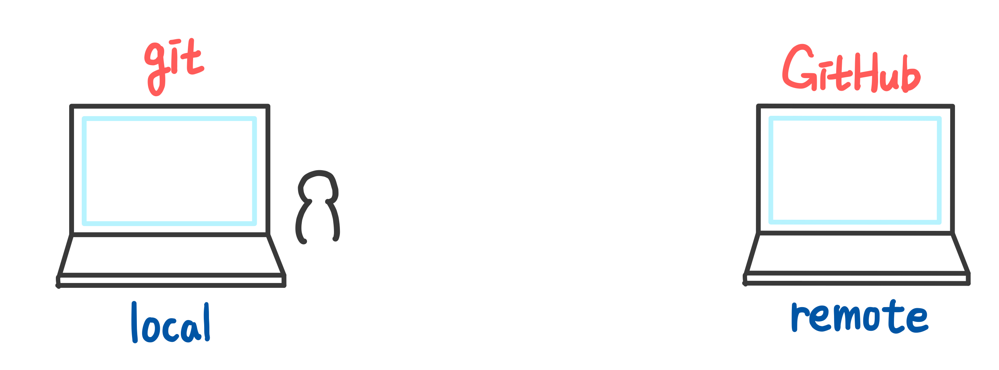
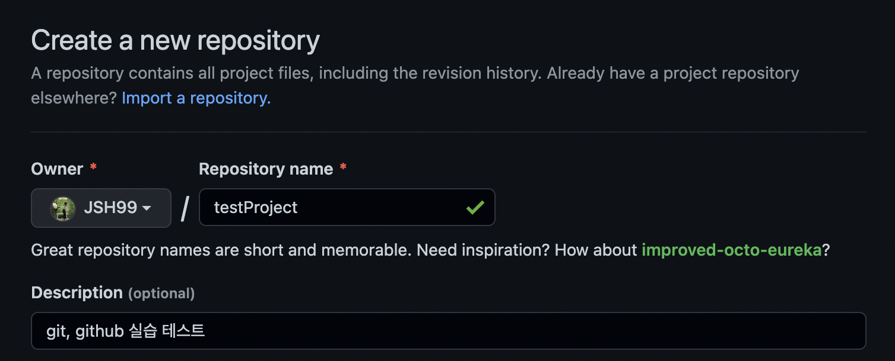
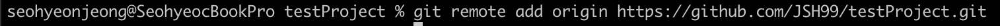
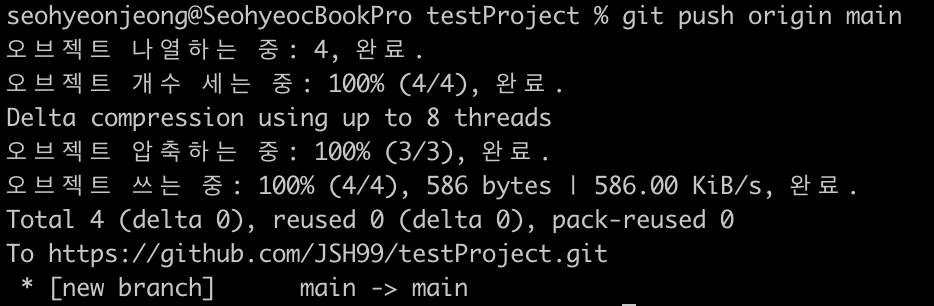
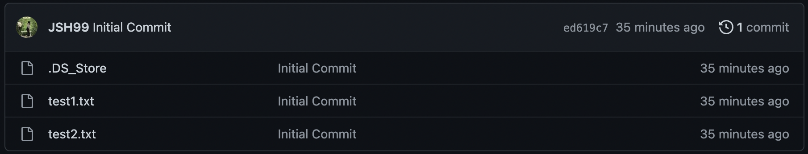
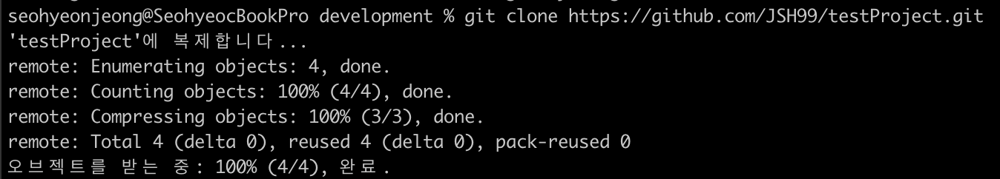
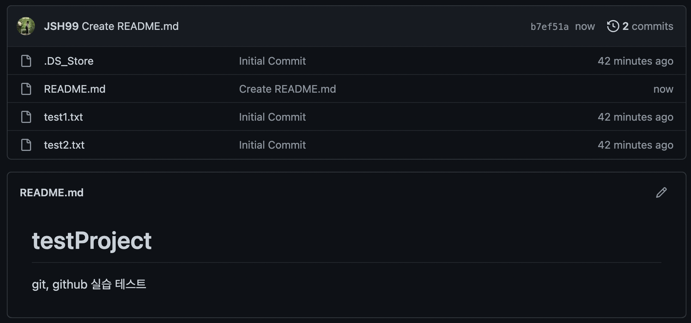
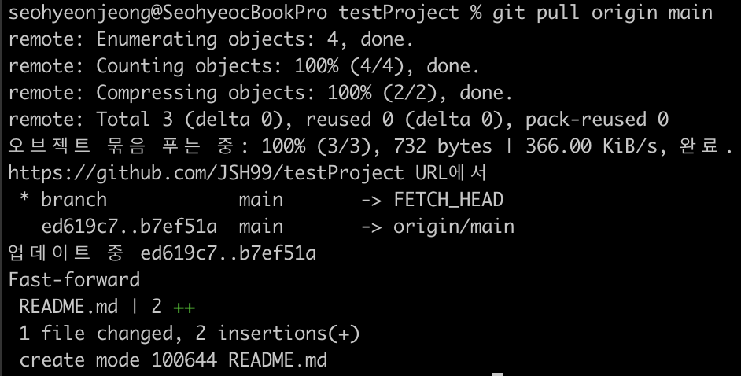
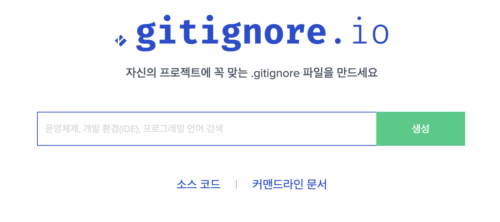

## Git & GitHub 실습 - 로컬 & 원격
<br><br>

### Local & Remote
- **`Local`** : 내 컴퓨터
- **`Remote`** : 다른 사람 컴퓨터  

  
  <br><br><br>

### local ➡️ remote
1. **github repository 생성**  
   github에서 새 리포지토리를 생성한다.
   
   <br>

2. **git remote add origin 리포지토리**  
   리포지토리와 내 로컬 폴더를 연결한다.
 ```bash
 git remote add origin repository_address
 ```

<br>

3. **git push origin main**  
   github 리포지토리 mian 브랜치에 현재 커밋들을 넣는다. **(로컬 → 서버)**
 ```bash
 git push origin main
 ```
  

<br><br><br>

### local ⬅️ remote

1. **git clone**  
   github 리포지토리에서 모든 커밋들을 내 로컬로 가져온다.
```bash
git clone repository_address
```

<br>

2. **git pull origin main**  
   서버에서 변경사항이 일어난 것을 로컬로 동기화한다. **(서버 → 로컬)**
 ```bash
 git pull origin main
 ```
  

<br><br><br>

### .gitignore
올리고 싶지 않은 파일을 포함한 파일
.gitignore.io 홈페이지 활용  


<br><br><br>

### pro설정✨
→ 다양한 혜택 제공, 대학생에게는 무료!
  
<br><br>  

**참고 강의**  
https://www.inflearn.com/course/%EC%8B%A4%EC%A0%84-%EA%B9%83-%EA%B9%83%EB%A6%B0%EC%9D%B4%EC%BD%94%EC%8A%A4#