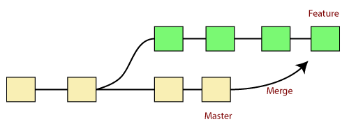
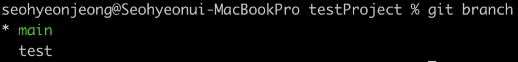
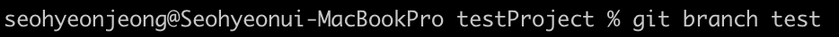
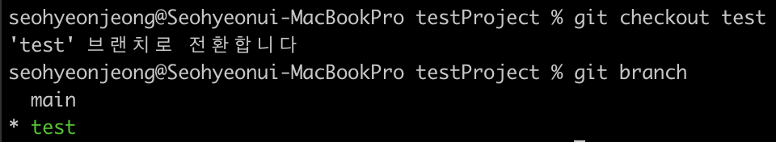
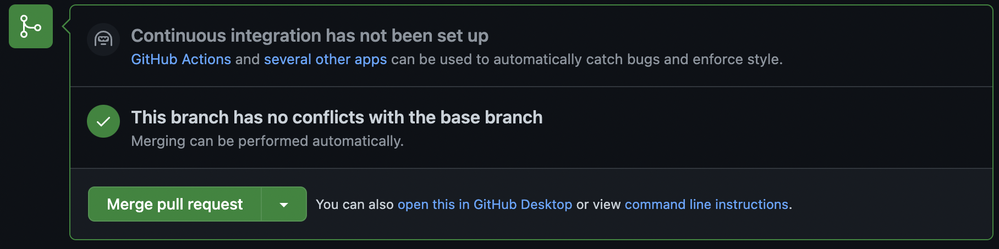
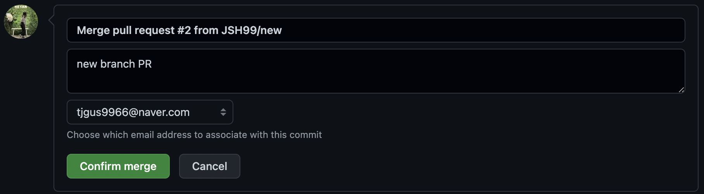

## Git & GitHub 실습 - 브랜치 & 협업
<br><br>

### branch
각자 브랜치에서 따로 개발한 후 merge(병합)하는 것이 더 편리하다. 이때 merge해달라는 요청이 pull request이다. PR을 수락하면 브랜치가 합쳐지면서 merge가 된다.  

  
<br>

- **branch 목록**  
  현재 생성되어 있는 브랜치의 목록을 본다.  
 ```bash
 git branch
 ```
  
<br>

- **branch 생성**   
  new_branch라는 새로운 브랜치를 만든다.  
 ```bash
 git branch new_branch
 ```
  
<br>

- **branch 이동**  
  branch_name이라는 브랜치로 이동한다.  
 ```bash
 git checkout branch_name
 ```  
  
<br>

- **branch push**  
  특정 브랜치를 깃허브에 푸시한다. (로컬 ➡️ 깃허브)   
 ```bash
 git push origin branch_name
 ```
<br><br>

- **branch pull**  
  브랜치를 깃허브에서 가져와서 최신화한다.  (깃허브 ➡️ 로컬)  
 ```bash
 git pull origin branch_name
 ```
<br><br>

- **branch 병합**   
  합쳐주고 싶은 브랜치를 선택하여 pull request를 통해 요청을 하고 충돌이 없다면 컨펌하여 merge할 수 있다.  

    

    

    

    
  <br><br><br>

### 협업
- **`branch`**   

  원본 리포지토리 클론 → 브랜치 생성 → 각자 브랜치에서 개발 → PR(요청) → Approve(동의) / Confirm(수락) → 브랜치 merge  
  <br>

- **`fork`**  

  = 남의 리포지토리를 내 리포지토리에 그대로 복제하는 것  
  원본 리포지토리 포크 → 포크해온 내 리포지토리 클론 → 개발 →  PR(요청) → 원본 리토지토리 유저의 Confirm(수락) → merge  
  <br><br><br>

### Slack
- **업무 협업 메신저**, 개발 도구와 연동 가능  
- 깃허브의 commit, PR 등 변경사항 → slack 알림  
<br>

**참고 강의**  
https://www.inflearn.com/course/%EC%8B%A4%EC%A0%84-%EA%B9%83-%EA%B9%83%EB%A6%B0%EC%9D%B4%EC%BD%94%EC%8A%A4#