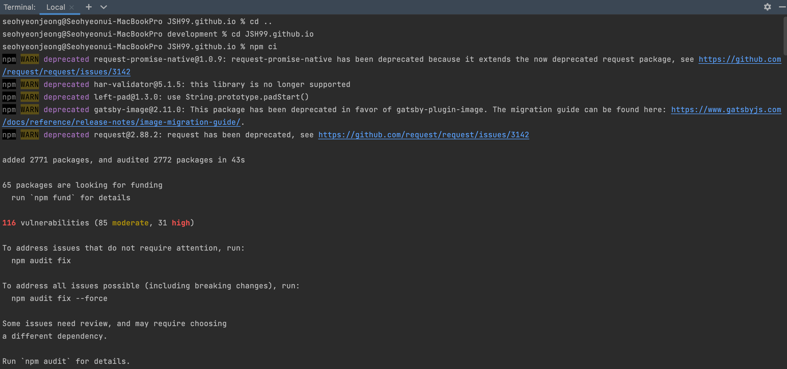

## package-lock.json 충돌 오류 해결
*노트북을 바꾸면서 진행중인 프로젝트를 모두 새 노트북에 클론 받아서 진행해야 했다. git을 잘 다룰 줄 몰라 혹시 잘 되지 않거나 충돌이 나면 어쩌나 걱정을 많이 했는데.. 역시나 한참을 헤맸다.. 누군가 이 글을 본다면 나와 같은 고생을 하지 않기를 바라면서 쓰는 오류 해결 글*🥲

  
### npm install & start 오류
`There was a problem loading the local develop command. Gatsby may not be installed in your site's "node_modules" directory. Perhaps you need to run "npm install"? You
might need to delete your "package-lock.json" as well.`  

새 노트북에 git 저장소를 클론을 해온 후 npm install이 잘 되지 않았다. 오류를 구글링 해서 install 문제를 겨우 해결했더니 이번에는 npm start에서 말썽이고... 구글링해서 해결하면 또 다른 이유로 start가 되지 않는 무한 반복에서 헤어나오지 못하다가 결국 node_modules 디렉토리를 싹 지우고  후, 새로 처음부터 다시 install한 후 start 해보니 되었다. *(이 방법은 적절한 해결 방법이 아니니 시도하지 말고 글을 끝까지 읽을 것!!)*  
  
### package-lock.json 충돌 오류
한시름 놓으며 커밋 후 merge를 해주려 하니,, package-lock.json 파일에서 충돌이 났다. 파일을 들여다보니 바뀌어도 한참 바뀌었더라... 충돌이 나지 않는 게 더 이상할 정도로ㅋㅋㅋㅋㅋ.. ~~2만 줄이었던 파일이 무려 5만 줄이 되어 있었다..~~  

  

충돌이 나면 그 전 파일로 다시 바꿔주면 충돌이 사라지지 않을까..? 싶은 마음에 package-lock.json 파일을 마음대로 전 노트북 때의 파일로 바꿨더니 merge는 성공했지만 다시 npm start가 되지 않는 상황ㅋㅋㅋㅋㅋㅋ 역시 이건 해결 방법이 아니었구나.. 스스로 어이없어 하며 열심히 오류를 구글링했다.  

찾아보니 package.json 파일과 package-lock.json 파일이 동기화 되지 않았을 때 npm install하면서 package-lock.json 파일만 업데이트되어 충돌이 생겼던 것이었다. 그렇다면 해결 방법이 없을까... 또 폭풍 구글링을 했고, 결국 npm start 오류와 git 충돌 오류 둘 다 해결할 수 있었다.  
  
### package-lock.json 충돌 해결
결론은! package-lock.json 파일이 변경되지 않도록 안전하게 설치해주기 위해서 npm install 대신 `npm ci`를 해주어야 했던 것! **npm ci**는 기존의 node_modules/ 디렉토리를 제거하고 새로 설치한다. 여기까지는 내가 시도한 node_modules 디렉토리를 제거하는 방법과 비슷한 것 같지만, 결정적으로 install과 ci의 차이점은 **재설치 시 package.json 파일과 package-lock.json 파일이 다르더라도 package-lock.json 파일을 변경하지 않아** 충돌이 생기지 않게 되는 것이다.  

  

  

**npm ci**를 통해 package-lock.json을 변경하지 않고 node_modules 재설치를 해주었더니 start와 merge 모두 오류 없이 잘 진행되는 것을 확인할 수 있다.  

결국 다시 clone한 후에 npm ci를 해주고 원격 저장소 연결까지 다시 해주는 수고스러움을 통해 오류를 해결했다. 이렇게 ~~무식하게~~ 몸이 고생하지 않으려면 git 공부를 정말 열심히 해야겠구나 싶었다. 앞으로 얼렁뚱땅 내 맘대로 package-lock.json 파일을 만지는 행동은 절대 하면 안 되겠다고 반성도 하고, 내가 아직 정말 배울 게 많구나라는 생각이 들게 만드는 오류였다. 같은 오류를 겪지 않도록 더욱 성장하자🌱💦