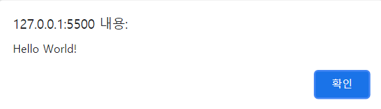
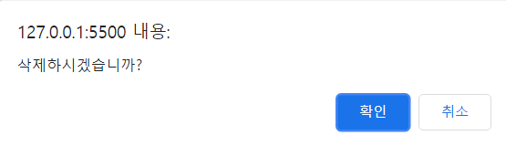
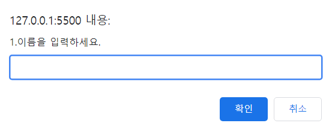
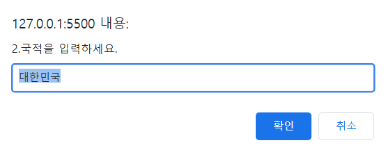

## javascript 알림 창
<br>

### 경고 창(Alert)
`alert`은  `경고 창`으로, 사용자에게 알릴 메세지를 표시한다.
```javascript
alert("Hello World!");
```  
<br>  

  
<br><br>  

### 선택 창(Confirm)
`confirm`은 `선택 창`으로, **취소 버튼**이 있어 사용자의 확인을 요구한다. 어떤 버튼을 누르는지 결과에 따라 프로그램이 동작한다. 사용자가 `확인`을 선택하면 `true`를 반환하고, `취소`를 선택하면 `false`를 반환한다.
```javascript
confirm("삭제하시겠습니까?");
```
<br>  


<br><br>  

### 입력 창(Prompt)
`prompt`는 `입력 창`으로, 텍스트 필드 안에 **메세지를 입력**할 수 있다. 입력한 내용은 프로그램에서 사용 가능하며, `기본 값`을 지정할 수도 있다. 입력된 값의 자료형은 **문자열**이다. 사용자가 값을 입력하고 `확인` 버튼을 누르면 사용자가 `입력한 값`을 반환하고, `취소` 버튼을 누르면 `null`을 반환한다.
```javascript
prompt("1.이름을 입력하세요.");
prompt("2.국적을 입력하세요.","대한민국"); #기본값 지정
```
<br>  

  

