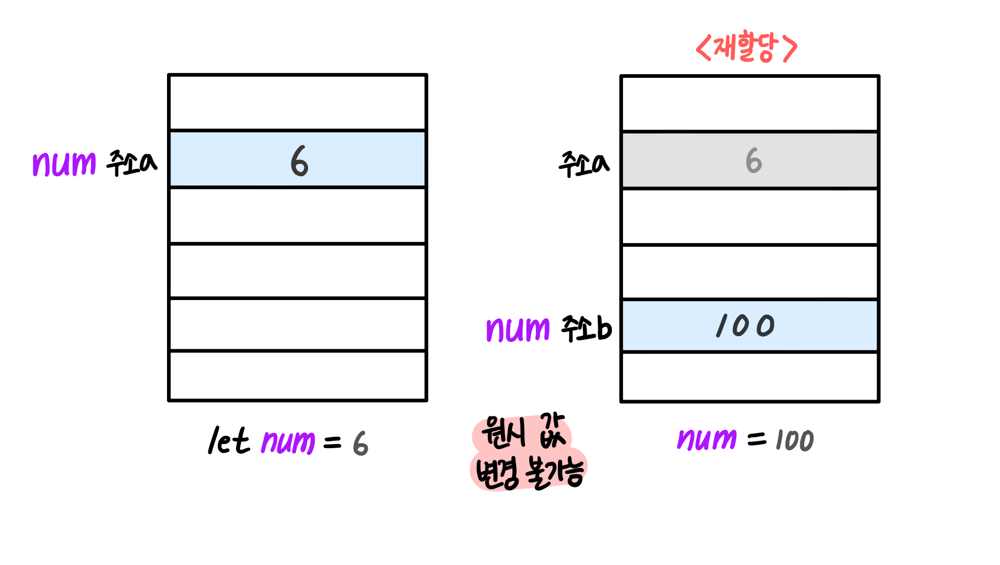
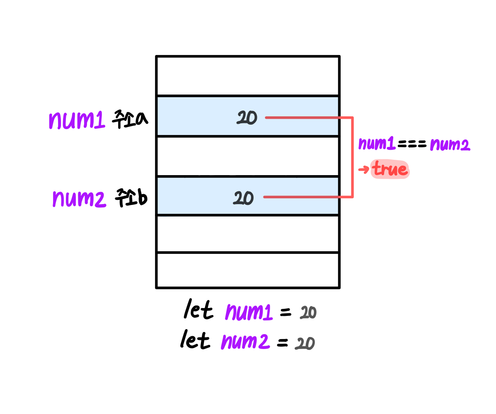
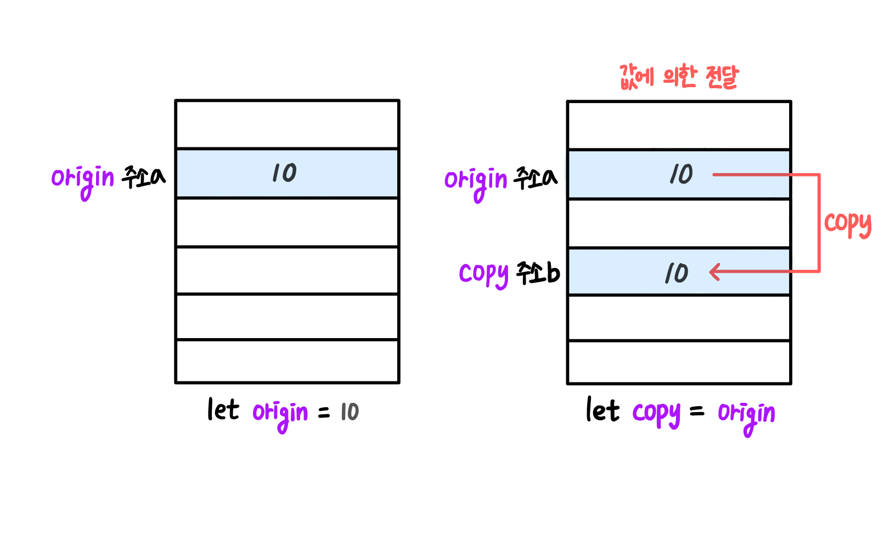
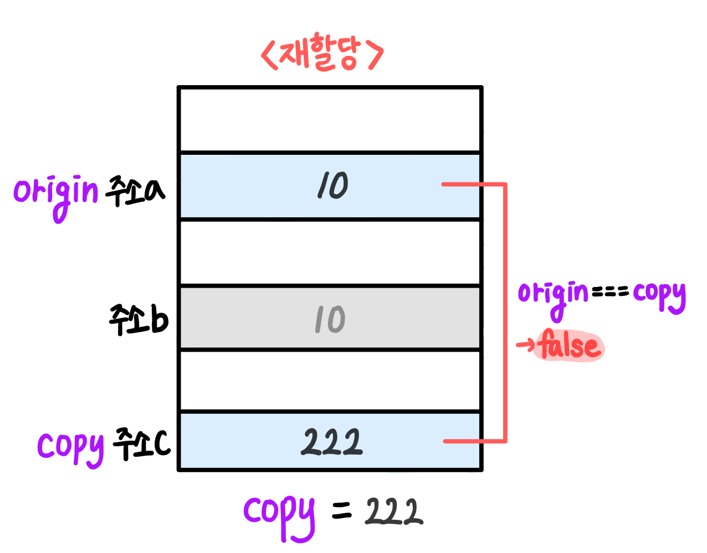
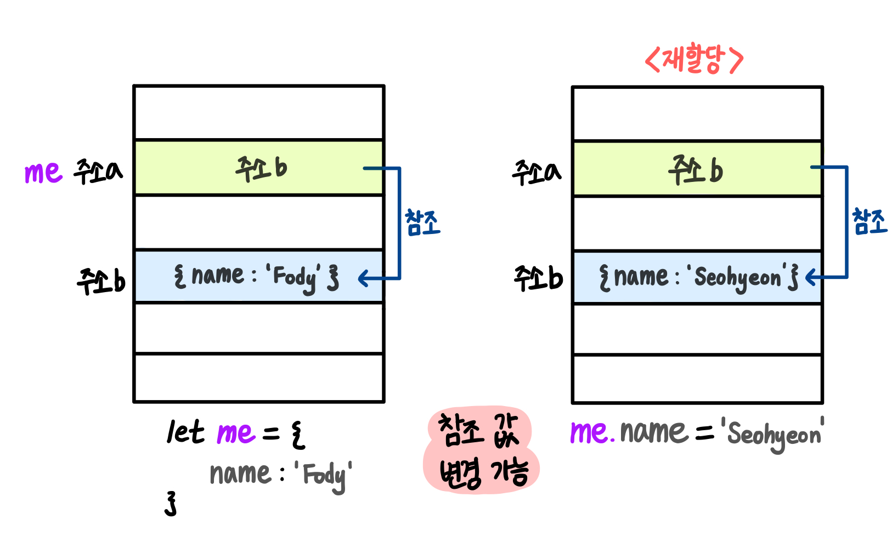
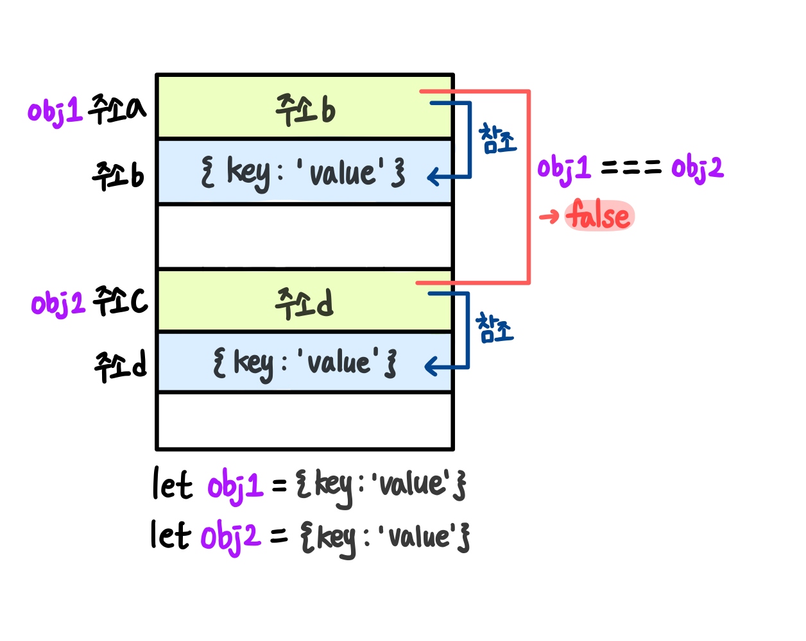
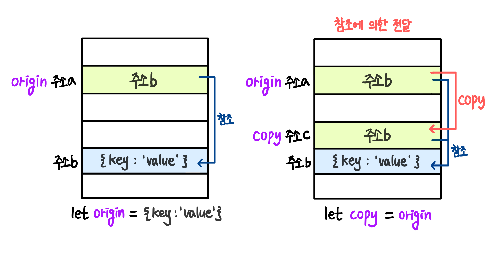
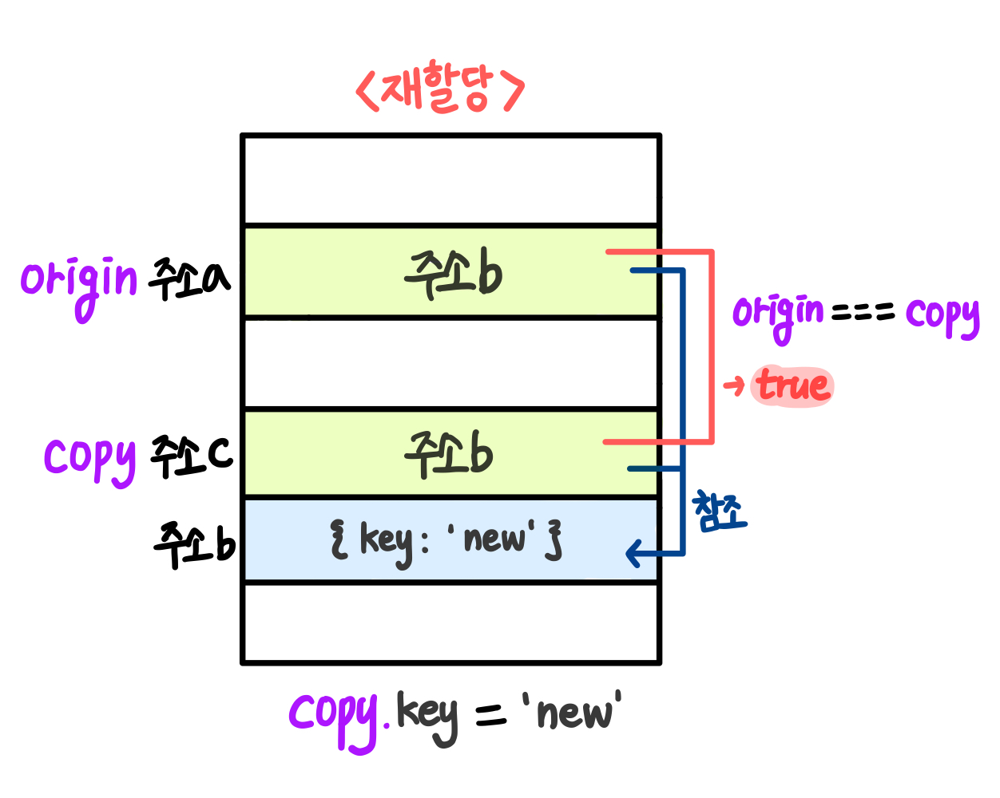

# javascript 원시값과 참조값
자바스크립트 변수는 크게 두 가지 타입으로 분류할 수 있는데, 바로 **`원시 값`**과 **`참조 값`**이다.  
<br><br>

## 원시 값(Primitive Type)
원시 값은 단순한 **데이터**이며, 모든 원시 값은 **변경이 불가능**하다. 원시 값을 변수에 할당하면 변수에 **`실제 값`**이 저장된다.  
- Number
- String
- Boolean
- Null
- Undefined
- Biglnt
- Symbol  
<br>

```javascript
let num = 6; 
num = 100; // 재할당
```
원시 값을 할당한 변수 `num`에 새로운 값 `100`을 재할당하면, 초기화했던 `6`이 저장된 메모리 안의 **원시 값 자체를 수정하는 것이 아니라 새 메모리 공간에 재할당한 원시 값을 저장**한다. 변수 `num`의 메모리 주소는 재할당한 원시 값인 `100`이 저장된 `주소b`로 바뀐다.  
> 원시 값은 변경 불가능하므로 값을 재할당하면 새로운 메모리 공간을 확보하고 재할당한 값을 저장한 후, 변수가 참조하던 메모리 공간의 주소를 변경한다.  

  
<br>  

```javascript
let num1 = 20;
let num2 = 20;
console.log(num1 === num1); // true
```

원시 값은 **실제 값 자체를 비교**하기 때문에 각각 다른 변수에 같은 값을 저정한 후 비교하면 두 값이 같다.  


<br><br>

### 값에 의한 전달(Pass by Value)
원시 값이 **실제 값이 복사 되어 전달**되는 것을 **`값에 의한 전달`**이라고 한다.  
```javascript
let origin = 10;
let copy = origin;
console.log(origin === copy); // true
```

새로운 변수 `copy`에 원시 값이 저장된 다른 변수 `origin`를 할당하면, `copy`에 `origin`의 **실제 값 `10`이 복사**되어 전달된다.  

  
<br>  

```javascript
copy = 222; // 재할당
console.log(origin === copy); // false
```

`copy`의 메모리 공간은 `origin`과 다른 메모리 공간을 사용하기에, `copy`의 값을 변경해도 `origin` 변수에 영향을 주지 않는다.  


<br><br><br>

## 참조 값(Reference Type)
참조값은 여러 값으로 구성되는 **메모리에 저장된 객체**이며, **변경이 가능**하다. 참조 값을 변수에 할당하면 변수에 **`참조 값`**이 저장된다.  
- Object (객체)
- Array (배열)
- Function (함수)  
<br>  

```javascript
let me = { 
  name : 'Fody'
}
me.name = 'Seohyeon';
```
참조 값을 할당한 변수 `me`에 새로운 값 `Seohyeon`을 재할당하면, 초기화했던 `Fody`이 저장된 메모리 안의 **참조 값이 변경되며 메모리 주소 `주소b`에는 영향을 주지 않는다.**
> 참조 값은 변경 가능하므로 값을 재할당하면 메모리 주소는 변하지 않고 참조 값 자체가 바뀐다.

  
<br>  

```javascript
let obj1 = {
	key : 'value'
}
let obj2 = {
	key : 'value'
}
console.log(obj1 === obj2); // false
```

참조 값은 값 자체가 아닌 **참조 값을 저장하고 있는 메모리 주소를 비교**하기 때문에 각각 다른 변수에 같은 값을 저정한 후 비교하면 두 값이 다르다.  


<br><br>

### 참조에 의한 전달(Pass by Reference)
참조 값이 실제 값이 아닌 **참조 값이 저장된 메모리 주소가 전달**되는 것을 **`참조에 의한 전달`**이라고 한다.  
```javascript
let origin = {
	key : 'value'
}
let copy = origin;
console.log(origin === copy); // true
```

새로운 변수 `copy`에 참조 값이 저장된 다른 변수 `origin`을 할당하면, `copy`에 `origin`의 **메모리 주소 값 `주소b`가 복사**되어 전달된다.  

  
<br>  

```javascript
copy.key = 'new'; // 재할당
console.log(origin === copy); // true
```

`copy`의 메모리 공간은 `origin`과 같은 메모리 주소를 참조하고 있기 때문에, `copy`의 값을 변경하면 `origin` 값에 영향을 준다. `origin`과 `copy`가 참조 값이 저장된 메모리 주소를 공유하고 있으므로, 두 변수 중 어느 하나의 값을 변경하더라도 두 변수의 값이 같이 바뀐다.  


<br><br>

👉 참고: [https://publizm.github.io/posts/javascript/Primitive_Reference](https://publizm.github.io/posts/javascript/Primitive_Reference)