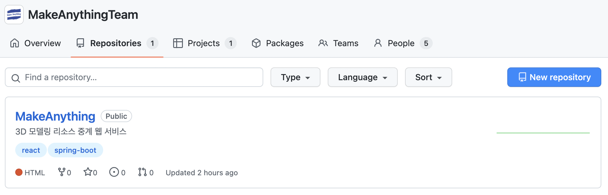
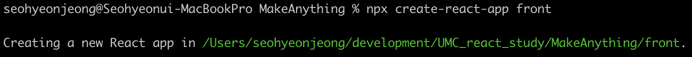
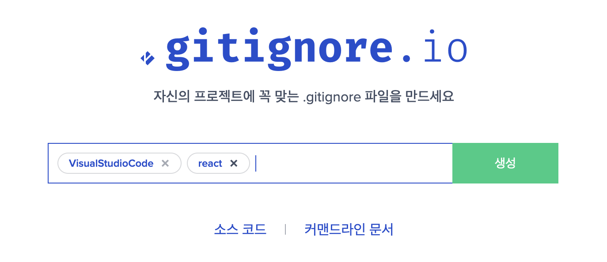

# [UMC] 2기 프로젝트 ⚛초기 설정⚛
<br><br>

## 프로젝트 시작👨‍👩‍👧‍👦
UMC 2기 팀 프로젝트가 시작되었다!  
프로젝트 진행사항을 글로 남겨보는 경험이 도움이 된다는 말을 흘러가며 들어서 블로그에 주섬주섬 작성해본다,,  
과연 프로젝트가 완성될 때까지 모든 단계를 꼼꼼하게 작성할 수 있을지는 모르겠지만 최대한 적어보려 한다.😂  
우리 팀은 해커톤에 참여하지 않았지만, 해커톤을 시작으로 7월 1일부터 프로젝트가 시작되었다.  
8월 20일까지 약 7주 동안의 시간이 주어졌다. 본격적인 개발이 시작된다면 아마 잠죽잠 모드가 예상된다···  
<br><br><br>  

## 팀 소개🖨
우리 팀 프로젝트 주제는 **3D 모델링 리소스 중계 서비스**이다!  
쉽게 말하면 3D 프린트를 할 수 있는 리소스를 사용자가 판매·구매하는 서비스이다.  
팀은 디자이너 1명, 웹 프론트엔드 3명, 백엔드 2명으로 구성되어 있다.      
프로젝트 경험은 부족하지만 내가 프론트엔드 리더를 맡게 되었고, 그만큼 열정적으로 개발할 것이다.🔥  

🛠 **`react`** **`spring-boot`**  
<br><br><br>  

## 초기 설정🐣
생각보다 협업을 위해 초기에 설정해야 하는 부분들이 많았고, 구글링을 열심히 해가며 주섬주섬 해본 초기 세팅..  
어려움을 겪었던 부분들을 다음에 협업할 때는 잘 해내고 싶어서 미리 해두면 좋은 것들을 정리해본다!  
<br>  

### 레포지토리 생성 및 연동
  

협업을 위해서 가장 먼저 해야 할 일은 역시 **GitHub Repository를 생성**하는 것이다.  
우리팀은 PM이 organization을 만들어둬서 organization 내에 새로운 레포지토리를 생성해주었다.  
new repository를 생성한 후에 **local과 remote를 연동**해준다.  
연동 방법은 `local` → `remote` / `remote` → `local` 두 가지 다 가능한데, 자세한 설명은 다음 포스팅을 참고! (👉 https://jsh99.github.io/Git/git_practice2/)  
한 사람이 만들어놓은 remote repository를 다른 팀원들이 각자의 local로 clone 받아 개발하면 된다.  
(GitHub으로 협업을 하는 방법은 여러 가지가 있으니 이 방법은 하나의 예시로써 참고하기를 바란다:>)  
<br><br>

### 리액트 프로젝트 생성
local과 remote를 연동했다면 local에서 **react 프로젝트를 생성**해준다.   
react 프로젝트를 생성하는 명령어는 다음과 같으며, react 프로젝트의 이름은 대문자로 시작할 수 없다.    
프로젝트를 생성한 후에 사용하지 않는 불필요한 파일은 정리해주었다.  
```shell
# npx create-react-app PROJECT_NAME
npx create-react-app front
```
  
<br><br>

### .gitignore 파일 작성
  

**.gitignore**은 커밋하지 않을 파일들을 적은 목록이다.  
https://gitignore.io/ 사이트를 이용하면 `운영체제`, `개발 환경(IDE)`, `프로그래밍 언어`를 작성하면 알아서 **gitignore 파일을 생성**해준다.  
사이트에서 생성된 목록을 복사해서 활용하면 쉽게 gitignore 파일을 작성할 수 있다.  

⚠️**주의사항**: gitignore에 **node_modules**를 포함했기 때문에, 라이브러리를 새로 설치하면 이 부분에 대한 소통이 필수라고 한다! 이런 부분들을 처음 알게 되었으니 조심하며 잘 소통해야 한다는 것을 배웠다.  
<br><br>  

### 팀원들과 정해야 하는 것들
오늘 세팅한 거 이외에도 앞으로 팀원들과 상의해서 정해야 하는 것들이 있다.  
- 브랜치 네이밍 규칙
- 커밋 메세지 작성 규칙
- 이슈 작성 규칙
- 충돌 해결 방법  

...등등 협업 시 필요한 사항에 대한 것은 다음 회의 때 이야기 나눌 예정이다.  
혼자 개발할 때보다 신경 써야 하는 부분들이 훨씬 많지만, 그래도 역시 누군가와 함께 개발할 때가 가장 즐겁다😊  