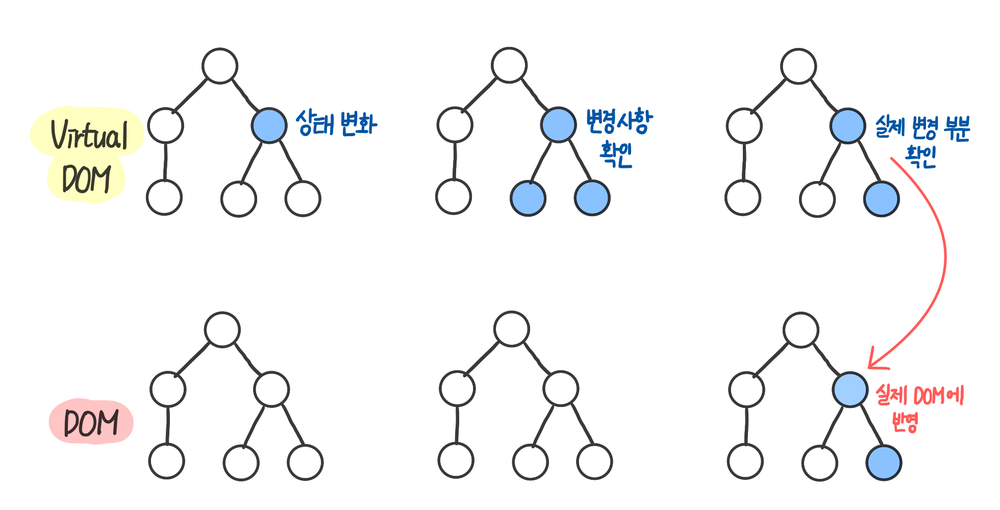
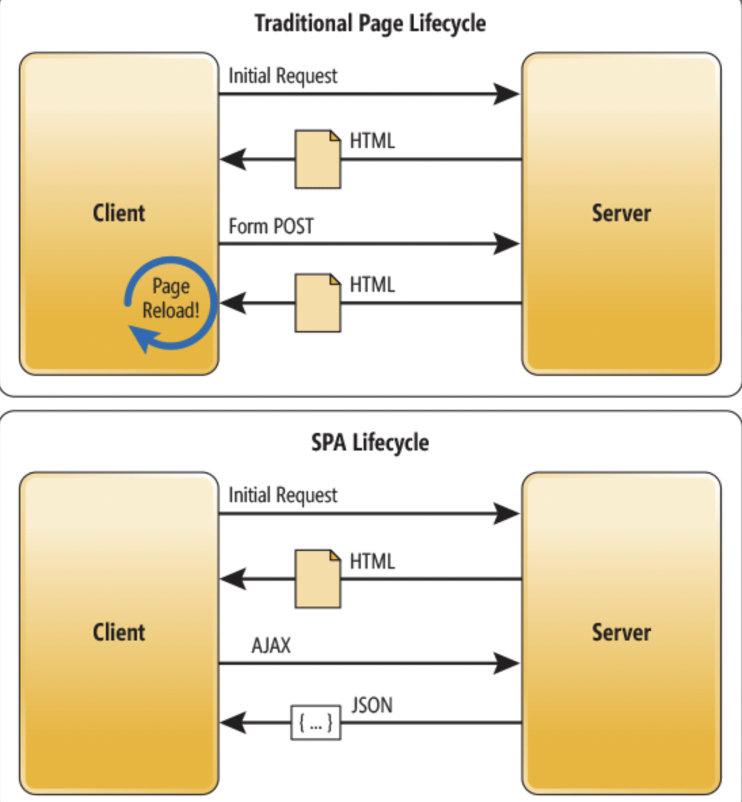
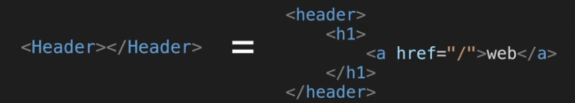
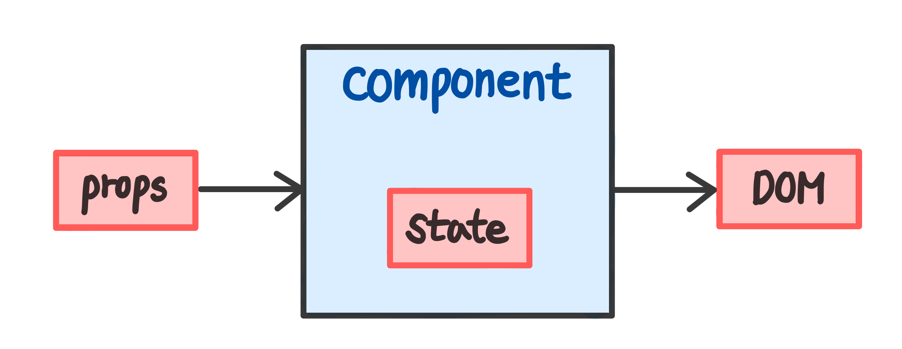

## UMC React Study 1주차
<br><br>

### 🌏 React의 탄생 배경
- 동일한 뷰에서 불필요하게 코드 반복하는 문제점
- 페이지 이동 시 새로고침이 발생하며 매번 데이터를 불러오는 문제점  

→️ 기존의 웹에 이러한 문제점을 개선하기 위해 **`React`** 라는 라이브러리가 탄생하게 되었다.  
<br><br><br>   

### 🧩 React의 특징
### Virtual DOM
우선 **`DOM`**은 Document Object Model의 약자로서, HTML 문서에 접근하기 위한 인터페이스이다. DOM은 웹 페이지의 객체 지향 표현이며, 자바스크립트를 이용해 콘텐츠를 추가, 수정, 삭제하거나 이벤트를 처리할 수 있도록 한다.  

**`Virtual DOM`**은 가상 DOM을 의미하는데, virtual DOM을 이용하면 실제 DOM에 접근하여 조작하는 대신에 이를 추상화시킨 자바스크립트 객체를 구성하여 사용한다.  

React에서 변한 데이터를 실제 DOM에 업데이트하는 과정은 다음과 같으며, 연산 횟수가 줄어들어 더 **효율적으로 작업을 처리**할 수 있다.  

  
1. 데이터가 업데이트 되면, 전체 UI를 Virtual DOM에 리렌더링  
2. 이전 Virtual DOM에 있던 내용과 현재의 내용을 비교  
3. 바뀐 부분만 실제 DOM에 적용  
<br><br>

### SPA
여러 페이지로 구성되어 있는 `MPA`(Multi Page Application)는 페이지를 로딩할 때마다 서버에서 리소스를 전달받아와서 렌더링한다. 규모가 커지고 사용자와 상호 작용이 많아짐에 따라, 데이터 정보 전송 과부화로 인한 속도 저하 등 문제점이 생기게 되었다.  

**`SPA`**는 Single Page Application의 약자로서, **페이지가 하나인 어플리케이션**을 의미한다. MPA는 페이지를 요청할 때마다 서버로 접속하여 받아왔기 때문에 페이지가 매번 새로고침 되었지만, SPA는 서버에서 제공하는 페이지가 한 개이기에 **새로고침되지 않고 데이터가 변경되는 부분만 다시 렌더링하여 효율적이고 사용자 편의에도 좋다.**  

   
<br><br>

### ES6
`ES`란 ECMAScript의 약자이며 **자바스크립트의 표준, 규격**을 나타내는 용어이다. `숫자`는 **버전**을 뜻하며, **`ES6`**은 2015년에 출시되었다. 이전 버전에는 없는 **화살표 함수**, **변수 선언**(const, let), **템플릿 리터럴**, **this**, **모듈**, **클래스 상속** 등 다양한 유용한 기능들을 포함하고 있으며, react를 배우기 위해서 ES6 문법을 먼저 익히는 것이 좋다.  
<br><br>

### JSX
**`JSX`**는 **JavaScript에 XML을 추가한 자바스크립트 확장 문법**으로, 자바스크립트 함수 내에 HTML 문법을 쓴 것을 의미한다. 브라우저가 이해할 수 없는 JSX 문법은 `Babel`을 통해 일반 자바스크립트 형태의 코드로 변환된다. **하나의 파일에 자바스크립트와 HTML을 같이 작성**할 수 있어 편리하며 가독성이 좋다.  
```jsx
// JSX 문법
function App() {
  return (
    <h1>Hi, SeoHyeon</h1>
  );
}
```
```javascript
// JavaScript 문법
function App() {
  return React.createElement('h1', null, 'Hi, SeoHyeon');
}
```
<br><br>

### Component
**`Component`**는 **react의 기본 단위**로서, props나 state와 같은 데이터를 입력받아 DOM 노드를 생성한다. component들을 모아서 하나의 view를 만들고, 만들어 둔 component를 다른 view에서 재사용 할 수도 있다. **코드의 재사용성을 높이고 유지보수를 용이하게 할 수 있다**는 장점이 있다.  

  
<br><br>

### Props
**`Props`**는 properties의 줄임말으로서, **부모 component에서 자식 component에게 데이터를 전달할 때 사용**한다. **자식 컴포넌트에서 값을 수정할 수는 없다**. Props을 통해 입력된 데이터를 Component 함수가 처리한 후 반환하면 새로운 UI가 구성된다.  

  

```javascript
// 부모 component
import ChlidComponent from './ChildComponent'
function ParentComponent() {
  return (
    <ChildComponent name="sseo" />
  );
}
```
```javascript
// 자식 component 
function ChildComponent(props) {
  return (
    <h1>Hello, {props.name}</h1>
  );
}
```
```javascript
// 자식 component (비구조화 할당)
function ChildComponent({name}) {
  return (
    <h1>Hello, {name}</h1>
  );
}
```
<br><br>

**reference**  
👉 https://jw910911.tistory.com/41  
👉 https://velog.io/@gwak2837/React-Virtual-DOM-이해하기  
👉 https://codingmania.tistory.com/328   
👉 https://www.youtube.com/watch?v=qN6Svts61qs

