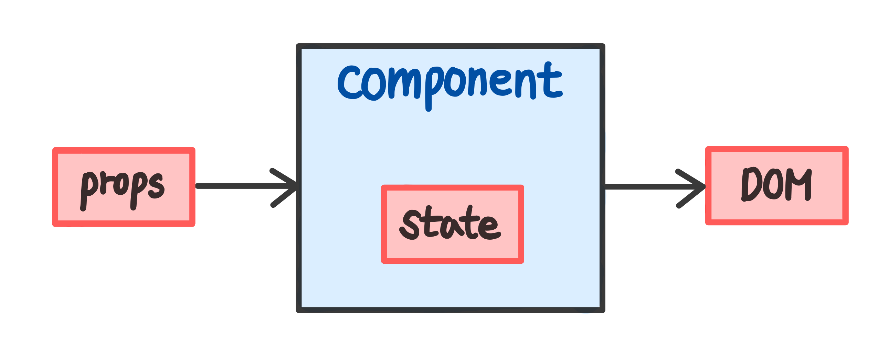

## UMC React Study 2주차
<br><br>

### 🪝 Hooks
>Hook은 React 16.8에 새로 추가된 기능입니다. Hook은 class를 작성하지 않고도 state와 다른 React의 기능들을 사용할 수 있게 해줍니다.  

클래스형 컴포넌트는 문법이 어렵고, 코드의 재사용성이 낮으며 축소가 어렵다. 이러한 클래스형 컴포넌트의 단점을 보완하기 위해 `함수형 컴포넌트`가 등장하였다. 하지만 함수형 컴포넌트에서는 클래스형 컴포넌트의 장점인 **State**나 **Life Cycle Method**을 다루는 기능을 사용하지 못한다. 이를 해결하기 위해 **`Hook`**이 등장했다.  

**`Hook`**은 **함수형 컴포넌트에서 state와 lifecycle 기능을 사용할 수 있게 해주는 함수**이다. Hooks의 대표적인 기능인 `useState`와 `useEffect`를 살펴보도록 하자.    
<br><br><br><br>   

### 🧘🏻‍♀️ useState
지난 시간에 배웠던 **`props`**가 컴포넌트의 **외부 input 값**이라면, **`state`**는 컴포넌트 **내부 input 값**이라고 할 수 있다.

  
<br><br>

함수형 컴포넌트는 **리렌더링될 때 내부의 모든 코드가 재실행**되기 때문에 함수형 컴포넌트에서 state 관리가 불가능했다. 예를 들어, 컴포넌트 내에 변수를 초기화한 후에 값을 바꿔주더라도, 리렌더링 시 모든 코드가 재실행되어 변수 값은 다시 초기 값으로 돌아가게 되는 것이다.    

이런 불편함을 해결하기 위해 Hook의 useState가 등장했다. React는 **`useState`**를 통해 생성한 state를 **함수형 컴포넌트 scope 밖에 저장**한다. 따라서, **컴포넌트가 리렌더링 되더라도 state 값이 유지**된다.  
<br><br>  

state 갱신 함수 이름은 일반적으로 **state 값 앞에 set을 붙여서** 짓는다. state 값은 **반드시 setState 함수로만 갱신이 가능**하다.  

>const [<state 값 저장 변수>, <state 값 갱신 함수>] = useState(<state 초기 값>);  
```javascript
// String
const [name, setName] = useState('');
setName('Fody');
```
```javascript
// Number
const [count, setCount] = useState(0);
setCount(count + 1);
```
```javascript
// Bollean
const [check, setCheck] = useState(false);
setCheck(!check);
```
```javascript
// Array
const [arr, setArr] = useState([]);
setArr(oldArr => [...oldArr, newArrValue]);
```
```javascript
// Object
const [obj, setObj] = useState({});
setObj(oldobj => {...oldObj, newKey:{newValue}})
```
<br><br><br><br>

### 🏄🏻 useEffect
**`useEffect`**는 함수형 컴포넌트 내에서 side effect를 수행할 수 있도록 해주는 기능이다. `side effect`는 **React 컴포넌트가 화면에 렌더링된 이후에 비동기로 처리되어야 하는 부수적인 효과**를 의미한다.(부작용의 의미 아님 주의!) 컴포넌트의 생명주기 관련 기능을 제공해주며, 컴포넌트의 생명주기에 따라 세 가지로 분류할 수 있다.   
<br><br>

✅ **컴포넌트가 화면에 최초 렌더링 됐을 때**만 실행하고 싶을 때    

클래스형 컴포넌트의 `componentDidMount` 메서드와 유사한 기능을 한다. 컴포넌트가 화면에 최초 렌더링 됐을 때에만 데이터를 조회하거나, 자동로그인을 판별하는 기능이 필요할 때 사용할 수 있다.
```javascript
useEffect(() => {
	// 컴포넌트가 화면에 가장 처음 렌더링 됐을 때만 실행하고 싶을 때의 코드
},[]);
```
<br><br>    

✅ **특정 props, state 값이 업데이트 될 때**만 실행하고 싶을 때    

클래스형 컴포넌트의 `componentDidUpdate` 메서드와 유사한 기능을 한다. 파라미터로 콜백함수와 업데이트를 감지할 특정 값를 넣은 **dependency array**를 전달한다.
```javascript
useEffect(() => {
    // 특정 값이 업데이트될 때마다 실행하고 싶을 때의 코드
	if(email && password) {
		setFlag(true);
		return;
	}
	setFlag(false);
},[email, password]); // dependency array
```
<br><br>  

✅ **컴포넌트가 사라지기 직전**에만 실행하고 싶을 때   

클래스형 컴포넌트의 `componentWillUnmount` 메서드와 유사한 기능을 한다.
```javascript
useEffect(() => {
	return () => {
		// 컴포넌트가 사라지기 직전에 특정 코드를 실행하고 싶을 때의 코드
	};
},[]);
```

<br><br>  

**reference**  
👉 https://ko.reactjs.org/docs/hooks-overview.html  
👉 https://devbirdfeet.tistory.com/52