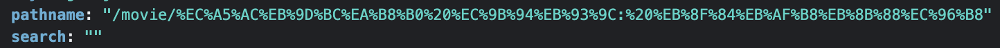

## UMC React Study 3주차
<br><br>

## 🎡리액트 라우팅(React Routing)
> **라우팅**(Routing)이란, **사용자가 요청한 URL에 맞는 페이지를 보여주는 것**이다.

리액트는 SPA 방식으로 렌더링하기 때문에 새로운 페이지를 로드하지 않고 **하나의 페이지 안에서 필요한 데이터만 가져오는 형태**로 동작한다.
**`react-router-dom`**은 신규 페이지를 불러오지 않는 상황에서 각각의 URL에 따라 선택된 데이터를 하나의 페이지에서 렌더링 해주는 라이브러리이다.  
<br>  

### 설치
```shell
npm install react-router-dom
```
<br><br>

### 주요 요소
- **`BrowserRouter`** : 라우팅에 포함시킬 페이지들은 모두 <BrowserRouter> 컴포넌트로 감싸줘야 한다.  
- **`Routes`** : <Routes> 컴포넌트는 여러 Route를 감싸서 그중 규칙이 일치하는 Route 단 하나만을 렌더링 시켜주는 역할을 한다.   
- **`공통 요소`** : 모든 Route에 공통으로 들어가는 요소가 있다면, <Routes> 밖으로 빼줘야 한다. (ex-Header.jsx)  
- **`Route`** : <Route> 태그의 `path` 속성에는 경로, `element` 속성에는 해당 경로에 띄워줄 컴포넌트를 넣어준다.  
- **`*`** : 특정 컴포넌트에 여러 경로를 매칭하고 싶을 때는 url 뒤에 *을 붙여준다. (ex-NotFound.jsx)  

```javascript
// src/App.js
import { BrowserRouter, Route, Routes } from "react-router-dom";
import Header from "./containers/Header";
import Course from "./pages/Course";
import Home from "./pages/Home";
import NotFound from "./pages/NotFound";
import Roadmap from "./pages/Roadmap";
function App() {
  return (
    <BrowserRouter>
      <Header />
      <Routes>
        <Route path="/" element={<Home />} />
        <Route path="/courses" element={<Course />} />
        <Route path="/roadmaps" element={<Roadmap />} />
        <Route path="/*" element={<NotFound />} />
      </Routes>
    </BrowserRouter>
  );
}
export default App;
```
<br><br><br>

## 📍페이지 이동
페이지 이동 방법은 크게 2가지가 있다.  
<br>

### Link 태그 사용하기
Link 태그는 클릭 시 바로 이동하는 로직을 구현할 경우에 사용한다.  
```javascript
import { Link } from 'react-router-dom';
<Link to="/">로고</Link>
```
<br><br>  

### useNavigate Hook
useNavigate Hook은 페이지 전환 시 추가로 처리해야 하는 로직이 있을 경우에 사용한다.  
- **`navigate(경로)`** : 해당 경로로 이동   
- **`navigate(-1)`** : 한 페이지 뒤로 가기  
- **`navigate(1)`** :  한 페이지 앞으로 가기  

```javascript
export default function Roadmap() {
  const navigate = useNavigate();
  return (
    <div>
      <h1>로드맵 화면입니다!</h1>
      <button onClick={() => navigate('/')}>홈 화면으로 이동하기</button>
      <button onClick={() => navigate(-1)}>뒤로</button>
      <button onClick={() => navigate(1)}>앞으로</button>
    </div>
  );
}
```
<br><br><br>

### 🪝라우팅 훅(Routing Hook)
### useNavigate Hook
**페이지를 이동**하는(url을 변경하는) **함수**를 반환  
> navigate(이동할 url, 전달할 인자);  

```jsx
import { useNavigate } from 'react-router-dom';
const navigate = useNavigate();
navigate(`/movie/${props.title}`, { state: props }); // 인자 전달
```
<br><br>  

### useLocation Hook
현재 페이지의 **경로 정보**를 담고 있는 **객체**를 반환  

> **useLocation 객체 속성**
>- `pathname` : 현재 경로 값(쿼리 스트링 제외)
>- `search` : 현재 경로의 쿼리 스트링 값  

  

```jsx
import { useLocation } from 'react-router-dom';
const { state } = useLocation(); // 인자 받기
```
<br><br>  

### useParams Hook
현재 페이지의 **url 파라미터의 정보**를 담고 있는 **객체**를 반환  
```jsx
// App.js
<Route path="/movie/:title" element={<component />} />
```
```jsx
// MovieDetail.jsx
import { useParams } from 'react-route-dom';
const { title } = useParmas(); // title 값 가져오기
```
<br><br><br>

## 🔑URL 파라미터 vs 쿼리 스트링
### URL 파라미터(URL Parameter)
주소 경로에 유동적인 값을 넣는 형태로서, id나 이름 등을 사용하여 특정 **데이터를 조회**할 때 사용한다.  
> https://comic.naver.com/webtoon/weekday

<br>

### 쿼리 스트링(Query String)
주소 뒷 부분에 **`?`** 문자열 이후 key=value로 값을 정의하여 **`&`**로 구분하는 형태로서, 키워드 검색 등 데이터 조회에 필요한 **옵션 전달**할 때 사용한다.  
> https://comic.naver.com/webtoon/weekdayList?week=mon&order=User&view=image

<br><br>  

**reference**  
👉 https://velog.io/@velopert/react-router-v6-tutorial  
👉 https://velog.io/@haesoohaesoo/useParams-useLocation-useNavigate