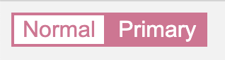

## UMC React Study 4주차
<br><br>

## 🎨CSS-technology

### CSS-in-JS
스타일 정의를 CSS 파일이 아닌 JavaScript로 작성된 컴포넌트에 바로 삽입하는 스타일 기법. 최근 웹 애플리케이션을 여러 개의 재활용이 가능한 빌링 블록으로 분리하여 개발하는 컴포넌트 기반 방법이 주가 되고 있다.
- `사용성`, `인지도` : styled-components
- `만족감`, `흥미도` : CSS-Modules  
<br><br>  

### CSS-Frameworks
사용자 친화적인 UI를 그대로 가져다가 쓸 수 있으며, 개발 속도 향상 및 간결한 CSS 코드 작성이 가능하다.

- Tailwind CSS
- React Bootstrap
- Ant Design
- Semantic UI  
<br><br>  

### SCSS
**CSS를 전처리** 해주는 기능을 제공하며, CSS Preprocessor라고 부르기도 한다. CSS의 단점을 보완하기 위한 CSS의 확장으로 나온 스크립트 언어이다. 기존의 복잡한 CSS 코드를 쉽게 입력하고, CSS가 동작하기 전에 CSS로 변환시켜준다. CSS는 CSS와 비슷한 문법으로 {}(중괄호)와 ;(세미콜론)을 사용하며, {}로 범위를 구분한다.

```css
 /* CSS */
nav ul {
    margin: 0;
    padding: 0;
    list-style: none;
}
nav li {
    display: inline-block;
}
```

```scss
// SCSS
nav {
  ul {
    margin: 0;
    padding: 0;
    list-style: none;
  }
  li {
    display: inline-block;
  }
}
```
<br><br>

### styled-components
컴포넌트 기반으로 CSS를 작성할 수 있게 도와주는 라이브러리. styled-component 정의는 **컴포넌트 밖**에 해주며, 일반 컴포넌트와 마찬가지로 **첫 글자는 대문자**로 작성한다.

- 자유로운 CSS 커스텀 컴포넌트를 만들 수 있다.
- 컴포넌트의 props를 참조할 수 있으며, props의 값에 따라 스타일을 다르게 개발할 수 있다.
- SCSS 라이브러리 설치 없이 SCSS 문법을 사용할 수 있다.  
- styled-component 안에서 className, id, tagName을 참조해서 스타일링 할 수 있다.  
<br>  

**설치**
```shell
npm install styled-components
```
<br><br>  

**HTML 요소 스타일링**
```jsx
import styled from 'styled-components';
const Title = styled.h1`
  font-size: 1.5em;
  text-align: center;
  color: palevioletred;
`;
```
<br><br>

**React 컴포넌트 스타일링**
```jsx
import { Link } from "react-router-dom";
const StyledLink = styled(Link)`
  color: palevioletred;
  font-weight: bold;
`;
render(
  <div>
    <Link>Unstyled, boring Link</Link>
    <br />
    <StyledLink>Styled, exciting Link</StyledLink>
  </div>
);
```
<br><br>

**props 값에 따라 다른 스타일**
```jsx
const Button = styled.button`
  background: ${props => props.primary ? "palevioletred" : "white"};
  color: ${props => props.primary ? "white" : "palevioletred"};
  font-size: 1em;
  border: 2px solid palevioletred;
`;
render(
        <div>
          <Button>Normal</Button>
          <Button primary>Primary</Button>
        </div>
);
```
  
<br><br>

### SCSS 🆚 styled-components
**SCSS**
- **`css in css`** 방식으로, JavaScript 파일과는 분리되어 있다. 
- 어떤 컴포넌트의 상태 값이 변하더라도 반응하기 쉽지 않다.
- 브라우저에 보이지 않는 컴포넌트까지 읽어 불필요한 컴파일 과정이 추가된다.  
<br>

**styled-components**
- **`css in js`** 방식으로, 컴포넌트가 렌더링 될 때만 해당 스타일 정보를 읽는다.
- 동적인 이벤트가 많은 사이트라면 컴포넌트가 렌더링 될 때마다 스타일 정보도 다시 읽어와야 한다.  
<br><br>

**references**  
👉 https://2021.stateofcss.com/en-US/technologies/css-in-js/  
👉 https://www.daleseo.com/react-styled-components/  
👉 https://velog.io/@gur0601/Styled-components%EC%99%80-SCSS-%EC%B0%A8%EC%9D%B4