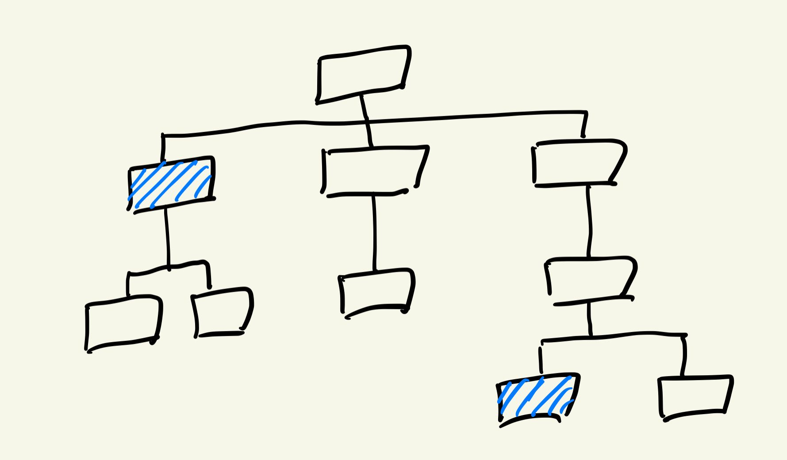
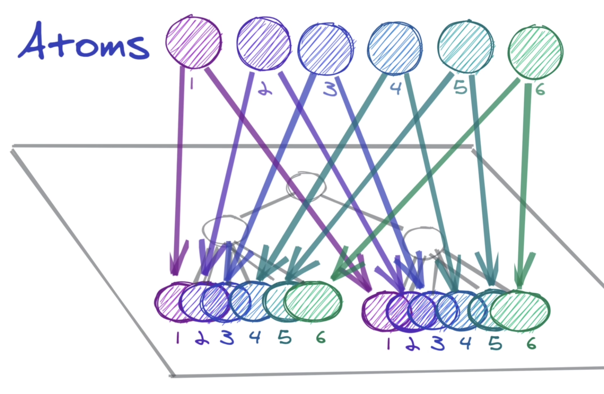

## UMC React Study 5주차
<br><br>

## 🌳상태관리 라이브러리의 필요성
React.js는 **단방향 데이터 흐름**을 가진다. 부모 컴포넌트에서 자식 컴포넌트 방향으로 `props`를 통해 데이터를 전달하는 것이 일반적이다. 이러한 특징은 서비스의 구조를 직관적으로 만들어주지만, 몇 가지 비효율적인 특징도 발생한다.
<br>  
  

1-depth 사이의 부모-자식 컴포넌트 간에 `setState` 함수를 전달하여 state를 끌어올리는 것은 간단할 수 있다. 하지만 만약 여러 depth 차이가 나는 컴포넌트 간에 state를 전달하려면 쓸데없이 state가 전달되는 **bridge 컴포넌트**가 반드시 존재해야 해서 비효율적이다.   

또한, 여러 컴포넌트에서 동일한 state 값을 사용하고 싶은 경우에 state를 **local storage**에 저장하여 사용 할 수도 있지만, 변화를 즉시 화면에 반영해줘야 하는 경우에는 state를 모두 공유해야 하는 번거로움이 생긴다. 최상위 부모에 state를 정의해두고, 해당 state를 공유하기를 원하는 자식 컴포넌트로 다 내려줘야 하기에 비효율적이다.  
<br>  

이렇게 상태(state) 관리의 어려움을 해결하기 위해 나온 것이 **`상태 관리 라이브러리(State Management Library`**이다. 상태 관리 라이브러리는 여러 종류가 있다.  
- Recoil⭐️
- Redux
- Mobx
- Context API  

<br><br>

## ⚛️Recoil
여러 상태 관리 라이브러리 중 가장 사용이 간단한 **`Recoil`**에 대해 학습해보자. Recoil에서 핵심은 **atom(원자성)**이다. atom은 **컴포넌트가 구독할 수 있는 state의 단위**이다. 쉽게 설명하면, 전역 상태(global state)를 하나의 저장소가 아닌, 전역 상태마다 atom이라는 상태 단위를 생성하여 관리하는 것이다.  (redux의 store가 recoil의 atom과 유사한 개념이라고 한다.)  

  
<br>  

### 특징
- **업데이트**와 **구독**이 가능하다. 
> atom이 업데이트 되면, 해당 atom을 구독하고 있던 모든 컴포넌트들의 state가 새로운 값으로 리렌더링 된다.

- 동일한 atom을 **여러 컴포넌트에서 구독**할 수 있다.  
> atom은 `key`라고 하는 **고유한 id**로 구분된다. 동일한 atom을 여러 컴포넌트에서 구독하고 있다면 해당 컴포넌트들은 같은 state를 공유하고 있는 것이며, 상태가 업데이트 되면 해당 atom을 구독 중인 모든 컴포넌트들이 리렌더링 된다.  

<br><br>  

### 설치
```shell
npm install recoil
```
<br><br>  

### 실습
recoil state를 사용하는 컴포넌트는 부모 트리 어딘가에 **`RecoilRoot`**가 필요하다. 그러므로 Root 컴포넌트에 RecoilRoot를 넣어주는 코드를 작성한다.  
```javascript
// src/index.js
import React from 'react';
import ReactDOM from 'react-dom/client';
import App from './App';
import { RecoilRoot } from 'recoil';
const root = ReactDOM.createRoot(document.getElementById('root'));
root.render(
  <RecoilRoot>
    <React.StrictMode>
      <App />
    </React.StrictMode>
  </RecoilRoot>
);
```
<br><br>  

recoil 폴더 안에 atom을 생성할 User.js 파일을 만든다. atom은 atom() 함수를 통해 **생성**할 수 있고, 인자로는 atom을 고유하게 구분할 수 있는 `key`와 초기 state 값을 나타내는 `default`를 넘겨주면 된다. 즉, `key`로 **고유한 atom을 구분**하고, `default`에 **기본으로 atom에 저장되는 값**을 지정한다!  
```javascript
// src/recoil/User.js
import { atom } from "recoil";
export const nicknameState = atom({
    key: "nicknameState",
    default: ""
})
```
<br><br>  

**`useRecoilState` hook**을 통해 atom을 **구독**할 수 있다. useRecoilState의 인자로는 생성한 후 export 해준 atom을 넣어준다.  
```javascript
// src/pages/Register.jsx
import { useRecoilState } from 'recoil';
import { nicknameState } from '../recoil/User';
const [nickname, setNickname] = useRecoilState(nicknameState);
return (
  <div>
    <input
      type='text'
      value={nickname}
      onChange={(e) => setNickname(e.target.value)}
    />
  </div>
)

```
<br><br>

특정 컴포넌트에서 state **구독만** 하고 업데이트는 하고 싶지 않은 경우에는 **`useRecoilValue` hook**을 사용하면 된다. 반대로 state 구독은 하지 않고 **업데이트만** 진행할 때에는 **`useSetRecoilState` hook**을 사용하면 된다.  
```javascript
// src/pages/Main.jsx
import { useRecoilValue } from 'recoil';
import { nicknameState } from '../recoil/User';
const nickname = useRecoilValue(nicknameState);
return (
  <div>
    <h1>안녕하세요, {nickname}님!</h1>
  </div>
)
```
<br><br>

### 🌻atom과 함께 사용되는 hooks 정리
- **`useRecoilState()`** : atom을 읽고 쓰려고 할 때 이 Hook을 사용한다. 이 Hook는 atom에 컴포넌트을 등록하도록 한다.  
- **`useRecoilValue()`** : atom을 읽기만 할 때 이 Hook를 사용한다. 이 Hook는 atom에 컴포넌트를 등록하도록 한다.  
- **`useSetRecoilState()`** : atom에 쓰려고만 할 때 이 Hook를 사용한다.  
- **`useResetRecoilState()`** : atom을 초깃값으로 초기화할 때 이 Hook을 사용한다  
<br><br>

**reference**  
👉  https://recoiljs.org/ko/docs/api-reference/core/atom/