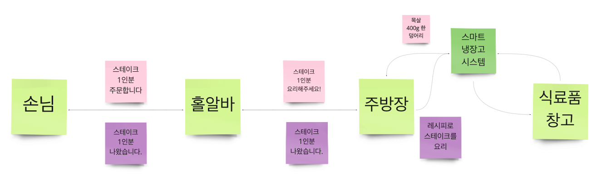

## UMC React Study 6주차
<br><br>

## 🌐React Network

### 서버(Server)
> Server = Serve + -er : 서브하는 사람  

실생활에서 서브하는 사람을 종업원(홀 알바)로 비유할 수 있다. 손님이 많은 경우에 홀 알바를 고용하는 것처럼, 서버 또한 클라이언트가 많아야 존재 이유가 있다.  
- **Server : Client = 1 : N**


<br><br>

### 네트워크 통신의 흐름
    

- 손님 = **Client**
  > Android, iOS, Safari, Chrome, Firefox 
- 홀 알바 = **Web Server**
  > Apache, Nginx
- 주방 = **Backend Language**
  > PHP → Laravel , codeigniter  
  > ASP →  ASP.net  
  > JSP → Spring, Spring boot  
  > JS → Node.js  
  > Python → Django  
- 스마트 냉장고 시스템 = **DBMS**
  > MySQL, MongoDB, MSSQL, Oracle
- 식료품 창조 = **DB**

<br><br>

### 네트워크 통신 시 클라이언트가 알아야 할 3가지
> 잘 모르는 여행지에 가서 스타벅스 커피를 마시고 싶다면?☕️
> - 스타벅스의 **주소**를 찾는다.
> - **메뉴판**을 보고 메뉴를 고른다.
> - 카운터/키오스크/앱 중에 **주문 방법**을 골라 주문한다.  

<br>

- 주소 = **IP/도메인 주소**
- 메뉴판 = **API 명세서**
- 주문 방법 = **프로토콜**  
<br>  

### IP 주소 & 도메인 주소
- **`IP 주소`** : 위도, 경도
> 서울 시청 - 37°33'58.87"N 126°58'40.63"E
- **`도메인 주소`** : 도로명 주소  
> 서울 시청 - 서울특별시 중구 세종대로 110

<br>  

### API 명세서
**api 내용을 구체화한 문서**로, api 이름, 파라미터, 메서드, 반환 값 등의 정보를 담고 있다.  

  
<br>  

### 프로토콜
> **`프로토콜`**이란, 컴퓨터 사이에서 데이터의 교환 방식을 정의하는 **규칙 체계**이다.  

<br>  

**HTTP** = HyperText Transfer Protocol  
→ 클라이언트와 서버 간의 데이터 통신 프로토콜 중 하나  
<br>  

- **HTTP 패킷** : 클라이언트/서버 통신에서 주고 받는 데이터 구조
  - `header` : 메타 데이터, 데이터 형식, 목적지 주소(우편물의 운송장)
  - `body` : 데이터(우편물 상자 안의 내용물)  
<br>  

- **HTTP 메서드**
  - `GET` - 조회
  - `POST` - 생성
  - `PUT` - 수정
  - `PATCH` - 일부 수정
  - `DELETE` - 삭제  
<br>  

- **데이터 요청 방식**
  - Query string  
    > /users?userId=123&key=value 
  - Path variable  
    > /user/:userId  
      
      > /user/{userId}
  - Body  
<br><br>

### Axios
> Axios는 브라우저, Node.js를 위한 Promise API를 활용하는 **HTTP 비동기 통신 라이브러리**이다.

<br>

- **설치**
```shell
npm install axios
```
<br>  

- **Promise**
```javascript
const axios = require('axios');
axios.get('/user?ID=123')
        .then(function(response) {
          console.log(response);
        })
        .catch(function(error) {
          console.log(error);
        })
```
<br>  

- **async & await**
```javascript
async function getUser() {
      try {
        const response = await axios.get('/user?ID=123');
        console.log(response);
      } catch (error) {
        console.log(error);
      }
}
```
<br><br>  

**references**  
👉 https://axios-http.com/kr/docs/intro  
👉 https://velog.io/@hyunn/Axios-%EB%9D%BC%EC%9D%B4%EB%B8%8C%EB%9F%AC%EB%A6%AC-%EA%B0%9C%EB%85%90-%EC%A0%95%EB%A6%AC