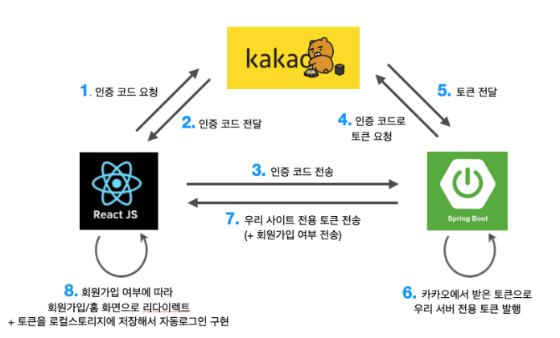

## UMC React Study 7주차
<br><br>

## 🤝리액트로 협업하기
> 회사에서 인수인계 받은 코드가 일반적이지 않고 이해하기 어렵다면?  

> 동료 개발자가 내 코드를 이해하는데 너무 오랜 시간이 소요된다고 불편함을 토로하면?

<br>  

위와 같은 문제들을 회사에 가서 협업을 본격적으로 하기 시작하면서 많이 발생한다. 협업을 위해 **코딩 컨벤션**에 익숙해지는 것이 중요하다.  
<br><br>  

### 코딩 컨벤션
> **코딩 컨벤션**(Coding Conventions)은 협업 시 유지보수 및 가독성, 코드 이해를 위해 지켜지는 개발자들 사이의 **규칙**을 의미한다.

<br>  

코딩 컨벤션은 규칙이기 때문에 지키지 않는다고 에러가 발생하지는 않는다. 팀 혹은 회사마다 각기 다양한 코딩 컨벤션들을 볼 수 있다.  

☘️ [뱅크샐러드 웹 코딩 컨벤션](https://github.com/banksalad/styleguide/tree/master/web)  
☘️ [카카오 개발자의 팀 코딩 컨벤션에 대한 고찰](https://velog.io/@dell_mond/Coding-Style-Guide-%EB%A5%BC-%EC%9E%91%EC%84%B1%ED%95%98%EB%A0%A4%EB%8A%94-%EC%A7%80%EA%B8%88-%EC%9A%B0%EB%A6%AC%EA%B0%80-%ED%95%B4%EC%95%BC-%ED%95%98%EB%8A%94-%EA%B1%B4-%EB%AC%B4%EC%97%87%EC%9D%BC%EA%B9%8C)  
☘️ [리액트 코딩 컨벤션 예시](https://3-stack.tistory.com/53)  
<br><br>  

### 소셜 로그인
  

1. **`FE`** : 인증코드 요청 및 받기
2. **`FE`** : 카카오 서버로부터 받은 인증 코드를 **`BE`**로 전달
3. **`BE`** : 인증 코드로 토큰 요청 및 받기
4. **`BE`** : 카카오 서버로부터 받은 토큰으로 앱 자체 토큰(JWT) 재발행하여 **`FE`**로 전달
5. **`FE`** : JWT에 따라 회원가입/로그인 여부 판별 후 페이지 전환

<br><br>  

### 이미지 업로드
프론트엔드에서 AWS S3, Firebase Storage 등 스토리지에 이미지 파일을 업로드하면, 스토리지 서비스는 **URL**을 리턴해준다. 해당 URL을 서버 API를 통해 전달해주면, 서버는 DB에 저장하는 구조이다.  

  

<br><br>

### 페이징 처리
### 🔵FE
> **무한 스크롤**(Infinite Scroll)은 로드해야 할 목록이 많은 페이지에서 사용자의 편의성과 **클라이언트**의 부담을 덜어주기 위한 아이템이다.  

어떤 요소가 화면에 노출되었는지를 감지하는 **Intersection Observer API**를 이용하여 무한 스크롤을 만들 수 있다.  


**설치**
```shell
npm install react-intersection-observer
```
<br>  

### 🔴BE
> **페이지네이션**(Pagenation)은 **서버**에서 클라이언트로 값을 전달할 때 일정 기준으로 분할하여 전달하는 것을 의미한다.  

무한 스크롤은 페이지네이션을 통해 구현된 것이며, 페이지네이션 방식은 크게 두 가지가 있다.  
- Offset Pagenation
- Cursor Pagenation  
<br><br>  

**references**  
👉 https://data-jj.tistory.com/53  
👉 https://codegear.tistory.com/8?category=968415  
👉 https://www.npmjs.com/package/react-intersection-observer  
👉 https://velog.io/@jce1407/React-%EB%AC%B4%ED%95%9C-%EC%8A%A4%ED%81%AC%EB%A1%A4-%EA%B5%AC%ED%98%84%ED%95%98%EA%B8%B0-with-Intersection-Observer  
👉 https://github.com/researchgate/react-intersection-observer  
👉 https://tape22.tistory.com/13
