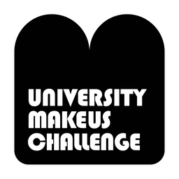
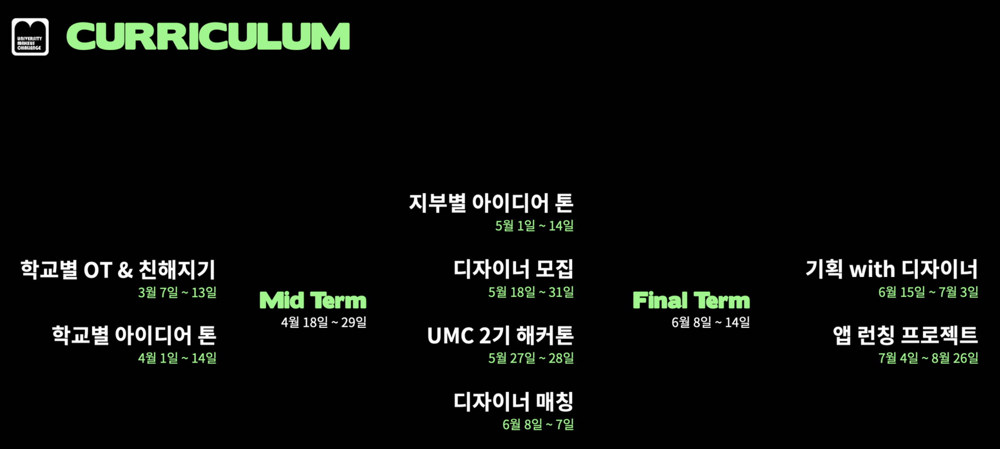
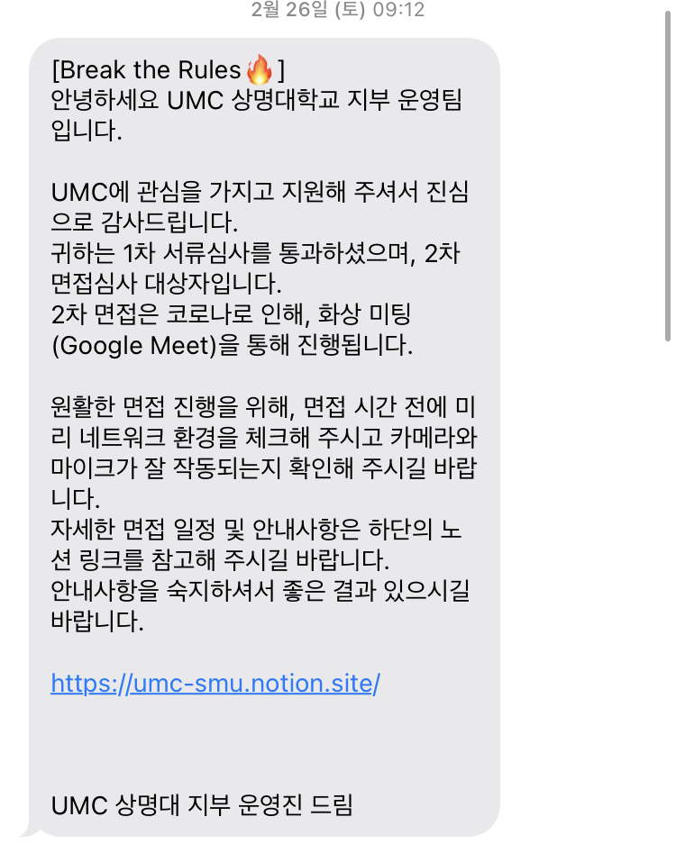
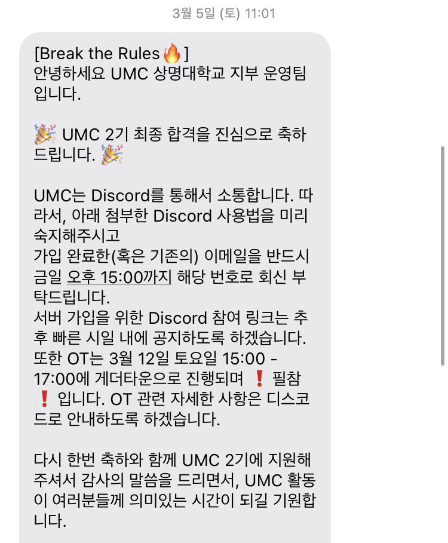
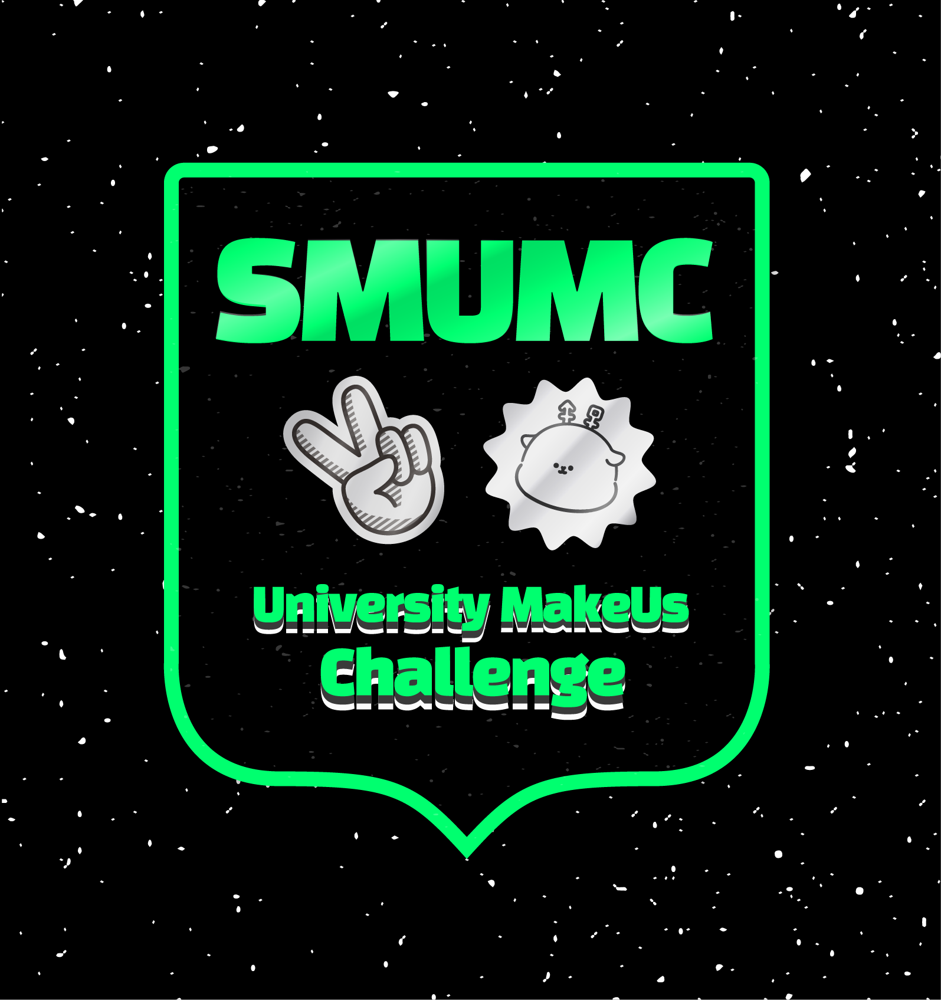

## UMC 2기 합격 후기
   

  

### UMC⭐️
👉**UMC 홈페이지**  https://makeus-challenge.oopy.io/umc

`UMC`는 University Makeus Challenge의 약자인 `대학생 연합 IT 동아리`이다. 디자이너, PM과 함께 협업하여 개발하고, 앱을 런칭하는 활동을 한다.  

스터디, 해커톤, 팀 프로젝트까지 모든 과정을 **6개월** 동안 진행한다. 자세한 커리큘럼은 사진에서 확인 가능👇  

  

### 지원 동기🙌
과 단톡방에 UMC 홍보가 올라온 것을 보고 바로 1기 서비스 랜딩 페이지를 구경했다. 1기는 우리 학교가 없기도 했고, 안드로이드 파트만 있었어서 조금 고민되긴 했지만 나에게 좋은 기회가 될 것 같아서 지원했다.  

작년에 교내 스터디를 하면서 협업을 조금이나마 경험해볼 수 있었는데, 그때 다른 사람들과 함께 개발하는 즐거움을 깨달아버렸다. 그래서 휴학한 동안 연합 동아리나 부트 캠프를 알아보고 있던 중이었는데 마침 운명처럼☄️ 나타난 UMC.  

**iOS**, **Android**, **Web**, **Node.js**, **Spring** 5개의 커리큘럼 중에 나는 `Web 파트`에 지원했고, 1차 자소서와 2차 면접을 모두 통과하고 최종 합격하여 동아리 활동을 할 수 있게 되었다.  
  

### 1차 자기소개서📝
자기소개서를 쓰는 건 항상 너무 어렵다. 특히 개발자로서의 나를 소개하는 것이 아직은 자신이 없어서인지 글이 쉽게 써지지는 않았다. 대단한 실력은 없지만 개발 열정과 협업에 진심인 사람이라는 것을 어필하자는 마음으로 썼다.  

나중에 찾아보니 학교마다 문항은 상이한 것 같았다. 우리 학교는 `지원 동기`, `협업 경험 및 갈등 해결`, `서비스 아이디어`, `열정적으로 해본 경험` 이렇게 4문항이었다. 4문항 모두 300~500글자 정도로 글자 수가 부담스럽지는 않았고, 아마 진솔하고 열정적인 마음을 가득 담아 써서 통과할 수 있지 않았을까 하는 생각을 했다.🙊

  
  

### 2차 면접💻
면접은 Google Meet로 진행되었고, 같은 커리큘럼에 지원한 사람들을 3~4명씩 묶어 n:m 형태의 면접을 봤다. 시간은 한 사람 당 10분 정도, 질문은 5~6개가 할당됐다.   

화상 면접은 처음이어서 그런지 많이 긴장됐고, 예상했었던 질문들이 거의 나오지 않아 많이 당황했다. 침착하게 대답하고 싶었지만 어버버 파티여서 면접이 끝나고 떨어졌구나 생각했다,,🥲  

면접을 잘 봤다고 생각하지는 않지만 그래도 나름대로 팁💡을 써보자면, `동아리 활동 의지`와 `협업을 할 자세가 되어있는지`에 대한 답을 준비해가면 도움이 될 것 같다. 개인 질문도 2~3가지가 있었는데, 1차에 제출한 자소서를 바탕으로 질문을 하니 자소서에 아무말을 쓰지 않는 것을 추천!  

  
  

### 합격🎉
학교마다 합격자 수가 상이한지는 모르겠지만, 우리 학교는 총 24명이 합격했는데 나중에 확인해보니 웹 파트는 2명..의 합격자가 전부였다. 그 두 명에 내가 있다는 사실에 놀라기도 하고 기쁘기도 하고,, 그 경쟁률 뚫고 합격한 만큼 더 열심히 해야겠다는 생각이 들었다.✨💪  

최종 합격을 하고 나면 디스코드 초대 링크를 보내준다. 디스코드에 입장한 후 OT까지 열심히 닉네임을 고민해서 참석하면 된다. OT는 3월 12일 토요일 게더타운으로 진행됐고, 2시간이 호다닥 지나갔다.  
    

### 이후 일정🗓
합격한지는 꽤 시간이 지났지만 이런 저런 시간들이 흘러 이제서야 쓰는 후기라서 벌써 오티와 1주차 스터디를 마친 상태이다. 깨알 자랑하자면 우리 팀이 제작한 로고가 학교 로고로 채택되었다. 🏆  

  

정말 하고 싶었던 동아리였던 만큼, 앞으로 10주간 팀원들과 스터디를 통해 열심히 공부할 예정이다.👊  
매주 공부한 내용도 블로그에 포스팅 할 예정이니 많관부!💙
