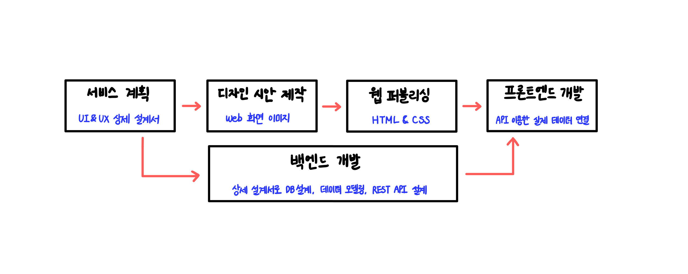
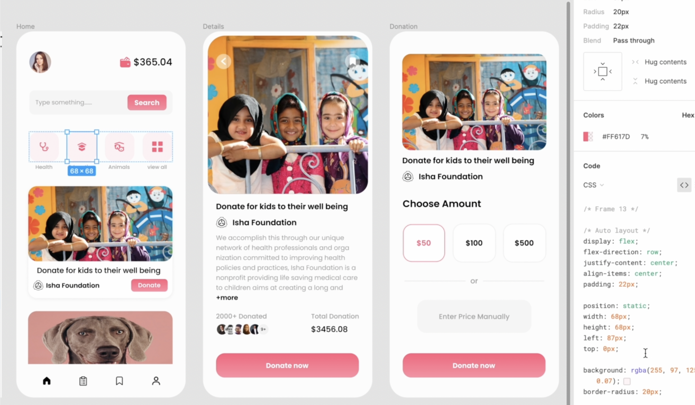
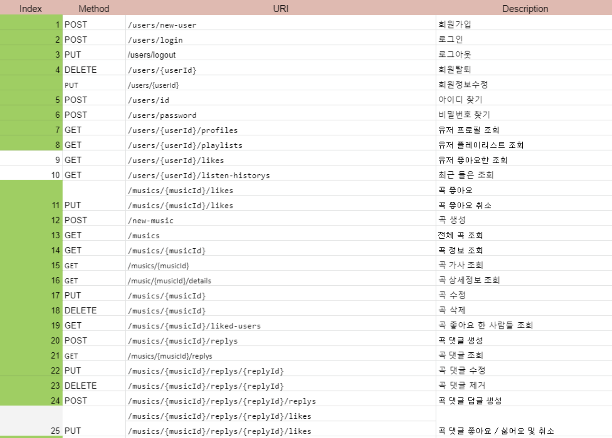
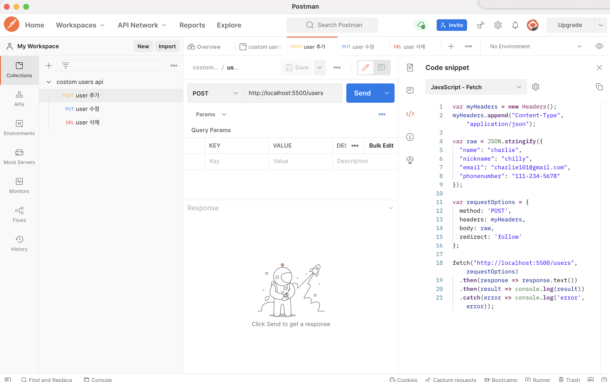
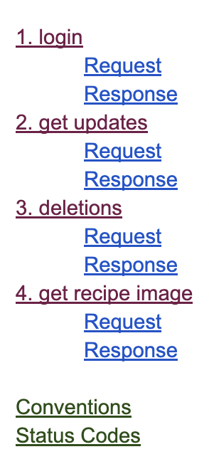
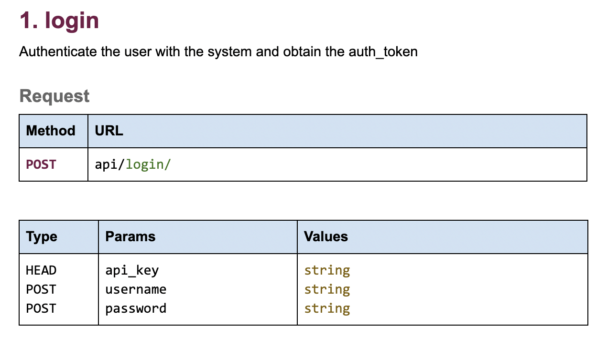
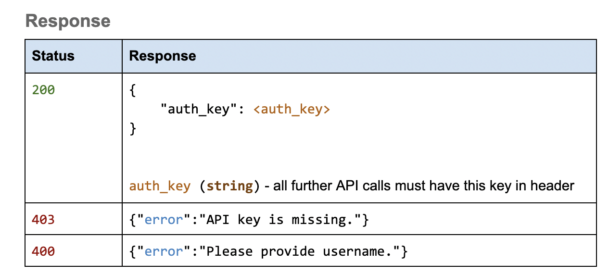
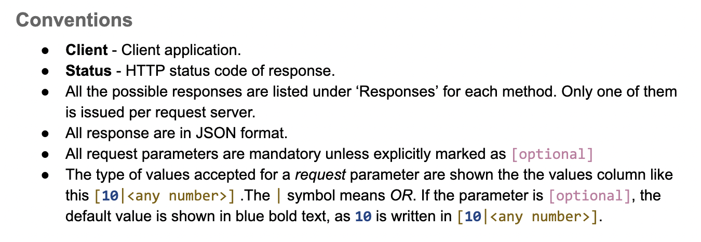
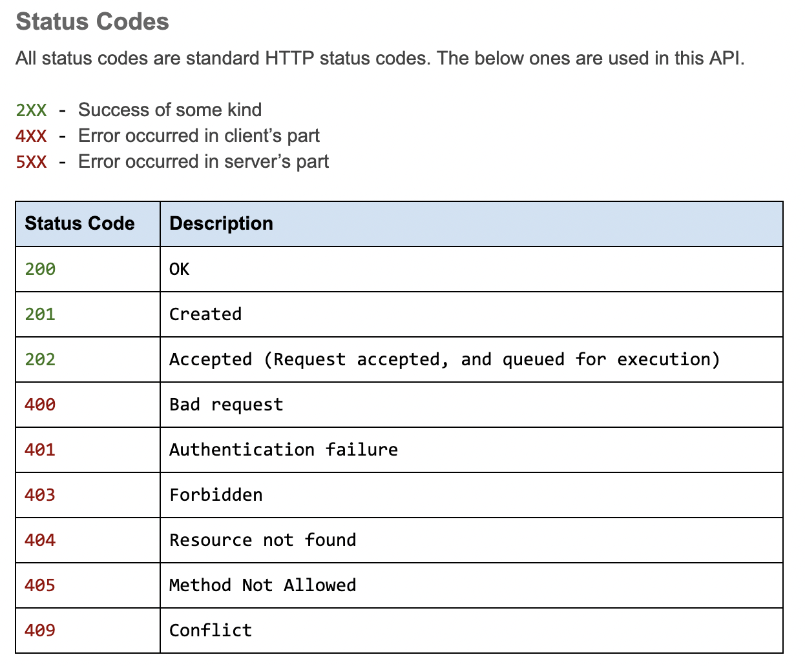

## UMC 10주차 워크북
  

### 서버와의 협업
- **협업**
  
    - `디자인 시안` → 개발 ( 프론트엔드 + 백엔드 )
    - 협업 시 어떤 `데이터`가 필요할지 회의 → 의견 취합, 적극 의견 제시
    - API 및 데이터 없이 프론트 개발을 시작해야 하는 경우 대부분 → 디자인 시안대로 `퍼블리싱`하는 것이 중요
    - API 명세서가 나올 때쯤 퍼블리싱 완료한 화면에 데이터 코드 작성  
    - 경청 및 수용, 의견 적극 제시, 책임감, 존중, 소통, 믿음, 역지사지•••  
    
  
- **퍼블리싱**  
: HTML, CSS을 위주로 **화면을 디자인대로 구현**하는 작업. 동적인 데이터가 들어가는 곳이라면 더미 데이터를 사용하여 구현.  
    

- **더미 데이터**  
: **가짜 데이터**. 간단하게 JSON 파일을 만들어서 최소한의 데이터를 만들어 놓은 것. 더미 데이터를 만들어 보는 과정을 통해 데이터에 대해 고민해보고, 백엔드와의 소통이 수월해질 수 있다.  
    

- **figma**  
  
**UI 디자인 툴**. 색상, 폰트 등 간략한 코드 및 정보 확인 가능(30% 정도 참고)  
    

- **api 명세서**  
  
**api 내용을 구체화한 것을 문서화**한 것이다. api 이름, 파라미터, 메서드, 반환 값 등의 정보를 담고 있다.  
    

- **postman**  
  
**api 테스팅 툴**. api response를 바로 확인할 수 있고, 여러 개의 api를 관리할 수 있다. fetch 등 request 옵션을 선택하여 작성된 코드를 가져다 쓸 수 있다.
     

### API 명세서 분석
- **api 명세서 구성**  
: 각 api별 요청&응답, 규정, 상태 코드
    

- **요청(request)**  
: 사용한 메서드, api URL, 파라미터 정보  

→ 로그인 api의 url은 ‘api/login’이고, post 메서드를 사용하여 새로운 데이터를 추가한다. 매개변수에는 api_key, username, password가 있으며 모두 string 타입의 값이다.  
    

- **응답(response)**
: 상태 코드, 예상 응답 값

→ 로그인 api가 성공했을 때(상태코드: 200) 예상 응답 값은 이렇고, 상태 코드별로 이런 오류일 때는 이러한 에러 메시지를 반환한다.  
    

- **규정(convention)**  
: 단어 정의 및 규칙/규정  
    

- **상태코드(status code)**  
: HTTP 상태 코드 의미 설명  

🛠분석자료 https://rebugged.com/web-service-api-specification-doc-template/
