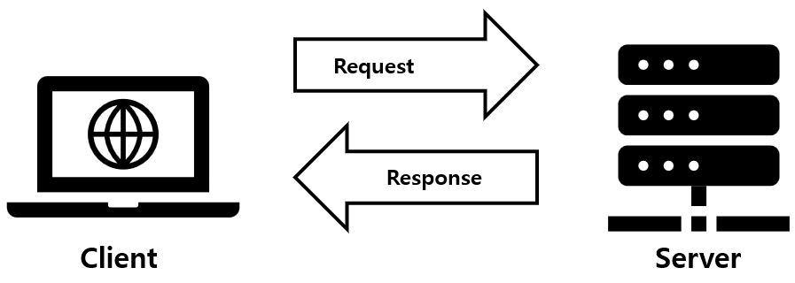
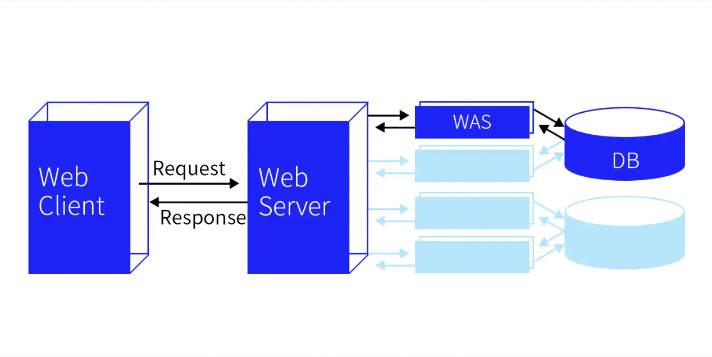
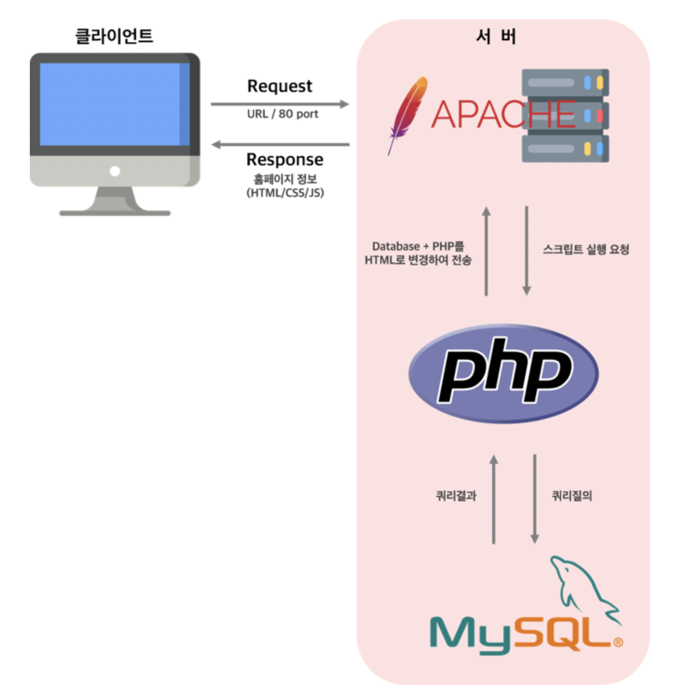
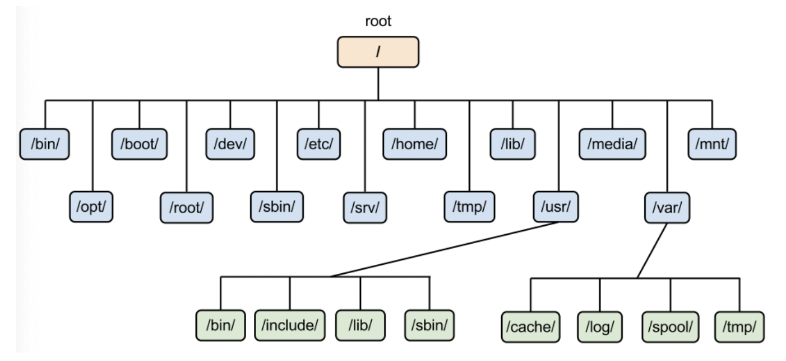
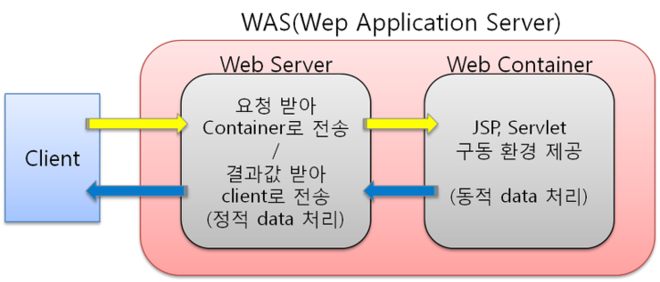

## UMC Server 워크북 1주차
<br>

**학습 목표**
> 서버의 **정의**와 **역할**을 이해한다.  

> 서버의 **구성 요소**와 각 **요소와의 관계**를 이해한다.  

> 서버가 **어떻게 구축**되는지 이해한다.  

> 서버와 **관련된 개념**들을 이해한다.  

<br>  

### 서버 & 서비스
> Server = Serve + -er : 서브하는 사람  

**`서버`**는  네트워크에서 다른 컴퓨터나 소프트웨어와 같은 클라이언트에게 **`서비스`**를 제공하는 컴퓨터를 의미한다.  
<br><br>  

### 클라이언트 & 서버 관계
**`클라이언트`**가 서버에 서비스를 **요청(request)**하면, **`서버`**는 클라이언트에게 **응답(response)**을 제공한다.  


<br><br>

### 서버의 동작 방식과 순서
  
1. `Client`: 서버에게 서비스 요청(request)
2. `Server`: 클라이언트 요청 전달
3. `Backend Language`: 데이터 가공
4. `Server`: 요청 처리 결과 반환
5. `Client`: 전달 받은 응답 출력  
<br><br>

### 서버의 구조
- **`Server Program`**: 클라이언트로부터 서비스 요청을 받아 리소스를 전달하는 프로그램이다.
  - 웹 서버(Web Server)
  > Apache, Nginx

<br>  

- **`Backend Language`**: 서버 개발을 위한 프로그래밍 언어이다.
  > PHP → Laravel , codeigniter  
  > ASP →  ASP.net  
  > JSP → Spring, Spring boot  
  > JS → Node.js  
  > Python → Django  

<br>  


- **`DB`**: DataBase는 여러 응용 시스템들의 통합된 정보를 저장하여 운영할 수 있는 공용 데이터들의 집합이다.  

<br>  

- **`DBMS`**: DataBase Management System은 DB를 저장하고 관리할 수 있는 기능들을 제공하는 프로그램이다.  
  - **SQL**: 관계형 데이터베이스로, 정해진 데이터 스키마에 따라 데이터베이스 테이블에 저장되며 관계를 통해서 연결된 여러 개의 테이블에 분산된다.
  > MySQL, MSSQL, Oracle   
  
  - **NOSQL**: 비관계형 테이버베이스로, 스키마와 관계가 존재하지 않아 구조가 다른 데이터를 같은 컬렉션에 추가할 수 있다.
  > MongoDB, Redis, Cassandra  

<br><br>

### APM
APM은 웹 서버 환경을 구축할 때 가장 많이 사용하는 `Apache`, `PHP`, `MySQL`을 의미한다.  

- **`Apache`**: 웹 서버  
- **`PHP`**: 웹 프로그래밍 언어  
- **`MySQL`**: 데이터베이스 서버  

  
<br><br>  

### 로컬 호스트
**`로컬 호스트`**(localhost)는 컴퓨터 네트워크에서 사용하는 loop-back 호스트명으로, 자신의 컴퓨터를 의미한다. IPv4에서 IP주소는 **127.0.0.1**이다.   

<br><br>

### 가상 머신
**`가상 머신`**(Vurtual Machine)은 물리적으로 존재하는 컴퓨터가 아닌, 다른 컴퓨터가 만들어내는 가상의 컴퓨터를 말한다.  
<br><br>  

### 리눅스
**`리눅스`**(Linux)는 Unix 기반의 오픈 소스 운영체제이다.  
<br>  

- **Ubuntu**  
**`우분투`**(Ubuntu)는 리눅스 배포판을 의미한다.  
<br>  

- **명령어**

  | 명령어   | 설명              |
  |-------|-----------------|
  | cd    | 경로 이동           |
  | ls    | 디렉토로 목록 확인      |
  | cp    | 파일/디렉토리 복사      |
  | mv    | 파일/디렉토리 이동      |
  | mkdir | 디렉토리 생성         |
  | rm    | 파일/디렉토리 삭제      |
  | cat   | 파일 내용 출력 및 덧붙이기 |
  | find  | 파일/디렉토리 검색      |
<br>  

- **디렉토리 구조**
  
리눅스에서는 디렉토리들을 파일을 효율적으로 관리하기 위해 계층적 **트리 구조**로 구성되어 있다. 디렉토리는 최상위 디렉토리인 **루트**를 시작으로 하위 디렉토리로 나누어지고 각 디렉토리에 파일들이 저장된다.  
<br>

- **편집기 사용법**  

  **편집기 열기**
```shell
vi FileName
```
<br>  

  **입력모드 전환**

  | 명령어 | 설명                  |
  |-----|---------------------|
  | i   | 현재 커서 앞에 입력         |
  | a   | 현재 커서 뒤에 입력         |
  | o   | 커서가 위치한 행의 다음 행에 입력 |
<br>  

  **파일 저장 및 종료**  
  
  | 명령어  | 설명                |
  |------|-------------------|
  | :q   | 작업 내용이 없을 때 종료    |
  | :q!  | 작업 내용을 저장하지 않고 종료 |
  | :w   | 작업한 내용을 저장        |
  | :wq! | 작업한 내용을 저장하고 종료   |
<br><br>

### WS & WAS
- **`Web Server`**: HTTP 요청을 받아 HTML, CSS, JavaScript, Image 등 서버에 저장되어 있는 파일인 **정적 데이터**를 제공하는 서버 프로그램이다.
> Apache, Nginx  

<br>

- **`Web Application Server`**: 사용자의 요청에 따라 DB, 서버 내에서 동적으로 생성되는 **동적 데이터**를 반환하는 서버 프로그램이다.
> Tomcat, uWSGI  

<br>  

  
<br><br>

### 운영체제
**`운영체제`**(OS)는 사용자의 하드웨어, 시스템 리소스를 제어하고 프로그램에 대한 일반적 서비스를 지원하는 시스템 소프트웨어이다.  
- **Window**: MS가 개발한 운영체제로 현재 가장 많은 사람들이 사용하고 있으며, 그래픽 아이콘으로 편리하게 작업을 수행할 수 있다.
- **MAC OS**: Apple이 개발한 운영체제로, 뛰어난 보안성과 개발에 유리한 Unix 기반이 장점이다.  
<br><br>

### GUI & CLI
- **`GUI`(Graphic User Interface)**: 사용자가 **그래픽**을 통해 시스템과 상호 작용하는 것을 의미한다.
<br>  

- **`CLI`(Command Line Interface)**: 사용자가 **명령어**를 통해 시스템과 상호 작용하는 것을 의미한다.  
> Window - cmd  
> Linux - terminal  

<br><br>

### HTTP
> HTTP = HyperText Transfer Protocol

**`HTTP`**는 클라이언트와 서버 간의 데이터 통신 규약을 의미한다.
- **HTTP 메서드**
  - `GET` - 조회
  - `POST` - 생성
  - `PUT` - 수정
  - `PATCH` - 일부 수정
  - `DELETE` - 삭제  
<br><br>  

### 패키지 설치 & 컴파일 설치
- **`패키지 설치`**: apt같은 **패키지 매니저**를 통해 의존성 프로그램과 함께 간단하게 설치하는 것을 의미한다.  
- **`컴파일 설치`**: **소스 코드**로 직접 설치하는 것을 의미하며, 설정을 커스터마이징 할 수 있다.
<br><br>  

**references**  
👉 https://server-talk.tistory.com/291   
👉 https://siyoon210.tistory.com/130  
👉 https://coding-factory.tistory.com/499  
👉 https://velog.io/@jiyoonoh-dev/APM%EC%9D%B4%EB%9E%80  
👉 https://about-tech.tistory.com/entry/Programming-%EC%9B%B9%EC%84%9C%EB%B2%84Web%EC%99%80-%EC%9B%B9-%EC%96%B4%ED%94%8C%EB%A6%AC%EC%BC%80%EC%9D%B4%EC%85%98-%EC%84%9C%EB%B2%84WAS-%EC%B0%A8%EC%9D%B4%EC%A0%90-The-difference-between-Web-Server-and-Web-Application-Server

 