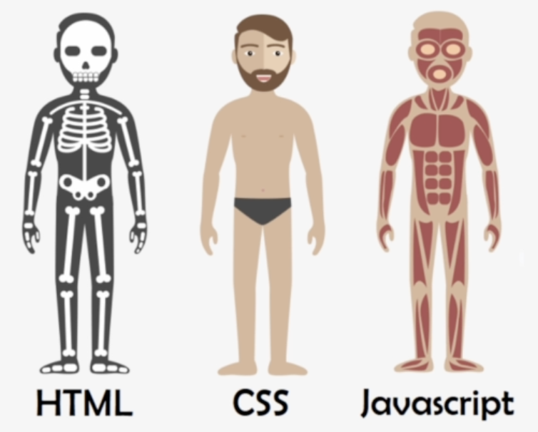

## UMC 1주차 워크북
<br>

### Web
- **웹이란 무엇일까?**  
`웹`이란 `World Wide Web`의 줄임말으로서, 인터넷에 연결된 사용자들이 서로의 정보를 공유할 수 있는 공간을 의미한다. 인터넷 서비스의 일종이며, 전 세계적으로 많은 정보들이 오가는 공간이다.  

- **웹의 역사**    
웹은 아이디어를 주고 받을 때 공통된 공간에 각자의 정보를 올리고 관리할 수 있는 정보 관리 시스템에서 시작되었으며, 1989년 팀 버스너리가 발명하였다.  
<br><br>  

### Web의 특징
웹은 인터넷 상에서 텍스트, 이미지, 비디오 등 멀티미디어 정보를 **하이텍스트 방식으로 연결**하여 제공한다. `하이퍼텍스트`란, 문서 내부에 또 다른 문서로 연결되도록 하는 `하이퍼링크`(다른 문서에 관한 참조 정보)를 사용하여 여러 문서를 연결하는 기술이다.  
<br><br>  

### HTML
- **tag**  
`태그`란 **정보를 정의 하는 형식**을 의미한다. plain text에 **의미를 부여**하기 위해 사용되며, 태그마다 지원하는 다양한 속성을 사용할 수 있다. 태그는 `opening tag`와 `closing tag`가 세트로 구성되어있으며, 닫는 태그가 없는 `self-closing tag`도 있다.  
```html
<p>Hello, World!</p>  <!-- opening tag & closing tag -->
<a href="https://www.youtube.com"/>  <!-- self-closing tag -->
```  
<br>

- **dom**  
`dom`은 `Document Object Model`의 줄임말으로서, **HTML 문서에 접근하기 위한 인터페이스**이다. dom은 **웹 페이지의 객체 지향 표현**이며, 자바스크립트와 같은 스크립팅 언어를 이용해 콘텐츠를 추가, 수정, 삭제하거나 이벤트를 처리할 수 있도록 한다.

dom은 `트리` 형태의 **계층적 자료구조**를 가지며, dom을 구성하는 요소로는 요소노드, 텍스트노드, 속성노드 등이 있다. 요소 노드는 body, p, ul 같은 일반적인 태그를 말하고, 텍스트 노드는 요소 노드 안에 들어있는 텍스트들을 말한다.  
<br><br>  

### HTML의 역할
  

`html`은 `Hyper Text Markup Language`의 줄임말으로, **뼈대를 설계하는 역할**을 한다. 웹 문서를 만들기 위해 태그를 이용하여 구조와 의미를 부여하는 언어이다. **웹의 구조를 구축**하는 역할을 한다.  
<br><br>  

### HTML 태그
html에는 무수히 많은 태그들이 있지만, 그중 중요하다고 생각하거나 자주 사용되는 태그들을 정리해보았다.  

| 태그      | 설명                                                                                                    |
|---------|-------------------------------------------------------------------------------------------------------|
| head    | 기계가 식별할 수 있는 문서 정보(메타데이터)를 담는다. 정보로는 문서가 사용할 제목, 스크립트, 스타일 시트 등이 있다.                                  |
| body    | HTML 문서의 내용을 나타낸다. 한 문서에 하나의 <body> 요소만 존재할 수 있다.                                                     |
| title   | 브라우저의 제목 표시줄이나 페이지 탭에 보이는 문서 제목을 정의한다.                                                                |
| hr      | 이야기 장면 전환, 구획 내 주제 변경 등, 문단 레벨 요소에서 주제의 분리를 나타낸다.                                                     |
| form    | 정보를 제출하기 위한 대화형 컨트롤을 포함하는 문서 구획을 나타낸다.                                                                |
| input   | 웹 기반 양식에서 사용자의 데이터를 받을 수 있는 대화형 컨트롤을 생성한다.                                                            |
| style   | 문서나 문서 일부에 대한 스타일 정보를 포함한다.                                                                           |
| header  | 소개 및 탐색에 도움을 주는 콘텐츠를 나타낸다. 제목, 로고, 검색 폼, 작성자 이름 등의 요소도 포함할 수 있다.                                      |
| h1 ~ h6 | 6단계의 구획 제목을 나타낸다. 구획 단계는 `<h1>`이 가장 높고, `<h6>`은 가장 낮다.                                                |
| div     | 플로우 콘텐츠를 위한 통용 컨테이너이다. CSS로 꾸미기 전에는 콘텐츠나 레이아웃에 어떤 영향도 주지 않는다.                                         |
| p       | 하나의 문단을 나타낸다.                                                                                         |
| span    | 구문 콘텐츠를 위한 통용 인라인 컨테이너로, 본질적으로는 아무것도 나타내지 않는다. 스타일을 적용하기 위해서, 또는 어떤 특성의 값을 서로 공유하는 요소를 묶을 때 사용할 수 있다. |
| br      | 텍스트 안에 줄바꿈을 생성한다. 줄의 구분이 중요한 내용을 작성할 때 유용하다.                                                          |
| ul      | 정렬되지 않은 목록을 나타낸다. 보통 불릿으로 표현한다.                                                                       |
| ol      | 정렬된 목록을 나타낸다. 보통 숫자 목록으로 표현한다.                                                                        |
| li      | 목록의 항목을 나타낸다.                                                                                         |
| img     | 문서에 이미지를 넣는다.                                                                                         |
| button  | 클릭 가능한 버튼을 나타낸다. 버튼은 양식 내부는 물론 간단한 표준 버튼 기능이 필요한 곳이라면 문서 어디에나 배치할 수 있다.                               |
➕더 많은 태그 살펴 보기 → https://developer.mozilla.org/ko/docs/Web/HTML/Element