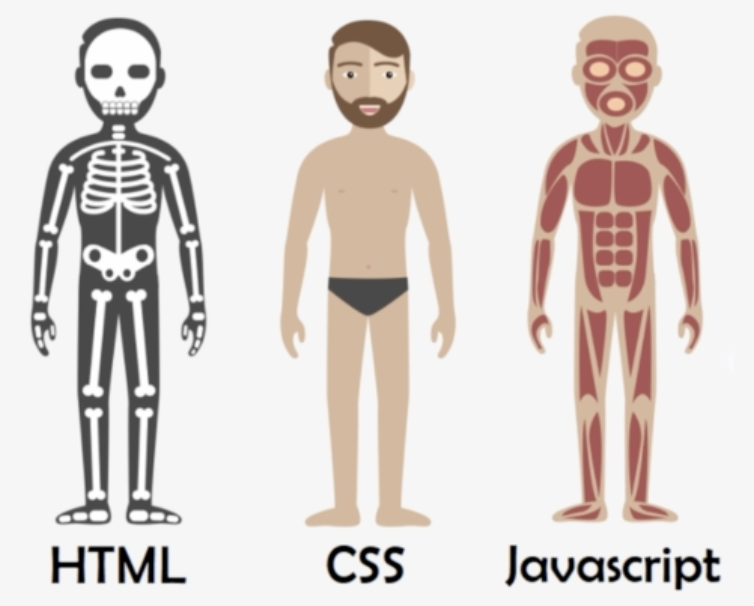
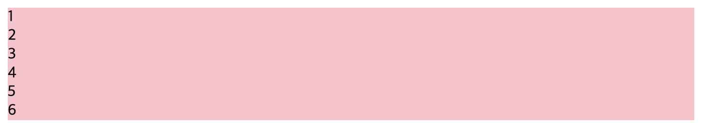
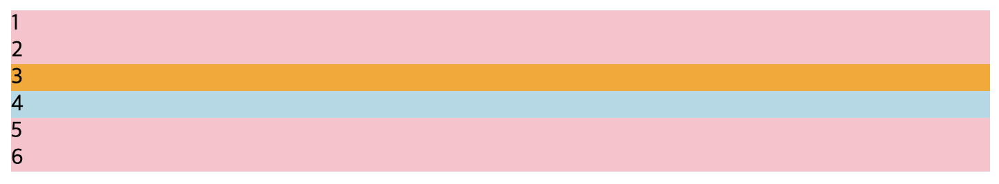
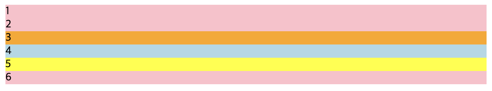
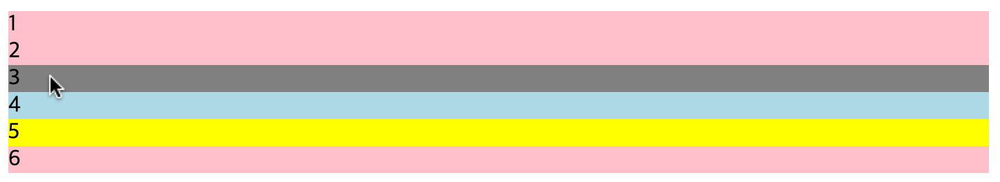
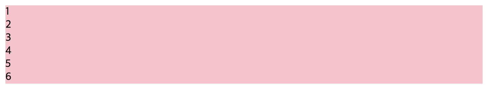

## UMC 2주차 워크북(1)
<br>

### CSS
  

html이 뼈대 역할을 했다면, `css`는 살(외관)의 역할이라고 할 수 있다. `Cascading Style Sheets`의 줄임말로, 사용자에게 문서를 표시하는 방법을 지정하는 언어이다. 기본 텍스트 문서를 **꾸며주는 역할**을 한다.  

html에서 외부 요소와 연결하는 `link`를 사용하여 css를 외부 파일로 만든 후에 html과 연결할 수 있다.  
```html
<link rel=’연결하고자 하는 파일과의 관계’ href=’파일 위치’>
<link rel=’stylesheet’ href=’./style.css’>
```  

<br><br>

### CSS 선택자
CSS의 문법은 다음과 같다. `선택자`는 **html 요소 선택**하는 역할을 한다. 
```css
/* css 문법 */
선택자 { css속성 : value; } 
```
<br>  

- **태그** : `태그 전체`를 선택한다.
```html
<div>1</div>
<div>2</div>
<div>3</div>
<div>4</div>
<div>5</div>
<div>6</div>
```
```css
div {
	  background-color: pink;
}
```
  
<br>

- **클래스** : 태그와 상관없이 동일한 스타일을 `여러 요소`에 주고 싶을 때 사용한다. 하나의 요소에 여러 개의 클래스를 사용할 수 있고(공백으로 구분), 중복일 경우 위에서 순차적으로 실행되기 때문에 마지막에 실행되는 코드로 적용된다. [ 예시: 영희 = 학생, 알바생, 안경 쓴 사람 ]
```html
<div class="orange lightblue">3</div>
<div class="lightblue">4</div>
```
```css
.lightblue {
	  background-color: lightblue;
}
.orange {
      background-color: orange; /* 순차적으로 실행 */
}
```
  
<br>

- **id** : 클래스는 동일한 클래스 이름을 여러 요소에 사용할 수 있었지만, id는 동일한 id 값을 가진 id가 있으면 안 되고 `하나의 요소`에만 사용해야 한다. 하나의 요소가 여러 id를 가질 수 없다. [ 예시: 영희 = 주민번호(다른 사람과 같지 않은 고유한 값이며 여러 개일 수 없다.) ]
```html
<!-- 동일한 id 값 - X -->
<div id="green">1</div>
<div id="green">2</div>
<!-- 하나의 요소 여러 id 값 - X -->
<div id="red blue">6</div>
```
```html
<div id="yellow">5</div>
```
```css
#yellow {
	  background-color: yellow;
}	
```

<br>

- **가상 선택자** : 일반 선택자로 사용할 수 없을 때 사용한다. 주로 `특정 상태`를 선택 할 때 사용한다.
  - `nth-child(n)` : tag의 n번째 자식 선택
  - `active` : 마우스로 누르고 있는 상태
  - `focus` : 클릭을 했을 때 포커스가 유지되는 상태
  - `hover` : 마우스를 올린 상태
```css
div:hover {
	      background-color: grey;
}	
```
  
<br> 

❗️주의사항  
**모든 태그 선택**은 `*`이며, **선택자가 중복될 경우에는 범위가 좁은 것이 우선순위가 높다**.    

**`important`** > **`id`** > **`class`** = **`가상 선택자`** > **`tag`**  
```html
<div >1</div>
<div >2</div>
<div class="orange lightblue">3</div> 
<div class="lightblue">4</div>
<div id="yellow">5</div> 
<div >6</div>
```
```css
/* 중복되는 다른 선택자의 background-color를 다른 색으로 설정해도,
  important로 인해 덮어쓰이기 때문에 주의해서 사용해야 한다. */
div {
  background-color: pink !important; /*우선순위가 가장 높은 important*/
  }
.lightblue {
  background-color: lightblue;
}
.orange {
  background-color: orange; 
}
#yellow {
  background-color: yellow;
}
div:hover {
  background-color: grey;
}
```
