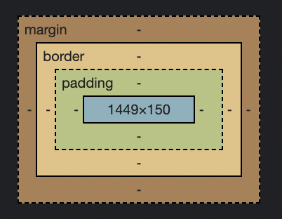
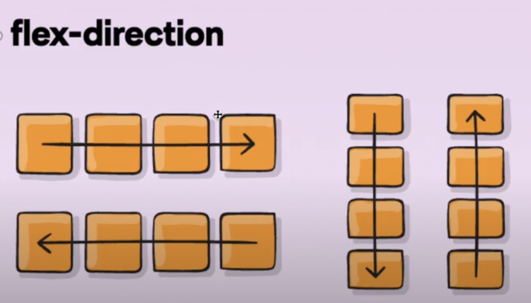
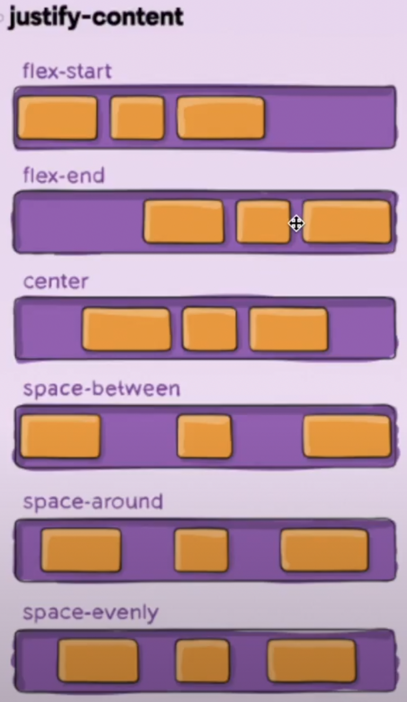
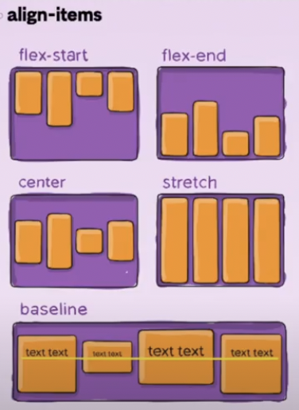
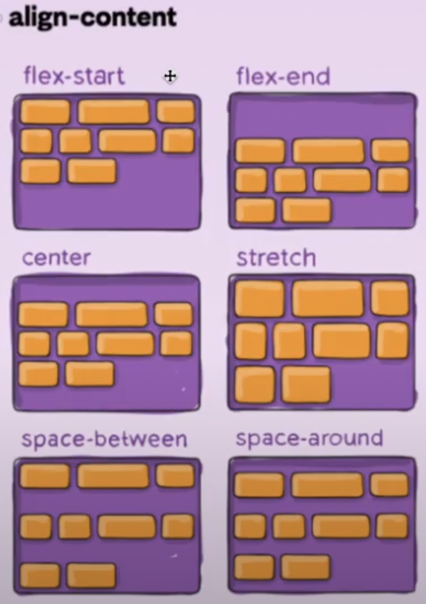

## UMC 2주차 워크북(2)
<br>

### CSS 속성(property)
태그는 컨텐츠 크기와 상관 없이 한 줄을 차지하는 태그인  `block` 요소와 컨텐츠 크기만큼 차지하는 태그인 `inline` 요소가 있다. 너비와 높이를 지정해주는 width, height 속성은 **block** 요소만 사용 가능하다. **inline** 요소는 적용해도 변화가 없다. 이런 특성을 변경해주는 속성이 `display`이다.
- **block tag** : p, div, ul, li, h1-h6
- **inline tag** : span, a, img, button  
<br>  

- **`display`**
  - `none` : 요소를 사라지게 한다.
  - `inline` : block 요소를 inline 요소처럼 사용한다.
  - `block` : inline 요소를 block 요소처럼 사용한다.
  - `inline-block` : inline과 block이 합쳐진 것으로, inline처럼 한 줄에 여러 요소들을 둘 수 있고 block처럼 width와 height를 지정할 수 있다.  
<br><br>  

  

- **`border`** : 요소의 **테두리**를 설정한다. `border-width`, `border-style`, `border-color` 값을 설정한다. (순서대로 작성 시 너비, 스타일, 색 순서로 작성)  
```css
border: 5px solid blue; 
```

- **`padding`** : 요소의 네 방향 **안쪽 여백 영역**을 설정한다. `padding-top`, `padding-right`, `padding-bottom`, `padding-left`가 있다. (순서대로 작성 시 시계방향으로 작성 - 위, 오른쪽, 아래, 왼쪽)  
```css
padding: 5px 0 10px 2em;
```  

- **`margin`** : 요소의 네 방향 바깥 여백 영역을 설정한다. `margin-top`, `margin-right`, `margin-bottom`, `margin-left`가 있다. (순서대로 작성 시 시계방향으로 작성 - 위, 오른쪽, 아래, 왼쪽)  
```css
margin: 3px 1px 0 1.5em;
```   
<br><br>  

- **`box-sizing`**
  - `content box` : 기본 값으로, content box 자체.
  - `border box` : content, padding, border를 포함하는 box.
```css
p {
          width: 100px;
          height: 100px;
          box-sizing: border-box;
}
```  
<br><br>  

- **`단위`**
  - `px` : 절대 단위
  - `%` : 상대 단위 (주로 width, height)
  - `em` : 상대 단위, 부모 요소를 기준으로 하는 단위 (주로 font, padding, margin)
  - `rem` : 상대 단위, root 요소(html)를 기준으로 하는 단위
```css
div span { /* 부모 자식 */
          font-size: 1.2em;
}
```   
❗️반응형 웹 → 디바이스 크기가 다양해지면서 화면 크기에 맞게 반응하는 것이 중요. 상대 단위 및 크기 중요.  
<br><br>  

- **`reset css`** : 브라우저별로 다른 패딩, 마진 등의 스타일링을 제거해주기 위한 코드.  
→ [https://meyerweb.com/eric/tools/css/reset/](https://meyerweb.com/eric/tools/css/reset/)  
<br><br>  

### css 플렉스박스(flexbox) 
- **`flex container`** : 부모 요소
- **`flex item`** : 자식 요소
- **`main axis`** : 메인 축. 수평일 수도 있고 수직일 수도 있다.(방향이 고정되어 있지 않음)
- **`cross axis`** : 메인 축이 수평, 수직이냐에 따라 메인 축의 반대 축이 된다.
  - **display: flex**를 사용하면 miain axis의 방향에 따라 정렬된다(기본 flex-direction은 row)  


<br>  

- **`justify-content`** : **main axis** 정렬하는 속성
  - `flex-start` : **기본 값**. 시작점에 붙여서 정렬
  - `flex-end` : 끝점에 붙여서 정렬
  - `center` : 가운데 정렬
  - `space-between` : 아이템 사이 공백 일정하게 정렬 (패딩이 있을 때는 아이템 양 끝에 공백이 생길 수도 있으니 이럴 때는 꼭 개발자 도구를 켜서 확인해야 함)
  - `space-around` : 아이템 사이 공백 1, 아이템 양 끝 0.5 비율로 정렬
  - `space-evenly` : 아이템 양 끝과 아이템 사이 공백 일정하게 정렬  

  
<br>  

- **`align-items`** : **cross axis** 정렬하는 속성
  - `flex-start` : 시작점에 붙여서 정렬
  - `flex-end` : 끝점에 붙여서 정렬
  - `center` : 가운데 정렬
  - `stretch` : **기본 값**. 부모 요소의 크기만큼 차지
  - `baseline` :  텍스트를 기준으로 정렬  

  
<br>  

- **`flex-grow`** : 화면이 커져 남는 공간을 일정 비율로 나눠 갖는 속성(기본값: 0)  
```html
<div class='flex-container'>
      <div class='flex-item'>1</div>
      <div class='flex-item'>2</div>
      <div class='flex-item'>3</div>
      <div class='flex-item'>4</div>
      <div class='flex-item'>5</div>
      <div class='flex-item'>6</div>
      <div class='flex-item'>7</div>
      <div class='flex-item'>8</div>
      <div class='flex-item'>9</div>
      <div class='flex-item'>10</div>
</div>
```
```css
 /* 1200 - 1000 = 200 */
.flex-item:nth-child(4) {
      flex-grow: 3; /* 1000/10 + 200 * 3/5 = 220 */
}
.flex-item:nth-child(5) {
      flex-grow: 2; /* 1000/10 + 200 * 2/5 = 180 */
}
```
- **`flex-shrink`** : 화면이 작아져 부족한 공간을 일정 비율로 나눠 갖는 속성(기본값: 1)  
```css
/* 1000 - 870 = 130 */
.flex-item:nth-child(4) {
      flex-grow: 3; /* 1000/10 - 130 * 3/13 = 70 */
}
.flex-item:nth-child(5) {
      flex-grow: 2; /* 1000/10 - 130 * 2/13 = 80 */
}
/* 나머지 item -> 1000/10 - 130 * 1/13 = 90 */
```
- **`flex-basis`** : width가 없을 때 width를 대신해서 grow와 shrink를 계산할 때 시작점이 되는 속성
- **`flex-wrap`** : 부모 태그에 작성하는 태그
  - `wrap` : 요소가 크기를 초과했을 때 다음 줄로 넘어가는 속성(시작점에서 끝점으로 정렬)
  - `wrap-reverse` : 요소가 크기를 초과했을 때 다음 줄로 넘어가는 속성(끝점에서 시작점으로 정렬)  
<br><br>  
  
- **`align-content`** : flex-wrap 속성이 **wrap**일 때만 사용 가능  

  
<br><br>  

### CSS 포지션(position)
- **`static`** : 기본 값.
- **`relative`** : **static을 기준**으로 위치를 정렬.  
  -> **z-index**를 음수로 주면 뒤로 들어가서 보이지 않는다.(기본값은 0) 양수일 경우 숫자가 클수록 위로 겹쳐보인다.
- **`absolute`** : static이 아닌 다른 포지션 값을 가진 **부모를 기준**으로 한다. 상위 태그 중 static이 없을 시 root 요소인 body가 기준.  
  -> 부모 요소에 relative를 사용하고 자식 요소에 absolute를 사용하는 경우가 많다.
- **`sticky`** : 스크롤을 사용할 때 주로 사용하는 값. 지정해준 **속성 값을 기준**으로 기준을 충족하는 시점부터 고정된다.
- **`fixed`** : 스크롤을 사용할 때 주로 사용하는 값. **화면 전체가 기준**으로 항상 그 위치에 고정된다.  

➕더 많은 속성 살펴 보기 → https://developer.mozilla.org/ko/docs/Web/CSS