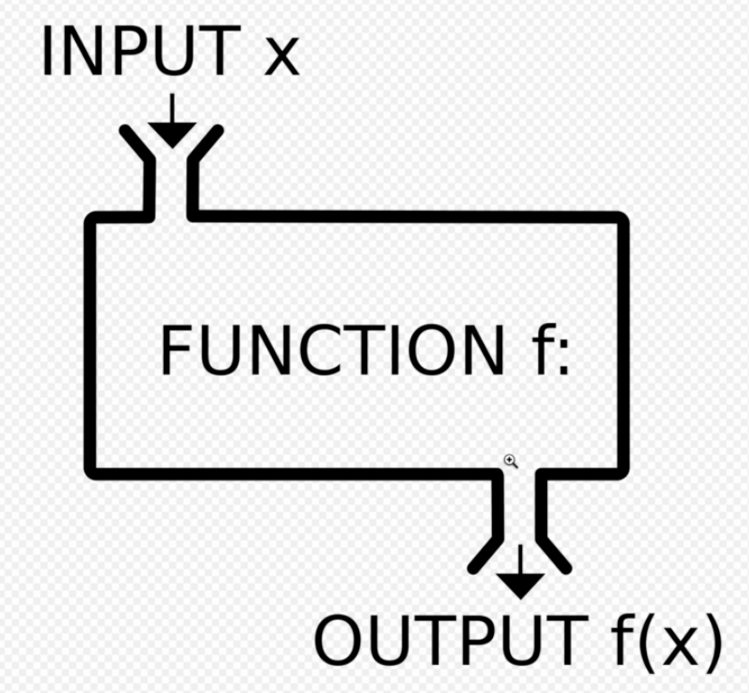

## UMC 3주차 워크북
<br>

### 변수(Variable)  
- **`변수`** : 데이터를 저장하는 상자
  - `const` : 변하지 않는 데이터 값 넣을 때 사용. 한 번 값을 할당하면 재할당 할 수 없다.
  - `let` : 데이터 값이 변할 때 사용.
  - **선언** : 변수를 정의하는 것  
  ```javascript
  let str;
  ```
  - **초기화** : 정의한 변수에 넣는 첫 번째 값
  ```javascript
  let str = '자바스크립트';   
  ```
  - **재할당** : 이미 값이 존재하는 변수에 다시 값을 넣는 것
  ```javascript
  let num = 3;
  num = 10;
  ```
<br><br>  

### 자료형(Data type)
- **`string`** : 문자열
- **`number`** : 숫자
- **`bigInt`** : 큰 값의 숫자
- **`boolean`** : true, false
- **`symbol`** : 중복되지 않는 고유값
- **`null`** : 비어있는 값. 수동적으로(의도적으로) 값이 없음을 나타낸다.
- **`undefined`** : 비어있는 값. 자동적으로 값이 없음을 나타낸다.
- **`object`** : 함수, 배열, 객체  
<br><br>

### 연산자(Operator)
- **`산술 연산자`** : +, -, /, *, %, **, ++, --
- **`할당(대입) 연산자`** : =
- **`문자열 연산자`** : +, +=
- **`비교 연산자`** : ==, ===(데이터 타입까지 비교), !=, !==, >, <, >=, <=
```javascript
1 == '1' // true
1 === '1' // false
null != undefined // false
null !== undefined // true
```
- **`논리 연산자`** :
  - `&&` : 조건 중 하나라도 false이면 **false**
  - `||` : 두 개의 조건이 모두 false여야 **false**
  - `!` : 반대(부정)  
<br><br>  

### 배열(Array)
- **`배열`** : 연관성 있는 값들의 리스트
  - **선언 및 초기화**
  ```javascript
  // 1. []
  const travel_spot = ['방콕', '뉴욕', '파리'];
  ```
  ```javascript
  // 2. new Array()
  const travel_spot = new Array('방콕', '뉴욕', '파리');
  ```
  ```javascript
  // 3. 빈 배열에 index 이용해서 하나씩 추가
  const travel_spot = new Array();
  travel_spot[0] = "방콕";
  travel_spot[1] = "뉴욕";
  travel_spot[2] = "파리";
  ```
  - **접근**
  ```javascript
  const paris = travel_spot[2];
  console.log(paris); // "파리"
  ```
  - **추가 및 삭제**
      - `push` : 뒤에 원소 추가
    ```javascript
    travel_spot.push("토론토", "퀘백");
    console.log(travel_spot); // ["방콕", "뉴욕", "파리", "토론토", "퀘백"]
    ```
      - `unshift` : 앞에 원소 추가
    ```javascript
    travel_spot.unshift("바르셀로나");
    console.log(travel_spot); // ["바르셀로나", "방콕", "뉴욕", "파리", "토론토", "퀘백"]
    ```
      - `splice` : 원하는 지접에 추가 및 삭제 (시작 index, 삭제하고 싶은 원소의 개수, 추가하고 싶은 원소들)
    ```javascript
    travel_spot.splice(4, 0, "멜버른", "아테네");
    console.log(travel_spot); // ["바르셀로나", "방콕", "뉴욕", "파리", "멜버른", "아테네", "토론토", "퀘백"]
    const result = travel_spot.splice(3, 3);
    console.log(travel_spot, result); // ['바르셀로나', '방콕', '뉴욕', '토론토', '퀘백'], ['파리', '멜버른', '아테네']
    travel_spot.splice(1, 1, "이스탄불", "하노이");
    console.log(travel_spot); //  ['바르셀로나', '이스탄불', '하노이', '뉴욕', '토론토', '퀘백']
    ```
      - `pop` : 뒤에서 원소 삭제
    ```javascript
    const result1 = travel_spot.pop();
    console.log(travel_spot, result1); // ['바르셀로나', '이스탄불', '하노이', '뉴욕', '토론토'], "퀘백"
    ```
      - `shift` : 앞에서 원소 삭제  
    ```javascript
    const result2 = travel_spot.shift();
    console.log(travel_spot, result2); // ['이스탄불', '하노이', '뉴욕', '토론토'], "바르셀로나"
    ```  
<br><br>  

### 객체(Object)
- **`객체`** : key - value 형태로 저장하는 값
  - `property` : 객체 내의 데이터
  - `method` : 객체 내의 함수  
  ❗️key 값에 특수 문자나 공백이 있을 경우에는 문자열의 형태(””)로 작성해야 한다.
  - **생성**
  ```javascript
  // 1. 객체 생성
  const pooh = {
          name: "pooh",
          species: "bear",
          job: "disney character",
          gender: "boy",
          "say-Hi": function () {
             console.log("I'm winnie the pooh, What's your name?");
          },
  };
  ```
  ```javascript
  // 2. 빈 객체 생성 후 값 추가
  const obj = new Object(); // 생성자 함수
  console.log(obj); // {}
  obj.name = 'dwell';
  obj.greeting = function() {
          console.log('hi');
  }
  ```
  ```javascript
  // 3. 객체 생성(생성자 함수 사용)
  const obj = new Object({
          name: "dwell",
          greeting: function () {
            console.log("hi");
          },
  });
  ```
  - **접근**
  ```javascript
  // 1. .
  console.log(pooh.species); // "bear"
  console.log(pooh.say-Hi); // 오류 -> 공백이나 특수문자가 들어갔을 때는 []로 접근해야 한다.
  ```
  ```javascript
  // 2. []
  console.log(pooh['species']);
  console.log(pooh['say-Hi']()); // 함수 실행
  ```
  - **추가 및 삭제**
  ```javascript
  // property 추가
  pooh.favorites = ["honey", "friends", "cake"];
  ```
  ```javascript
  // method 추가
  pooh["say-Bye"] = function () {
          console.log("I'm winnie the pooh, See you later");
  };
  ```
  ```javascript
  // 삭제
  delete pooh.favorites;
  ```
  - **`생성자 함수`** : `틀` 역할, 객체를 생성해주는 함수.  
  생성자 함수를 통해 만들어진 객체를 `인스턴스` 라고 하는데, 각각의 인스턴스를 가리킬 때 `this` 를 사용한다.
  ```javascript
  function Character(name, species, job, gender) {
          this.name = name;
          this.species = species;
          this.job = job;
          this.gender = gender;
          this["say-Hi"] = function () {
            console.log(`I'm ${this.name}, What's your name?`);
          };
          this["say-Bye"] = function () {
            console.log(`I'm ${this.name}, See you later`);
          };
  }
  ```
  - **인스턴스 생성**
  ```javascript
  const winnie_the_pooh = new Character("winnie the pooh", "bear", "disney character", "boy");
  const snoopy = new Character("snoopy", "dog", "comic book character", "boy");
  const pikachu = new Character("pikachu", "squirrel", "pokemon character", "boy");
  ```  
  - **메서드 호출**
  ```javascript
  console.log(winnie_the_pooh["say-Hi"]()); // "I'm winnie the pooh, What's your name?"
  console.log(snoopy["say-Bye"]()); // "I'm snoopy, See you later"
  console.log(pikachu["say-Bye"]()); // "I'm pikachu , See you later"
  ```
<br><br>  

### 함수(Function)
  

- **`함수`** : input 값(인자)이 어떤 function(기능)을 거쳐 output(반환값)으로 출력된다.
    - `컨벤션` : 이름만 보고 함수에서 수행되는 기능을 알 수 있도록 이름을 지정하는 규칙
    - **선언**
    ```javascript
    function multiply10 (num) {
          const result = num * 10;
          return result;
    }
    ```
    - **호출**
    ```javascript
    const data = multiply10(10);
    console.log(data); // 100
    ```
<br>  

- **`화살표 함수`** : 불필요한 것을 생략하여 간단하게 작성할 수 있다.
```javascript
const multiply10 = (num) => num * 10;
const multiply10 = num => num * 10; // 인자가 하나일 때는 괄호 생략 가능
const data = multiply10(100);
console.log(data); // 1000
```
<br><br>  

### 조건문
- **`if문`** : 조건이 참일 때 if문 내의 코드가 실행되는 조건문
  - **false로 판별되는 값** : 0, -0, null, false, NaN, undefined, ‘’  
  → 이외의 값은 모두 true이다.
  ```javascript
  if ( age > 19 ) {
          console.log('술을 마실 수 있다');
  }
  ```
  - `else if` : 조건이 여러 개일 때 else if를 중첩해서 사용할 수 있다. 조건 중에 하나라도 만족하면 코드를 실행하고 조건문을 종료한다.
  ```javascript
  if(age >= 70) {
          console.log('노인');
  } else if (age >= 60) {
          console.log('60대');
  } else if (age >= 50) {
          console.log('50대');
  } else if (age >= 40) {
          console.log('40대');
  } else if (age >= 30) {
          console.log('30대');
  } else if (age >= 20) {
          console.log('20대');
  } else if (age >= 10) {
          console.log('10대');
  } else {
          console.log('애기');
  }
  ```
<br>  

- **`삼항 연산자`** : 조건 ? 참일때 실행될 코드 : 거짓일때 실행될 코드
  ```javascript
  const result = age > 19 ? '술을 마실 수 있다':  '미성년자';
  ```
<br>  

- **`switch문`** : 대상이 되는 변수 값을 case로 작성하여 해당되는 코드를 실행한다. case 값은 조건문이 아닌 단일 ‘값'이어야 한다. 조건 중에 만족하는 case부터 끝까지 코드를 실행하며, 이것을 방지하기 위해 break 를 사용한다.  
  ```javascript
  switch (age) {
    case 70:
      console.log("70대");
      break;
    case 60:
      console.log("60대");
      break;
    case 50:
      console.log("50대");
      break;
    case 40:
      console.log("40대");
      break;
    case 30:
      console.log("30대");
      break;
    case 20:
      console.log("20대");
      break;
    case 10:
      console.log("10대");
      break;
    default:
      console.log("애기");
  }
  ```
<br><br>  

### 반복문
- **`for문`** : **for ( 초기값 ; 종료조건 ; 증감) { 실행할 코드 }**
```javascript
const numArr = [45, 32, 11, 98, 22];
for(let i = 0; i < numArr.length ; i++) {
      numArr[i] += 10;
}
console.log(numArr); // [55, 42, 21, 108, 32]
```
<br> 

- **`while문`** : **while (조건) { 코드; 증감; }**  
```javascript
const numArr = [45, 32, 11, 98, 22];
let i = 0;
while(i < numArr.length) {
      numArr[i] += 10;
      i++;
}
console.log(numArr); // [55, 42, 21, 108, 32]
```
  - `break` & `continue`
    ```javascript
    let i = 1;
    while(true) {
          if(i > 10) {
            break; // i가 10을 초과하면 반복문을 멈춘다.
          }
          i++;
          if(i%2 !== 0) {
            continue; // i가 홀수이면 뒤아래 코드를 실행하지 않고 다음 반복문으로 넘어간다.
          }
          console.log(i) // 2 4 6 8 10
    }
     ```
<br>  
  
- **`do while문`** : **do { 실행할 코드 } while (조건)**  
  조건과 상관 없이 코드가 한 번 실행되고 나서, 조건을 확인한 후 true일 경우 반복한다. 한 번이라도 코드를 실행해야 할 때 사용한다.
  ```javascript
  let i = 12;
  do {
      console.log(i); // 12
      i++;
  } while (i < 11);
  ```