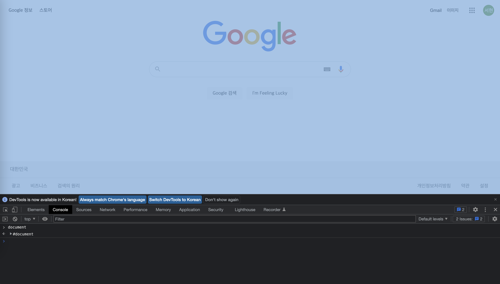
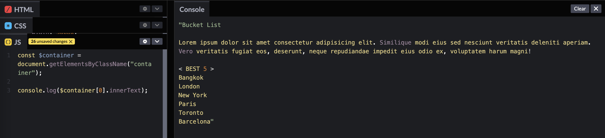
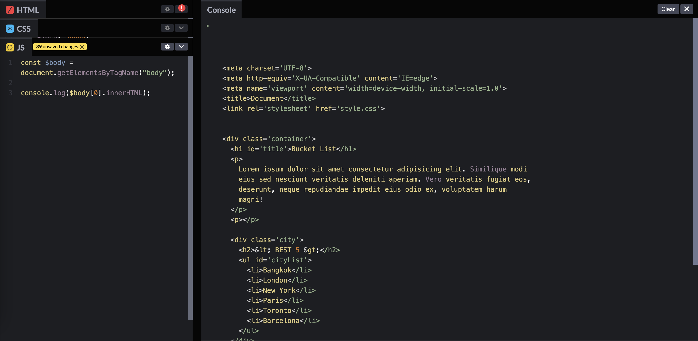
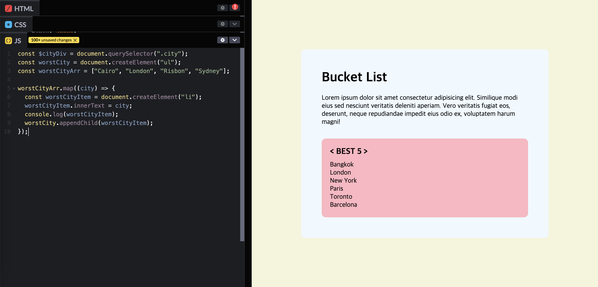
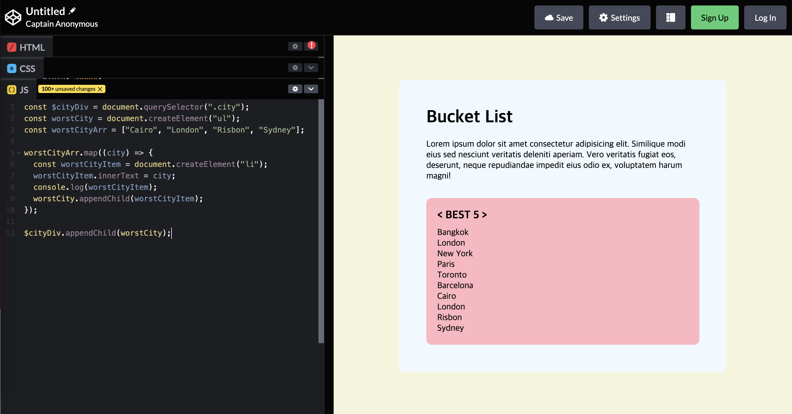
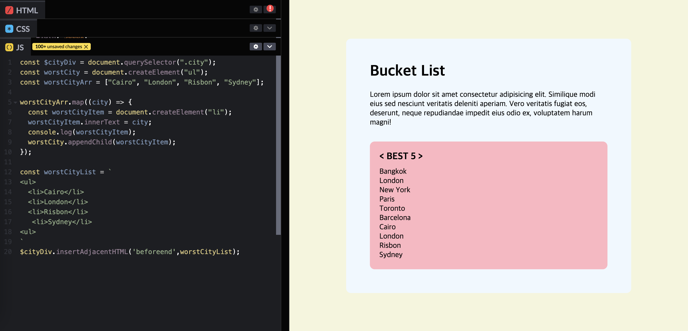

## UMC 4주차 워크북
<br>

### document
document = html. 개발자 도구를 켜서 console에 document를 입력하면 전체 선택되는 것을 확인할 수 있다. DOM을 선택한 변수는 다른 변수와 구분하기 위해 $ 표시를 하는데, 생략해도 무관하다.  
  

**DOM을 제어하는 것이 곧 HTML을 제어하는 것이다.** 자바스크립트는 HTML의 DOM 객체를 가져와 조작할 수 있다. element를 가져오고, element의 텍스트를 읽고, element를 생성, 삭제, 수정할 수 있다.  
➕참고 : https://grace-go.tistory.com/78
<br><br>  

### dom elements 가져오기
- **`getElementsByTagName`** : 해당되는 **태그**를 모두 지정해서 유사 배열(HTMLCollection)에 넣는다. document가 아닌 dom을 선택한 변수를 선택하여 영역을 제한할 수 있다.
- **`getElementsByTagClassName`** : 해당되는 **클래스**를 모두 지정해서 유사 배열(HTMLCollection)에 넣는다.
- **`getElementById`** : 해당되는 **id**를 배열이 아닌 element로 반환한다. id 값은 중복될 수 없기 때문에 결과 값이 하나이므로 단일 값이 반환되는 것이다.
- **`querySelector`** : css 선택자처럼 사용할 수 있어, 복잡한 조합의 선택자들을 선택할 수 있다. **해당 조건을 만족하는 첫번째 element**만 선택한다.
- **`querySelectorAll`** : **해당 조건을 만족하는 모든 element**를 선택하여 유사 배열(NodeList)로 반환한다.
```javascript
const $body = document.getElementsByTagName("body");
const $container = document.getElementsByClassName("container");
const $title = document.getElementById("title");
const $cityList = document.getElementById("cityList");
const $cities = $cityList.getElementsByTagName("li");
const $citiesAll = $cityList.querySelectorAll('li');
const $cityDiv = document.querySelector(".city");
```
  - `innerText` : 태그를 제외하고 태그 안에 있는 모든 텍스트들을 나열한다.
    ```javascript
    console.log($container[0].innerText);
    ```
    
  - `innerHTML` : 태그를 포함해서 태그와  태그 안에 있는 모든 텍스트들을 나열한다.
    ```javascript
    console.log($body[0].innerHTML);
    ```
      
<br><br>  

### 유사 배열
**유사 배열**이란, 배열은 아니지만 배열처럼 인덱스를 이용해 값에 접근할 수 있는 데이터 구조를 말한다. `HTMLCollection`과 `NodeList`가 있는데, NodeList에서만 **forEach**를 지원한다. 유사 배열을 배열로 변환하는 방법은 두 가지가 있다.  
- **`spread operator`**
```javascript
const newCities = [...$cities];
```
- **`Array.from `**
```javascript
const newCities_ = Array.from($cities);
```  
<br><br>  

### style 변경
css뿐만 아니라, **자바스크립트에서도 스타일을 변경할 수 있다.** 파일 별로 명확하게 코드가 분리되는 것이 좋으므로 자바스크립트에서 스타일을 변경하는 것을 권장하지는 않는다.  
```javascript
$body[0].style.backgroundColor = "teal"; // 하이픈 X
$cityDiv.style.color = "grey";
```  
<br><br>  

### element 추가
- **`createElement`** : 지정한 태그의 HTML 요소를 만들어 반환한다.  
    ```javascript
    const worstCity = document.createElement("ul");
    ```  
<br>

- **`appendChild`** : 한 노드를 특정 부모 노드의 자식 노드 리스트 중 마지막 자식으로 붙인다.  
    ```javascript
    $container[0].appendChild(worstCityDiv); 
  // container 요소에 마지막 자식으로 worstCityDiv 넣기
    ```
    
    <center>appendChild 전</center>  

    
    <center>appendChild 후</center>  
<br>

- **`insertAdjacentHTML`** : 특정 position에 노드를 추가할 수 있다.
    - `beforebegin` : element 앞에
    - `afterbegin` : element 안에 가장 첫번째 child
    - `beforeend` : element 안에 가장 마지막 child
    - `afterend` : element 뒤에  

  ```javascript
    const worstCityList = `
    <ul>
      <li>Cairo</li>
      <li>London</li>
      <li>Risbon</li>
       <li>Sydney</li>
    <ul>
    `
    $cityDiv.insertAdjacentHTML('beforeend', worstCityList);  
  // element 안에 가장 마지막 child에 worstCityList 넣기
  ```
  
  <center>insertAdjacentHTML 전</center>  

  
  <center>insertAdjacentHTML 후</center>  
<br>  

| -         |     **appendChild**     |            **insertAdjecentHTML**            |
|:----------|:-----------------------:|:--------------------------------------------:|
| **메서드**   | Node.appendChild(child) |   Node.insertAdjacentHTML(position, text)    |
| **설명**    |    요소에 마지막 자식 요소 생성     |              HTML 문자열 지정 위치에 삽입              |
| **추가 위치** |   자식 노드 리스트 중 마지막 자식    | beforebegin, afterbegin, beforeend, afterend |

<br><br>  

### element 클래스 및 속성 추가
- **`classList`** : 해당 element들의 class들을 배열 형태로 나타낸다.
  - `add` : class 추가
  ```javascript
  worstCityDiv.classList.add("city"); 
  ```
  - `remove` : class 삭제
  ```javascript
  worstCityDiv.classList.remove("city"); 
  ```
<br>  

- **`setAttribute`** : element에 attribute를 추가한다. **element.setAttribute("name", "value")**
```javascript
worstCity.setAttribute("name", "worstCity");
// worstCity element의 name 속성 값을 worstCity로 설정
```