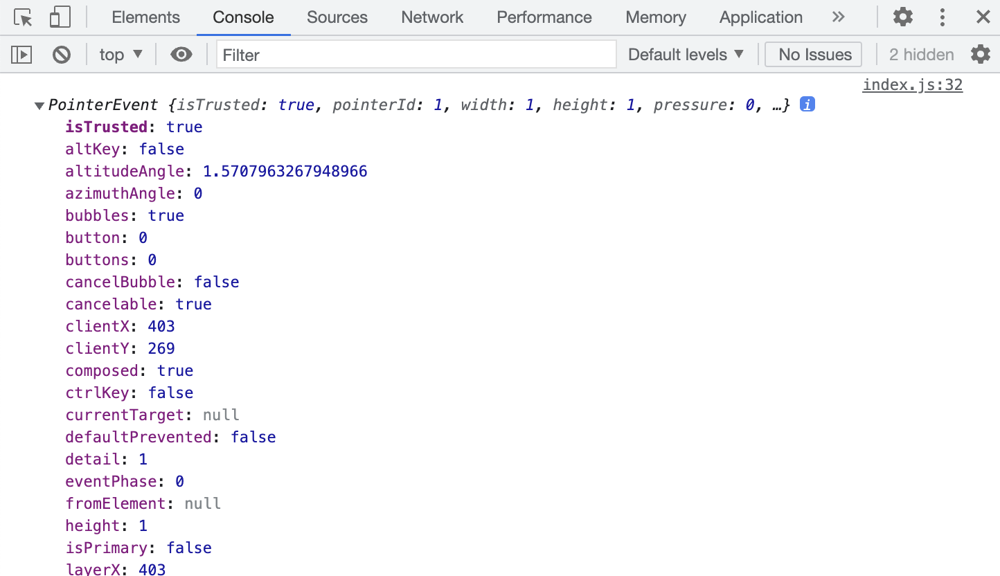
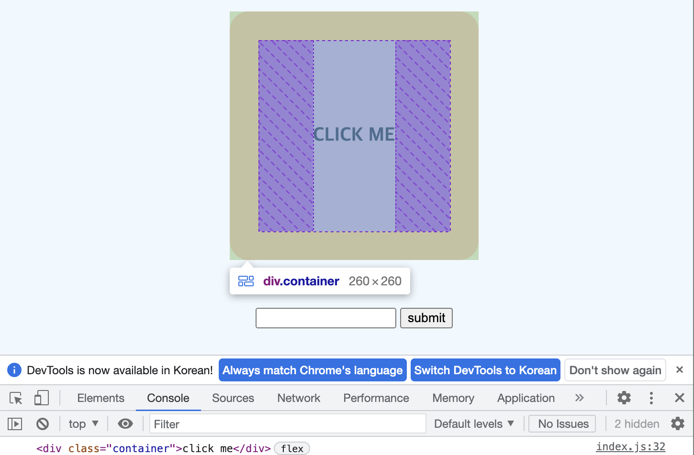
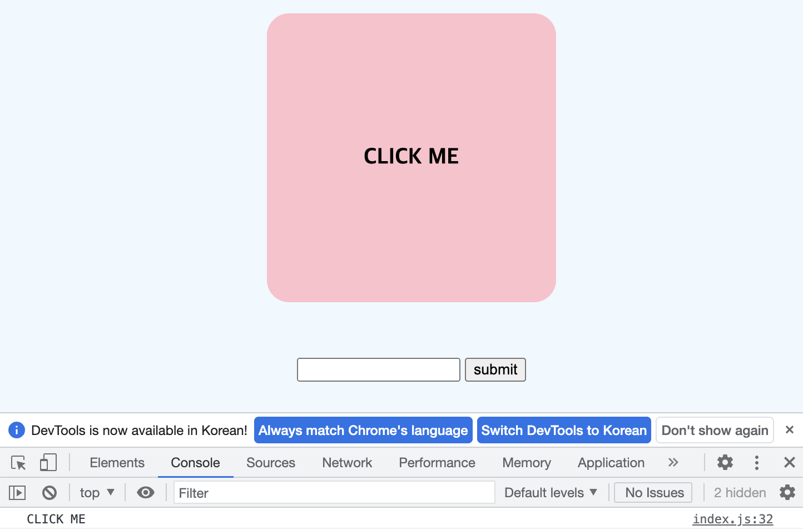
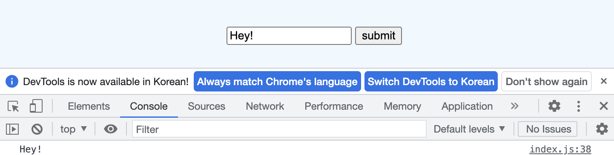
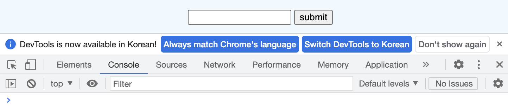
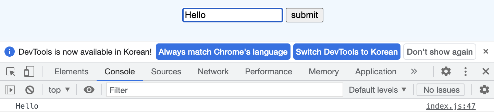

## UMC 5주차 워크북
<br>

### 이벤트 핸들러(Event Handler)
콜백함수를 **`이벤트 핸들러`**라고 한다. 이벤트 핸들러는 가독성 및 유지보수를 위해 따로 작성하는 것이 좋다. 함수 뒤에 호출 기호가 없는 이유는 콜백함수이기 때문이다. 콜백은 클릭이 이루어질 때마다 함수를 자동적으로 호출해준다.  
```javascript
target.event_name = callback_function
```  
<br>  

이벤트 핸들러의 단점은 동일한 이벤트에 서로 다른 콜백함수를 지정할 경우 뒤의 이벤트 핸들러가 앞의 이벤트 핸들러를 덮어씌운다.  
```javascript
$div.onclick = () => console.log("clicked"); // 실행 X
$div.onclick = () => alert("clicked"); // 실행 O
```
<br><br>  

### 이벤트 리스너(Event Listner)
- **`addEventListner`**  
이벤트 핸들러와 다르게 **동일한 이벤트에 서로 다른 콜백함수를 실행할 수 있다.**
```javascript
$div.addEventListener('click', () => console.log("clicked"));//실행 O
$div.addEventListener('click', () => alert("clicked"));//실행 O
``` 
<br>

  addEventListener는 아래와 같이 사용할 수 있으며, 인자들은 다음과 같다.
```javascript
addEventListener(type, listener);
addEventListener(type, listener, options);
addEventListener(type, listener, useCapture);
```
| -      |                    **type**                    |                 **listener**                 |           **options**            |                                          **useCapture**                                           |
|:-------|:----------------------------------------:|:--------------------------------------------:|:--------------------------------:|:----------------------------------------:|
| **설명** |     수신할 이벤트 유형을 나타내는 대소문자 구분 문자열(**이벤트명**)     | 지정한 이벤트(이벤트 인터페이스를 구현한 객체)를 수신할 객체(**콜백함수**) | 이벤트 수신기의 특징을 지정할 수 있는 객체(**옵션**) | 이벤트 대상의 DOM 트리 하위에 위치한 자손 EventTarget으로 이벤트가 전달되기 전에, 이 수신기가 먼저 발동돼야 함을 나타내는 불리언 값(**기본값 false**) |
| **종류** | `click`, `change`, `focus`, `select`, `load` 등 |                   지정한 콜백함수                   |            `capture`, `once`, `passive`, `signal`                      |                                             버블링, 캡처링                                              |  
<br> 

  addEventListener에서 함수에 파라미터를 전달하고 싶다면, **익명함수**를 사용해야 한다. `handleClick(num)`로 작성할 경우 이벤트가 발생됐을 때 함수가 실행되어야 하는데, JS 파일을 읽어내려가는 순간 handleClick() 함수가 실행되어 버린다. 따라서 파일을 읽으면서 실행되지 않고 이벤트가 발생할 때 함수가 실행되려면 아래와 같이 작성해야 한다.  
```javascript
$div.addEventListener('click', handleClick(num)); // 오류
$div.addEventListener('click', () => {handleClick('num');}); // 이벤트 객체 사용하지 않을 때
$div.addEventListener('click', function(event){handleClick(event, 'num'}); // 함수
$div.addEventListener('click', (event) => {handleClick(event, 'num');}); // 화살표 함수
```
<br>  

- **`removeEventListner`**  
**이벤트를 삭제**할 때 사용한다. 제거할 함수 이름을 적어야 하기 때문에 익명함수를 넣으면 안 된다.
```javascript
$div.removeEventListner('click', handleClick_); 
```
<br><br>  

### 콜백함수(Callback Function)
이벤트 핸들러나 addEventListener에서의 리스너 함수를 함수를 **`콜백 함수`**라고 한다. 이벤트가 실행됐을 때, 사용자에게 다시 알려준다는 의미에서 call back이다. **파라미터로 함수를 전달**받아, 함수의 내부에서 실행하는 함수이다. 이벤트가 아니더라도 콕백을 활용할 수 있다. 콜백함수 사용 원칙은 다음과 같다.
1. *익명 함수 사용하기*
2. *함수 이름만 넘기기*
3. *전역변수, 지역변수 콜백함수의 파라미터로 전달 가능*
<br><br>

### 이벤트 인자
- **`event`**  
이벤트 함수들은 이벤트에 대한 정보들을 인자들로 받을 수 있다. 이벤트 함수는 첫 번째 인자로 현재 일어난 이벤트에 대한 정보를 확인할 수 있다. 매개변수의 이름은 무엇이든 상관이 없지만, 보통 `e`나 `event`를 많이 사용한다.
```javascript
function handleClick0 (event) {
    console.log(event);
}
```
  
<br>  

  여러 정보들 중 가장 많이 사용하게 될 정보는 `target`이다. target은 **이벤트가 일어난 대상**이다. dir를 사용하면 객체에 대한 정보를 가져올 수 있다.  
```html
<div class="container">click me</div>
```
```javascript
function handleClick0 (event) {
    console.log(event.target);
}
```
  
<center>event target</center><br>  

  ```javascript
  function handleClick0 (event) {
      console.log(event.target.innerText);
  }
  ```
  
<center>event target innerText</center><br>

- **`change`**  
change는 다른 곳에 한 번 클릭해야 실행이 된다. 입력받은 내용을 받아오고 싶다면 value를 받아오면 된다.  
```javascript
function handleChange(event) {
    console.log(event.target.value);
}
```
 
<center>event target value</center><br>

- **`form`**  
form은 버튼을 누르면 자동적으로 form이 제출이 되면서 새로고침되는 것이 기본 성격이다. 이 과정에서 입력한 input 값이 모두 사라지기 때문에 새로고침이 되는 것을 막기 위해서는 `preventDefault` 메서드를 사용해야 한다.  
  
<center>preventDefault 전</center><br>

  `preventDefault`는 **이벤트가 가지고 있는 기본 동작들을 막아준다**. form에 preventDefault를 사용하면 새로고침이 되지 않고 input이 유지되는 것을 확인할 수 있다.
```javascript
function handleSubmit(event) {
    event.preventDefault();
}
```
  
<center>preventDefault 후</center><br><br>

### 이벤트 종류
- **마우스 이벤트**

| 이벤트                                     | 설명                                                     |
|:----------------------------------------|:-------------------------------------------------------|
| `click`                                 | 요소에 마우스를 클릭했을 때 이벤트가 발생                                |
| `dbclick`                               | 요소에 마우스를 더블클릭했을 때 이벤트가 발생                              |
| `mouseover`                             | 요소에 마우스를 오버했을 때 이벤트가 발생                                |
| `mouseout`                              | 요소에 마우스를 아웃했을 때 이벤트가 발생                                |
| `mousedown`                             | 요소에 마우스를 눌렀을 때 이벤트가 발생                                 |
| `mouseup`                               | 요소에 마우스를 떼었을 때 이벤트가 발생                                 |
| `mousemove`                             | 요소에 마우스를 움직였을 때 이벤트가 발생                                |
|  `contextmenu`                          | context menu(마우스 오른쪽 버튼을 눌렀을 때 나오는 메뉴)가 나오기 전에 이벤트 발생  |
<br>

- **키보드 이벤트**

| 이벤트             | 설명                 |
|:----------------|:-------------------|
| `keydown`       | 키를 눌렀을 때 이벤트가 발생   |
| `keyup`         | 키를 떼었을 때 이벤트가 발생   |
| `keypress`      | 키를 누른 상태에서 이벤트가 발생 |
<br>

- **폼 이벤트**

| 이벤트        | 설명                                                     |
|:-----------|:-------------------------------------------------------|
| `focus`    | 요소에 포커스가 이동되었을 때 이벤트 발생                                |
| `blur`     | 요소에 포커스가 벗어났을 때 이벤트 발생                                 |
| `change`   | 요소에 값이 변경 되었을 때 이벤트 발생                                 |
| `submit`   | submit 버튼을 눌렀을 때 이벤트 발생                                |
| `reset`    | reset 버튼을 눌렀을 때 이벤트 발생                                 |
| `select`   | input이나 textarea 요소 안의 텍스트를 드래그하여 선택했을 때 이벤트 발생        |
<br>

- **로드 이벤트**

| 이벤트           | 설명                        |
|:--------------|:--------------------------|
| `load`        | 페이지의 로딩이 완료되었을 때 이벤트 발생   |
| `abort`       | 이미지의 로딩이 중단되었을 때 이벤트 발생   |
| `unload`      | 페이지가 다른 곳으로 이동될 때 이벤트 발생  |
<br>

- **기타 이벤트**

| 이벤트      | 설명                      |
|:---------|:------------------------|
| `resize` | 요소에 사이즈가 변경되었을 때 이벤트 발생 |
| `scroll` | 스크롤바를 움직였을 때 이벤트 발생     |

👉 참고 : [https://jenny-daru.tistory.com/17](https://jenny-daru.tistory.com/17)  
➕ 더 많은 이벤트 : [https://developer.mozilla.org/ko/docs/Web/Events](https://developer.mozilla.org/ko/docs/Web/Events)