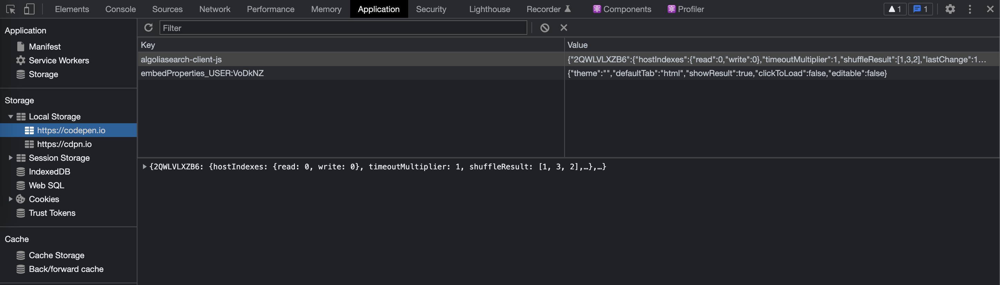
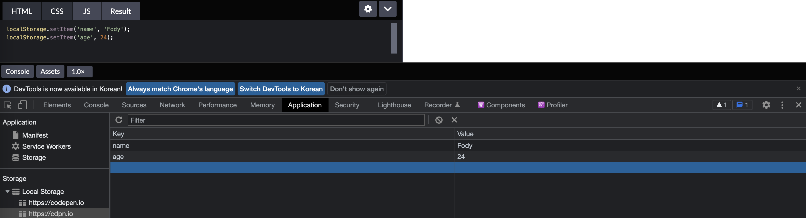
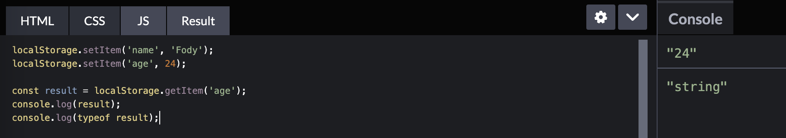
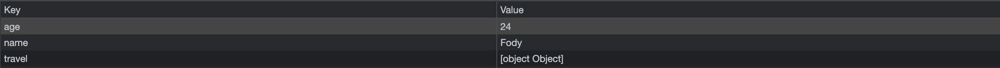
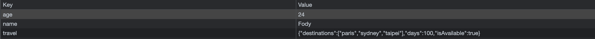
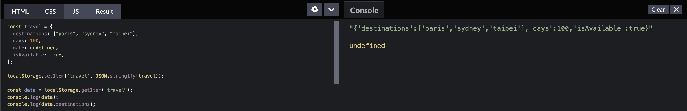
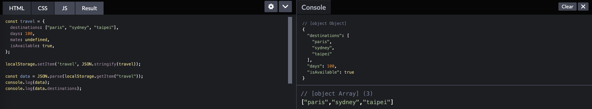
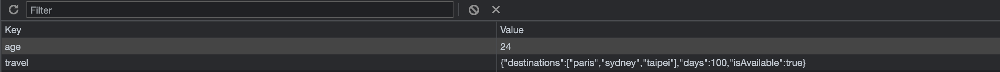
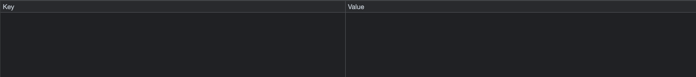

## UMC 6주차 워크북
<br>

## Local Storage
로그인 정보와 같이 계속 유지되어야 하는 데이터를 저장하기 위해 **`Local Storage`**를 사용한다. 말 그대로 로컬 환경의 저장 공간에 정보를 저정하는 것이다. 개발자 도구를 통해 Application - Local Storage를 누르면 해당 페이지에서 로컬 스토리지에 저장되고 있는 정보 목록을 확인할 수 있고, **Key - Value** 형태로 저장된다.  

  

### Local Storage가 사용되는 기능
- 중요 CSS 저장용
- 웹페이지간 정보 전달(웹서버를 경유하지 않고 정보 로컬에 유지)
- Canvas나 이미지에 대한 임시 저장 기능(base64로 변환)
- 현재 읽은 글의 히스토리 저장(카운팅, 읽은글 표시 등으로 활용)
- 웹페이지의 개인화 설정들에 대한 저장과 제공(캐쉬로 활용)
- 웹서버에 필수적으로 접근해야 하는 캐쉬용(캐쉬로 먼저 서비스 제공, 차후에 업데이트)
- 글쓰기를 하다가 사용자가 창을 벗어난 경우 관련 작성하던 내용 백업/복구용
- Sesstion Storage를 활용해서 사용자가 '입력폼'을 입력하다가 페이지에서 벗어난 경우 백업/복구  
<br><br>  

## setItem
**`setItem`**은 **local storage 정보를 저장할 때 사용하는 메소드**이다. 개발자 도구를 통해 local storage에 정보가 잘 저장된 것을 확인할 수 있으며, 새로고침해도 여전히 저장되어 있는 것을 확인할 수 있다.  
```javascript
// localStorage.setItem(Key, Value)
localStorage.setItem('name', 'Fody');
localStorage.setItem('age', 24);
```
  
<br><br>

## getItem
**`getItem`**은 **local storage에서 정보를 가져올 때 사용하는 메소드**이다. local storage에 저장된 값은 모두 `문자열`인데, getItem을 통해 정보를 가져온 후 console에 출력해보면 문자열인 것을 확인할 수 있다.  
```javascript
// localStorage.getItem(Key);
const result = localStorage.getItem('age');
console.log(result) // '24'
```  
  
<br>
다음과 같이 객체 안에 다양한 타입의 자료형을 넣어주어도, local storage에 저장된 값을 가져오면 객체 안의 자료형들이 제대로 저장되지 않는다. 이때 객체를 잘 저장하기 위해 사용하는 메서드가 `JSON.stringfy`와 `JSON.parse`이다.
```javascript
const travel = {
  destinations: ["paris", "sydney", "taipei"],
  days: 100,
  mate: undefined,
  isAvailable: true,
};
localStorage.setItem('travel', travel);
```  
  
<br><br>

## JSON
### JSON.stringfy
**`JSON.stringfy`**를 사용하여 데이터를 저장하면 **객체를 그대로 저장**할 수 있다.  
```javascript
// JSON.stringify(value[, replacer[, space]])
localStorage.setItem("travel", JSON.stringify(travel));
```  
  
<br>
하지만 제대로 잘 저장한 객체의 정보를 가져와보면 객체 자료형이 아닌 `문자열`로 저장된다. 따라서 객체의 key에 접근하여 값을 출력하면 undefined가 출력된다.  
```javascript
const data = localStorage.getItem("travel");
console.log(data); // 문자열
console.log(data.destinations); // 접근 불가능
```
  
<br>

### JSON.parse
`JSON.parse`은 문자열인 데이터를 **객체 형태로 가져오기 위해 사용**한다.  
```javascript
// JSON.parse(text[, reviver])
const data = JSON.parse(localStorage.getItem("travel"));
console.log(data);
console.log(data.destinations);
```
  
<br>
정리하자면, 객체로 만든 데이터를 `JSON.stringfy`를 통해 문자열로 저장하고, 문자열로 저장된 데이터를 `JSON.parse`를 통해 다시 객체 형태로 가져오는 것이다.<br>  
✨ **original 자료형** → **`JSON.stringfy`** → **문자열** → **`JSON.parse`** → **original 자료형** ✨  
<br><br>  

## removeItem
**`removeItem`**은 **local storage의 정보를 삭제할 때 사용하는 메소드**이다.
```javascript
// localStorage.removeItem(Key);
localStorage.removeItem('name');
```  
  
<br><br>  

## clear
**`clear`**는 **local storage에 저장된 모든 정보를 삭제할 때 사용하는 메소드**이다.  
```javascript
// localStorage.clear();
localStorage.clear();
```  
  
<br><br>

## Local Storage & Session Storage
로컬 스토리지와 세션 스토리지는 **HTML5**에서 추가된 저장소로서, **`Web Storage`**의 일종이다. `key - value` 형태로 사용된다.  
  
| -            |         **local Storage**         |    **Session Storage**    |
|--------------|:---------------------------------:|:-------------------------:|
| **데이터 <br/>만료 기간** |   사용자가 데이터를 지우지 않으면 <br/>영구적으로 보존      | 데이터의 세션이 끝나면(브라우저 종료) 소멸  |
| **저장되는 <br/>데이터** | 브라우저를 닫고 난 후 재방문 시에도 <br/>남아있어야 하는 데이터 |휘발성 데이터|  
<br>  

- **`Local Storage🌐`**
    - 사용자 세션 데이터를 유지할 수 있다.
    - 브라우저를 닫았다가 다시 열었을 때도 지속된다.
    - 탭을 여러 개 열어도 공유된다.
    - 명시적으로 삭제될 때까지 지속된다.
    - 변경사항은 저장되어 현재 및 향후 사이트 방문 시 사용할 수 있다.  

- **`Session Storage⛽️`**
  - 브라우저 세션 기간 동안만 사용할 수 있으며 탭이나 창을 닫을 때 삭제된다.
  - 새로고침을 해도 유지된다.
  - 변경된 사항은 현재 페이지에서 닫힐 때까지 저장되어 사용할 수 있다.
  - 탭이 닫히면 저장된 데이터가 삭제된다.

- **`Cookie🍪`**  
  **쿠키**란, 클라이언트에 정보를 저장하는 기술이다. 아래와 같은 단점을 보완하기 위해 웹 스토리지가 등장하였다.
  - 문자열만 저장 가능(객체 불가능)
  - 용량 제한, 시간 제한, 갯수 제한
  - 모든 쿠키 서버 전송 → 부하 발생
  - 이벤트 없음
<br><br>  

👉 참고 : https://dev-syhy.tistory.com/39  
👉 참고 : https://youngman12.tistory.com/15  
👉 참고 : https://unikys.tistory.com/352  