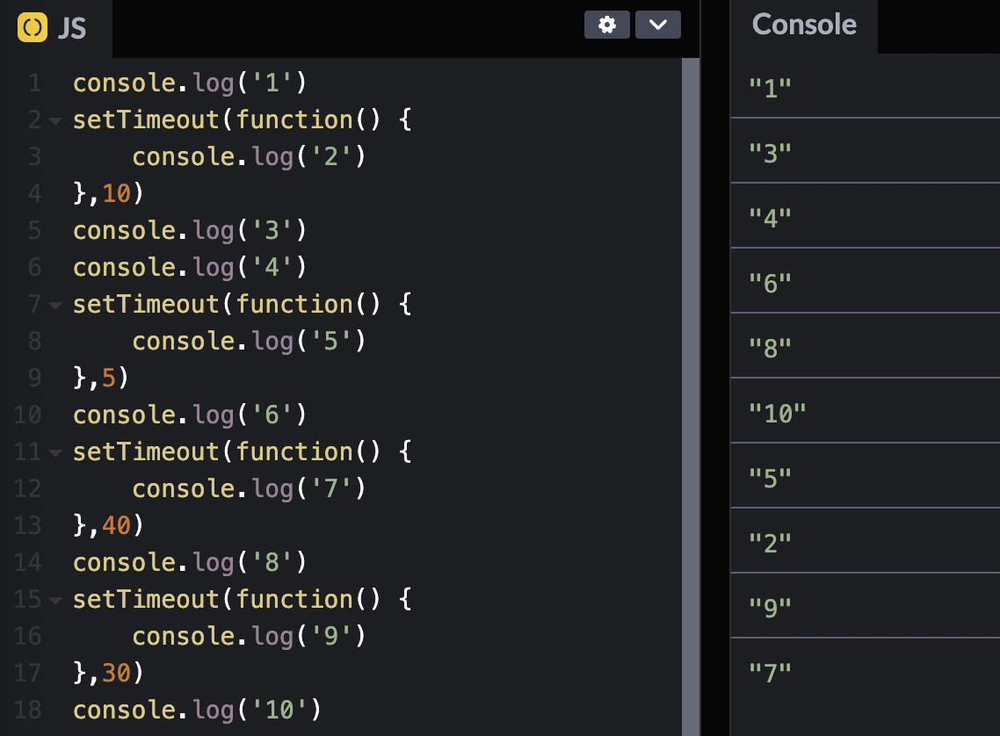
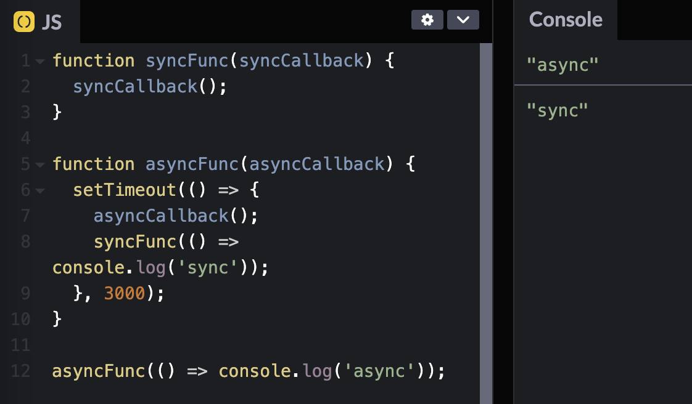
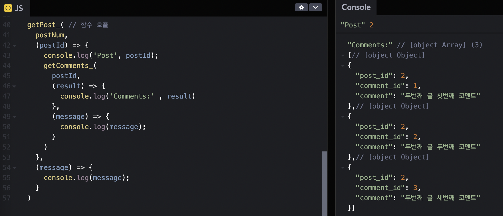
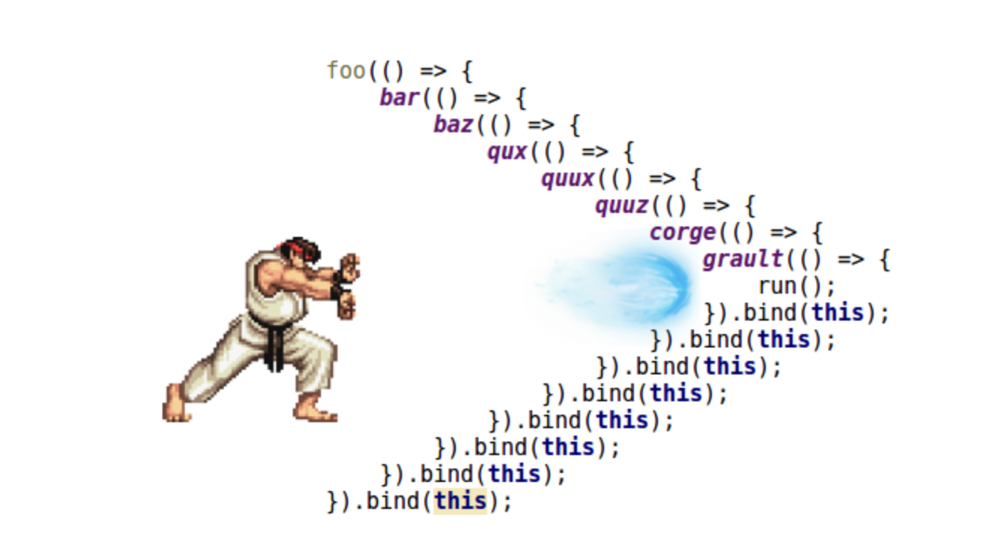
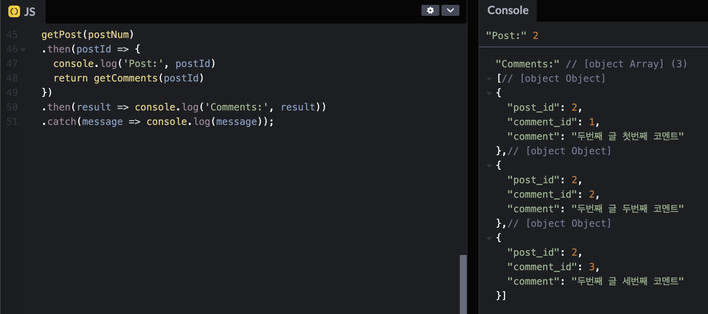
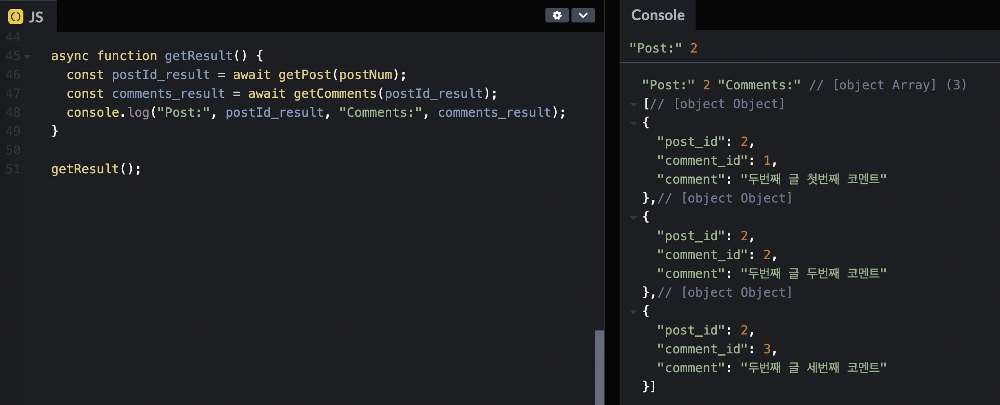

## UMC 7주차 워크북
<br>

## 동기 & 비동기
- **`동기(synchronous)`** : 순서대로 일을 처리하는 방식
- **`비동기(asynchronous)`** : 순서대로 일을 처리 하지 않고 빨리 처리할 수 있는 것들을 먼저 처리하는 방식  

```javascript
console.log('1')
setTimeout(function() {
    console.log('2')
},10)
console.log('3')
console.log('4')
setTimeout(function() {
    console.log('5')
},5)
console.log('6')
setTimeout(function() {
    console.log('7')
},40)
console.log('8')
setTimeout(function() {
    console.log('9')
},30)
console.log('10')
```
<br>    

  자바스크립트는 `동기적 언어`이지만, 비동기적으로 처리하기 위해 사용할 수 있는 함수가 **`setTimeout`**이다. 1, 3, 4, 6, 8, 10은 **동기적**으로 먼저 처리되고, 5, 2, 9, 7은 동기적으로 처리가 된 후에 설정된 시간이 작은 것부터 순차적으로 **비동기적**으로 처리된다.  
  - **`setTimeout`** : 만료된 후 함수나 지정한 코드 조각을 실행하는 타이머를 설정한다.
      - `function` : 타이머가 만료된 뒤 실행할 function
      - `code` : 함수 대신 문자열을 지정하는 대체 구문
      - `delay`(optional) : 주어진 함수 또는 코드를 실행하기 전에 기다릴 밀리초 단위 시간
      - `arg1, ..., argN`(optional) : function에 전달할 추가 매개변수  
    
  ```javascript
  var timeoutID = setTimeout(function[, delay, arg1, arg2, ...]);
  var timeoutID = setTimeout(function[, delay]);
  var timeoutID = setTimeout(code[, delay]);
  ```  
<br><br><br>  

### Callback (콜백함수)
**`콜백함수`** : 함수 안에 인자로 들어가는 함수 (비동기적으로 사용될 수도 있고, 동기적으로 사용될 수도 있다.)  

콜백함수를 사용하는 대표적인 이유는, 동기와 비동기를 함께 썼을 때 순서를 보장할 수 있기 때문이다. 콜백을 중첩해서 원하는 순서대로 실행하도록 코드를 짤 수도 있다.  

<br>    

콜백이 대표적으로 쓰이는 곳은 **데이터 통신**이다. 블로그 포스트의 아이디 값을 입력하면, 해당 댓글들을 출력해주는 기능을 만들어보자.
```javascript
// 함수 호출
getPost( 
    postNum,
    (postId) => {
      console.log('Post', postId);
      getComments(
        postId,
        (result) => {
          console.log('Comments:' , result)
        },
        (message) => {
          console.log(message);
        }
      )
    },
    (message) => {
      console.log(message);
    }
  )
```

<br>  

다음과 같이 코드를 작성하면 원하는대로 포스트 아이디와 댓글들이 출력되지만, 콜백이 중첩되어 가독성이 떨어진다. 이를 **`콜백지옥`**이라고 한다. **콜백지옥**이 있으면 가독성이 좋지 않고 유지보수 및 수정이 어려워지기 때문에, 이를 해결하기 위한 방법으로 `promise`와 `async&await`이 있다.  


<center>콜백지옥 예시 이미지</center><br><br><br>  

### Promise
- `pending` : 비동기 작업 진행 중
- `fulfilled` : 비동기 작업이 성공적으로 끝난 상태
- `rejected` : 비동기 작업이 실패로 끝난 상태  

```javascript
new Promise(resolve, reject) 
// resolve : 성공했을 때 실행할 함수
// reject : 실패했을 때 실행할 함수
```  
<br>  

콜백지옥을 해결하기 위해 **`promise`**를 사용하여 함수를 호출하면 코드가 훨씬 간결해진다.
```javascript
// 함수 호출
getPost(postNum)
  .then(postId => {
    console.log('Post:', postId)
    return getComments(postId)
  })
  .then(result => console.log('Comments:', result))
  .catch(message => console.log(message));
```
  
<br><br><br>  

### Async & Await
promise와 같은데 조금 더 직관적인 방법으로 async와 await이 있다. **`async & await`**은 **비동기적인 것들을 동기적으로 느끼게 해준다**.  
```javascript
// 함수 호출
async function getResult() {
    const postId_result = await getPost(postNum);
    const comments_result = await getComments(postId_result);
    console.log("Post:", postId_result, "Comments:", comments_result);
  }
  
  getResult();
```
<br>    

⁉️ **Promise** VS **async & await**  
→ **`에러 헨들링`** : 오류가 발생하더라도, 사이트가 멈추는 게 아니라 오류를 다루는 코드로 넘어간 후 다음 코드를 실행하는 것  

**Promise**를 활용할 시에는 `.catch()`문을 통해 **에러 핸들링**을 하고, **async/await**은 `try-catch()`문을 활용하여 에러 핸들링을 한다.  **async/await**은 promise와 다르게 then, catch를 추가적으로 사용하지 않아도 하나의 catch로도 에러 핸들링을 할 수 있어 유리하다.  

**Promise**는 `.then() 지옥`의 가능성이 있기 때문에 코드가 길어질수록 **async/await**를 활용하는 것이 가독성이 좋다. **async/await**은 비동기 코드를 동기 코드처럼 읽히게 해주어 코드 흐름을 이해 하기 쉬우며, 에러 발생 위치를 쉽게 알 수 있다.  

👉 참고 : https://velog.io/@pilyeooong/Promise와-asyncawait-차이점