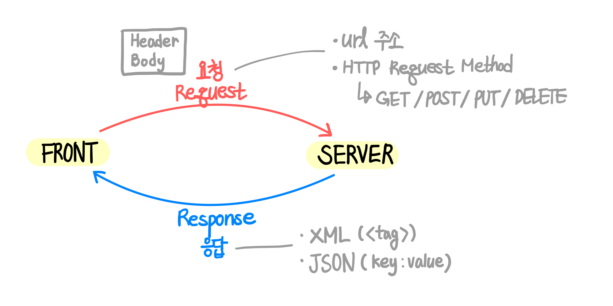
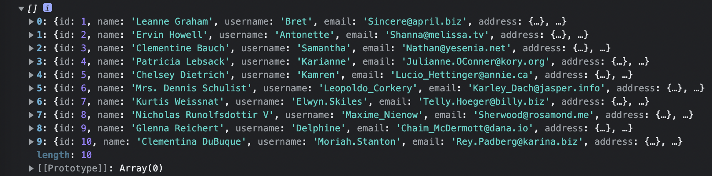
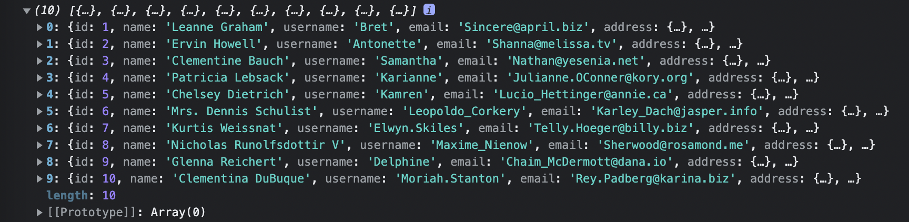

## UMC 8주차 워크북
<br> 

### HTTP
**`HTTP`** = **HyperText Transfer Protocol**  
→  프론트와 서버 간의 데이터 통신 방법 중 하나  

**`HTTPS`** = **HyperText Transfer Protocol Secure**  
→ HTTP + **보안**  


- **`request(요청)`**
    - **URL address**
    - **HTTP Request Method**
        - `GET` : 기존의 데이터를 접근해서 사용하는 메서드(read 기능)
        - `POST` : 기존 데이터에 새로운 데이터를 추가하는 메서드
        - `PUT` : 기존의 데이터를 수정하는 메서드
        - `DELETE` : 데이터를 삭제하는 메서드  
<br>  
- **`response(응답)`**
  - **XML**
  ```xml
  <?xml version="1.0" encoding="UTF-8"?>
      <message>
          <warning>
              Hello World
          </warning>
      </message>
  ```
  👉 https://developer.mozilla.org/en-US/docs/Web/XML/XML_introduction   
  - **JSON**
  ```json
  {
  "squadName": "Super hero squad",
  "homeTown": "Metro City",
  "formed": 2016,
  "secretBase": "Super tower",
  "active": true,
  "members": 
          {
            "name": "Molecule Man",
            "age": 29,
            "secretIdentity": "Dan Jukes",
            "powers": [
              "Radiation resistance",
              "Turning tiny",
              "Radiation blast"
            ]
          }
  }
  ```
  👉 https://developer.mozilla.org/ko/docs/Learn/JavaScript/Objects/JSON  
<br><br><br>  

### 데이터 통신
### fetch  
**`fetch`**는 브라우저에서 제공해주는 메서드이므로 별도의 설치가 필요 없다. 
```javascript
fetch(url, options)
```
<br>  

- **Promise**
```javascript
const result = [];
fetch("https://jsonplaceholder.typicode.com/users")
.then(response => response.json())
.then(data => data.map(item => result.push(item)))
.catch(error => console.log(error))
console.log(result);
```    
<br>  

- **async & await**  
```javascript
const dataFetch_ = async() => {
        const response = await fetch("https://jsonplaceholder.typicode.com/users");
        const data = await response.json();
        return data
}
const dataResult_ = dataFetch_();
console.log(dataResult_);
```
<br><br>  

###axios
**`axios`**는 자동으로 JSON으로 변환해주어 fetch보다 더 쉽게 사용 가능하나, 별도의 설치가 필요하다.<br>  

- **Promise**
```javascript
axios.get("https://jsonplaceholder.typicode.com/users")
.then(response => console.log(response.data))
```  
<br>    

- **async & await**
```javascript
const dataFetch = async() => {
        const response = await axios.get("https://jsonplaceholder.typicode.com/users").data;
        return response;
}
const dataResult = dataFetch();
console.log(dataResult);
```
<br><br><br>  

### ⁉️ XML 대신 JSON을 데이터 통신에서 많이 쓰는 이유

→ XML과 JSON은 모두 데이터를 전달하기 위해 사용되며, **계층적인 구조**로 프로그래밍 언어에 의해 **파싱된다**는 공통점이 있다. 하지만 `XML`은 종료 태그를 사용해야하며 배열을 사용할 수 없고 읽고 쓰는 속도가 느리다. 반면, `JSON`은 XML에 비해 비교적 덜 엄격하고 직관적이며, 읽고 쓰는 속도가 빠르고 배열을 사용할 수 있다는 장점이 있어 데이터 통신에서 JSON을 더 많이 사용한다.  

👉 https://sujl95.tistory.com/59  
<br><br><br>  

### ‼️ JavaScript API 호출 방식

- **XML HTTP Request**  
모든 브라우저에서 XMLHttpRequest 대상이 서버에서의 데이터 요청을 지원하여 포괄적으로 사용할 수 있지만, ES6에서는 사용되지 않는다.
```javascript
var request = new XMLHttpRequest();
request.open('GET', 'https://api.github.com/users/anuradha9712');
request.send();
request.onload = ()=>{
      console.log(JSON.parse(request.response));
}
```
<br>  

- **Fetch**  
Fetch API는 네트워크를 통해 자원을 비동기적으로 가져오는 인터페이스를 제공하며, Promise 객체를 반환한다. 내장 라이브러리로서 사용이 비교적 쉽지만 JSON으로 변환해주어야 한다.
```javascript
fetch('https://api.github.com/users/anuradha9712')
.then(response =>{
      return response.json();
}).then(data =>{
      console.log(data);
})
```
<br>  

- **Axois**  
HTTP 요청을 보내는 소스 라이브러리로서, 브라우저와 node.js에서 실행할 수 있으며 지원하는 기능이 다양하고 Promise 객체를 반환할 수 있어 사용이 쉽지만 별도의 설치가 필요하다.
```javascript
axios.get('https://api.github.com/users/anuradha9712')
.then(response =>{
      console.log(response.data)
})
```
<br>  

- **AJAX**  
비동기식 HTTP 요청을 수행하여 웹에서 데이터를 조회할 때 페이지 전체를 새로고침하지 않아 효율적이지만, Promise 기반이 아니어서 then & catch를 사용할 수 없다.
```javascript
$(document).ready(function(){
        $.ajax({
            url: "https://api.github.com/users/anuradha9712",
            type: "GET",
            success: function(result){
                console.log(result);
            }
        })
})
```  

👉 [https://intrepidgeeks.com/tutorial/four-methods-of-calling-api-from-javascript](https://intrepidgeeks.com/tutorial/four-methods-of-calling-api-from-javascript)
👉 [https://yeoossi.tistory.com/55](https://yeoossi.tistory.com/55)