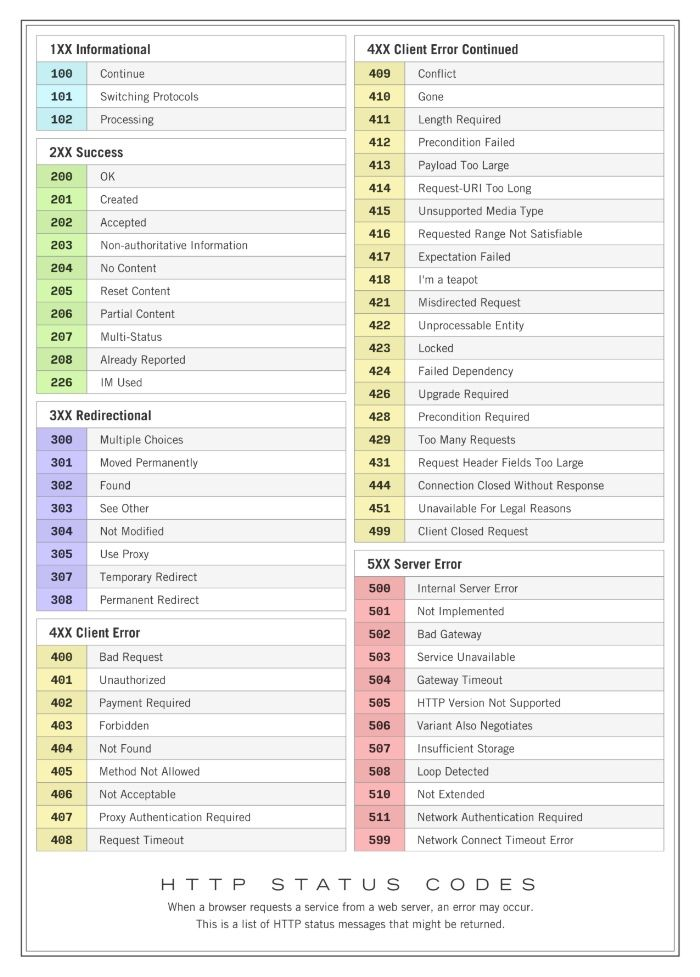
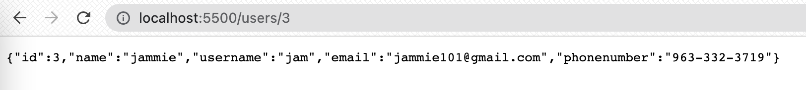
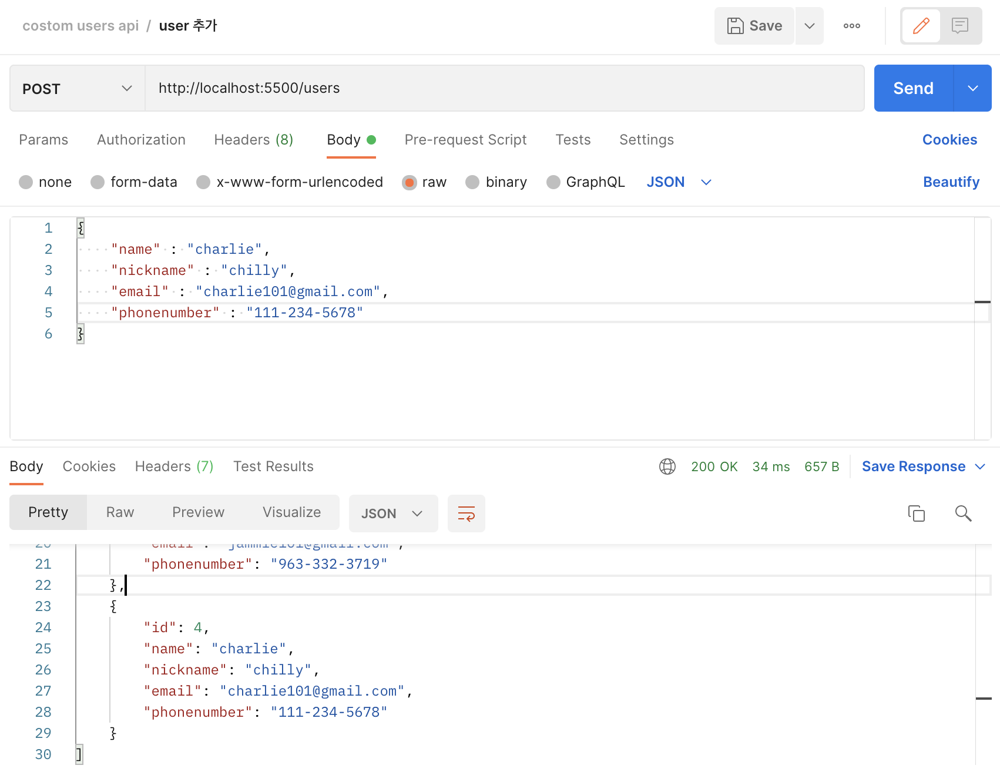
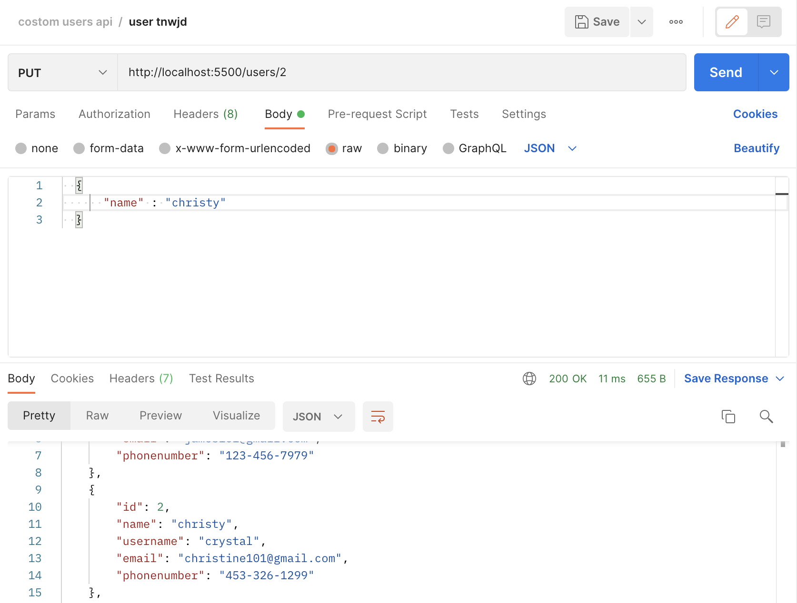
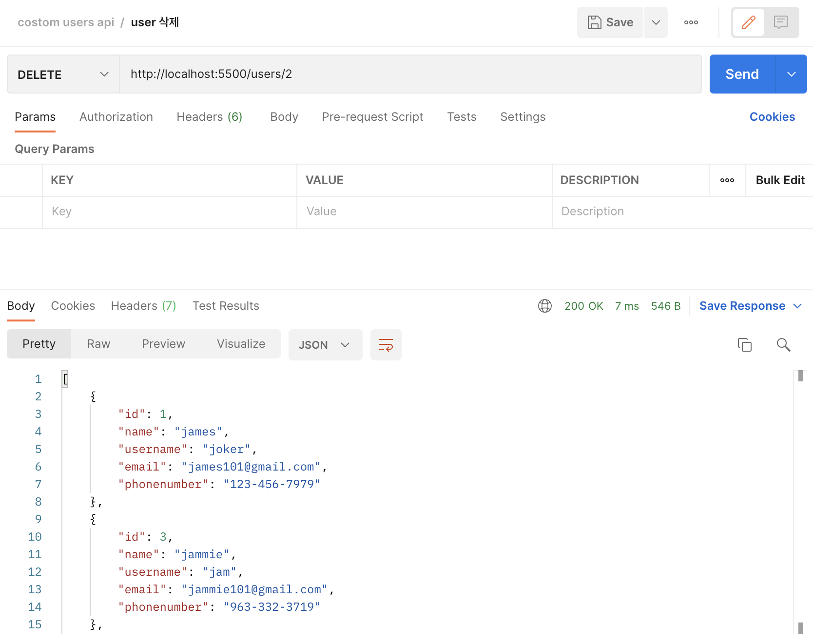

## UMC 9주차 워크북
<br> 

### 라우팅(Routing)
`라우팅`이란 URI(또는 경로) 및 특정한 HTTP 요청 메소드(GET, POST 등)인 특정 엔드포인트에 대한 클라이언트 요청에 애플리케이션이 응답하는 방법을 결정하는 것을 말한다.  
👉 https://expressjs.com/ko/starter/basic-routing.html   
<br><br><br>

### CRUD  
`CRUD`는 데이터 처리 기능 4가지를 의미한다. HTTP 요청 메서드와 연결하면 다음과 같다.
- **Create(생성)** ⇒ `post`
- **Read(조회)** ⇒ `get`
- **Update(갱신)** ⇒ `put`
- **Delete(삭제)** ⇒ `delete`  
<br><br><br>

### HTTP 상태 코드(http status codes)
`HTTP 상태 코드`는 클라이언트가 보낸 HTTP 요청에 대한 서버의 응답 코드로, 상태 코드에 따라 요청의 성공/실패 여부를 판단한다.  
- **1xx `Informational`** : 요청을 받았으며 프로세스를 계속한다.
- **2xx `Success`** : 요청을 성공적으로 받았으며 인식했고 수용했다.
- **3xx `Redirection`** : 요청 완료를 위해 추가 작업 조치가 필요하다.
- **4xx `Client Error`** : 요청 문법이 잘못되었거나 요청을 처리할 수 없다.
- **5xx `Server Error`** : 서버가 명백히 유효한 요청에 대해 충족을 실패했다.  

👉 https://ko.wikipedia.org/wiki/HTTP_상태_코드  
  
```javascript
// 요청 success
res.status(200).json(user);
```
```javascript
// 요청 error
res.status(404).send('요청한 userId를 찾을 수 없습니다')
```
<br><br><br>

### HTTP 요청 메서드
- **GET**  
→ 기존의 데이터에 접근해서 사용하는 메서드
  - `req` : 사용자가 보낸 요청(request)
  - `res` : 보내줄 응답 값(response)  

```javascript
app.get('/', (req, res) => {
  res.send('Hello World!'); 
}) 
// 사용자가 요청한 주소가 '/'일 때 우리는 응답으로 'Hello Wolrd!'를 줄게!
```
<br>  

**동적으로 사용되는 주소**는 앞에 `콜론`을 붙여준다.  
```javascript
// user 정보 출력
app.get("/users/:userId", (req, res) => {
  const user = users.find((user) => user.id === parseInt(req.params.userId));
  if (!user) {
    res.status(404).send('요청한 userId를 찾을 수 없습니다')
  }
  res.status(200).json(user);
});
// userId 값에 따라 주소가 동적으로 바뀐다.
```
  

<br><br>  

- **POST**  
→ 기존 데이터에 새로운 데이터를 추가하는 메서드
  - `req.body` : 요청 본문에 제출된 key-value 형태의 데이터 포함. JSON과 같은 데이터를 받을 때 사용한다.  

```javascript
// 새로운 user 정보 배열에 추가 
app.post("/users", (req,res) => {
  const newUser = req.body;
  if (Object.keys(newUser).length === 0) {
    res.status(400).send('user에 관한 정보를 입력해주세요');
  } else if (Object.keys(newUser).length < 4) {
    res.status(400).send('user를 추가하기 위해 필요한 정보를 모두 입력해주세요')
  } else {
    users.push({
      id: users[users.length - 1].id + 1, 
      ...newUser,
    });
  }
  res.json(users);
})
```
  
<br><br>

- **PUT**  
→ 기존의 데이터를 수정하는 메서드  

```javascript
// user 데이터 수정
app.put("/users/:userId", (req, res) => {
  const id = users.findIndex(user => user.id === parseInt(req.params.userId));
  if (id === -1) {
    return res.status(404).send('요청한 id를 찾을 수 없습니다.');
  }
  users[id] = {
    ...users[id],
    ...req.body
  }
  res.status(200).json(users);
})
```
  
<br><br>

- **DELETE**  
→ 기존의 데이터를 삭제하는 메서드  

```javascript
// user 데이터 삭제
app.delete("/users/:userId", (req, res) => {
  const id = users.findIndex(
    (user) => user.id === parseInt(req.params.userId)
  );
  if (id === -1) {
    return res.status(404).send("요청한 id를 찾을 수 없습니다.");
  }
  users.splice(id, 1);
  res.status(200).json(users);
})
```
  
<br><br>  

- **PATCH**  
→ 데이터의 일부만 수정하는 메서드  
<br>  

⁉️ **PUT** vs **PATCH**  

`PUT`: 리소스의 **모든 것**을 업데이트 한다.  
`PATCH`: 리소스의 **일부**를 업데이트 한다.<br><br>  

|member|1|
|---|---|
|name|홍길동|
|age|100|
|gender|M|
<리소스><br><br>  

**PUT** : 보내지지 않은 값은 `null` 값이 된다.
```javascript
PUT /members/1
{
    name : "포디"
}
```
|member| 1 |
|---|---|
|name| 포디 |
|age|   |
|gender|   |
<br>  

**PATCH** : 요청에 포함되어 있는 부분만 변경된다. (기존 데이터 유지)  
```javascript
PATCH /members/1
{
    name : "포디"
}
```
|member| 1  |
|---|----|
|name| 포디 |
|age| 100 |
|gender| M  |  

👉 https://programmer93.tistory.com/39
<br><br><br>  

### 🔑 KEYWORD  
**`Routing`** : 네트워크 안에서 데이터를 최적의 경로를 선택하는 과정을 라우팅이라고 한다. 웹 애플리케이션에서 라우팅은 **사용자가 요청한 URL에 따라 알맞는 페이지를 보여주는 것**을 의미한다.  

**`API`** : Application Programming Interfaces 약자로, 응용프로그래밍 인터페이스를 의미한다. **복잡한 기능을 쉽게 개발할 수 있도록 프로그래밍 언어로 코드를 제공하는 것**으로, 애플리케이션과 기기가 원활하게 통신할 수 있도록 해준다.  

**`Node.js`** : Chrome의 V8엔진을 이용하여 javascript로 서버를 구축하고, **서버에서 JavaScript가 작동되도록 해주는 런타임 환경**이다.  

**`Web Server`** :  **HTTP 또는 HTTPS를 통해 웹 브라우저에서 요청하는 HTML 문서나 오브젝트(이미지 파일 등)을 전송해주는 서비스 프로그램**이다. 브라우저가 웹 서버에서 불려진 파일을 필요로 할때, 브라우저는 HTTP를 통해 파일을 요청한다. 요청이 올바른 웹 서버(하드웨어)에 도달하였을 때, HTTP 서버는 요청된 문서를 HTTP를 이용해 보내준다.  
  
👉 https://developer.mozilla.org/ko/docs/Learn/Common_questions/What_is_a_web_server
