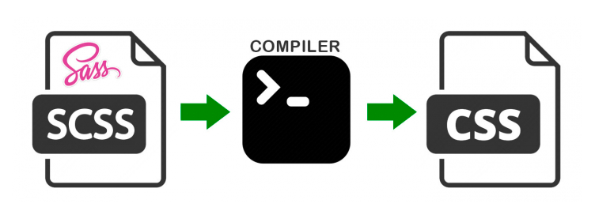

# SCSS

<br><br>

## 정의



`SCSS`란 CSS pre-processor(전처리기)로서, 복잡한 작업을 쉽게 할 수 있게 해주고, 코드의 재활용성 및 가독성을 높여주어 유지보수를 쉽게 해준다.  
<br><br><br>

## 사용

**중괄호**와 **세미콜론**을 모두 사용한다.

```scss
.example {
  width: 100px;
  li {
    color: blue;
  }
}
```

<br><br><br>

## 특징

### 변수(Variable) 할당

자주 사용하는 속상 값을 변수로 지정하여 재사용할 수 있다.

```scss
$color: #ed5b46;

div {
  background-color: $color;
}
```

<br><br>

### 중첩(Nesting) 구문

중첩 구문을 사용해 가독성을 높일 수 있다.

```scss
nav {
  ul {
    margin: 0;
    padding: 0;
    list-style: none;
  }

  li {
    display: inline-block;
  }

  a {
    display: block;
    padding: 6px 12px;
    text-decoration: none;
  }
}
```

<br><br>

### 모듈화(Modularity)

`@use`를 사용하여 파일을 모듈화 할 수 있다.

```scss
/* _base.scss */

$font-stack: Helvetica, sans-serif;
$primary-color: #333;

body {
  font: 100% $font-stack;
  color: $primary-color;
}
```

```scss
/* styles.scss */

@use 'base';

.inverse {
  background-color: base.$primary-color;
  color: white;
}
```

<br><br>

### 믹스인(Mixins)

함수처럼 default parameter를 지정할 수 있고, parameter를 받아 속성을 부여할 수 있다.

```scss
@mixin theme($theme: DarkGray) {
  background: $theme;
  box-shadow: 0 0 1px rgba($theme, 0.25);
  color: #fff;
}

.info {
  @include theme;
}
.alert {
  @include theme($theme: DarkRed);
}
.success {
  @include theme($theme: DarkGreen);
}
```

<br><br>

### 확장 / 상속 (Extend / Inheritance)

`@extend`를 사용하여 scss 속성 집합을 상속 받을 수 있다.

```scss
/* This CSS will print because %message-shared is extended. */
%message-shared {
  border: 1px solid #ccc;
  padding: 10px;
  color: #333;
}

/* This CSS won't print because %equal-heights is never extended. */
%equal-heights {
  display: flex;
  flex-wrap: wrap;
}

.message {
  @extend %message-shared;
}

.success {
  @extend %message-shared;
  border-color: green;
}

.error {
  @extend %message-shared;
  border-color: red;
}
```

<br><br>

### 연산자(Operators)

div, random, max, min, sin, cos 등 여러 가지 수학적 기능을 사용할 수 있다.

```scss
article[role='main'] {
  width: math.div(600px, 960px) * 100%;
}

aside[role='complementary'] {
  width: math.div(300px, 960px) * 100%;
  margin-left: auto;
}
```

<br><br><br>

## 장점

- 선택자를 중첩하여 반복되는 부모 요소 사용 감소

<br><br><br>

## 단점

- 전처리기를 위한 도구 필요
- 컴파일 시간 소요

<br><br><br>

## SCSS 🆚 SASS

**`SCSS`** : Sassy Cascading Style Sheets

```scss
a {
  color: yellow;
  background-color: black;
  border-radius: 3px;

  &:hover {
    color: red;
  }
}
```

<br><br>

**`SASS`** : Syntatically Awesome Style Sheets

```sass
a
  color: yellow
  background-color: black
  border-radius: 3px

  &:hover
    color: red
```

→ 중괄호와 세미콜론의 유무에 따라 사용 방식이 조금 다르지만, SCSS와 SASS는 서로 완벽하게 호환된다.  
<br><br><br>

**references**  
👉 https://sass-lang.com/documentation/  
👉 https://cocoon1787.tistory.com/843
