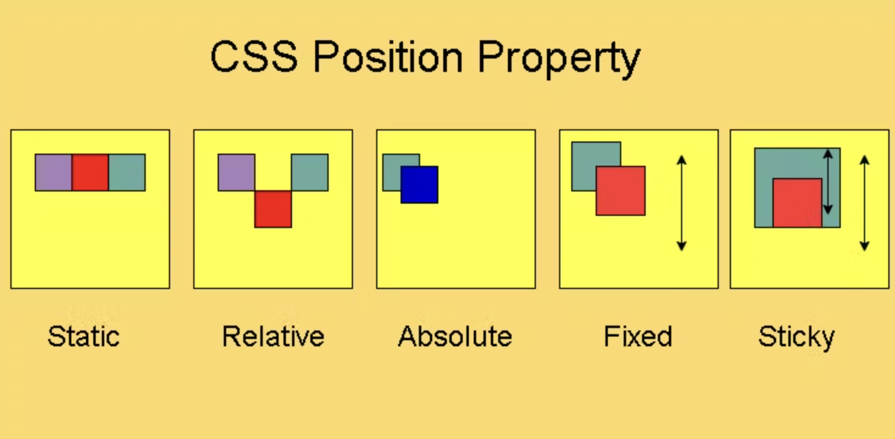

# position

<br><br>

## 정의

  
CSS `position` 속성은 문서 상에 요소를 배치하는 방법을 지정한다.  
<br><br><br>

## 속성 값

### static

```css
position: static;
```

기본 값. 요소를 일반적인 문서 흐름에 따라 배치하며, top, right, bottom, left, z-index 속성이 아무런 영향을 주지 않는다.  
<br><br>

### relative

```css
position: relative;
```

요소를 일반적인 문서 흐름에 따라 배치하며, top, right, bottom, left 값에 따라 offset을 적용한다. offset은 다른 요소에는 영향을 주지 않아 레이아웃에서 요소가 차지하는 공간은 static과 같다. z-index 값이 auto가 아니라면 새로운 쌓임 맥락을 생성한다.  
<br><br>

### absolute

```css
position: absolute;
```

요소를 일반적인 문서 흐름에서 제거하고, 레이아웃에 공간도 배정하지 않는다. 가장 가까운 static이 아닌 다른 포지션 값을 가진 부모를 기준으로 상대적으로 배치한다. 상위 요소 중 static이 없을 시 초기 컨테이닝 블록을 기준으로 삼는다. 최종 위치는 top, right, bottom, left 값이 지정한다. z-index 값이 auto가 아니라면 새로운 쌓임 맥락을 생성한다.  
<br><br>

### fixed

```css
position: fixed;
```

요소를 일반적인 문서 흐름에서 제거하고, 레이아웃에 공간도 배정하지 않는다. 화면 전체의 초기 컨테이닝 블록을 기준으로 삼아 배치하고, transform, perspective, filter 속성 중 어느 하나라도 none이 아니라면 화면 전체 대신 그 조상을 컨테이닝 블록으로 삼는다. 최종 위치는 top, right, bottom, left 값이 지정하며, 항상 새로운 쌓임 맥락을 생성한다. 해당 요소는 **항상 그 위치에 고정**되어 인쇄 시 모든 페이지의 같은 위치에 출력된다.  
<br><br>

### sticky

```css
position: sticky;
```

요소를 일반적인 문서 흐름에 따라 배치하고, 가장 가까운 스크롤이 가능한 조상과 가장 가까운 블록 레벨 조상을 기준으로 top, right, bottom, left 값에 따라 offset을 적용한다. offset은 다른 요소에 영향을 주지 않는다. 항상 새로운 쌓임 맥락을 생성하며, 스크롤 동작이 존재하는 가장 가까운 조상에 달라 붙는다. 지정해준 속성 값을 기준으로 **기준을 충족하는 시점부터 고정**된다.  
<br><br><br>

**references**  
👉 https://developer.mozilla.org/ko/docs/Web/CSS/position  
👉 https://scriptoplankton.hashnode.dev/position-property-in-cascading-style-sheets
