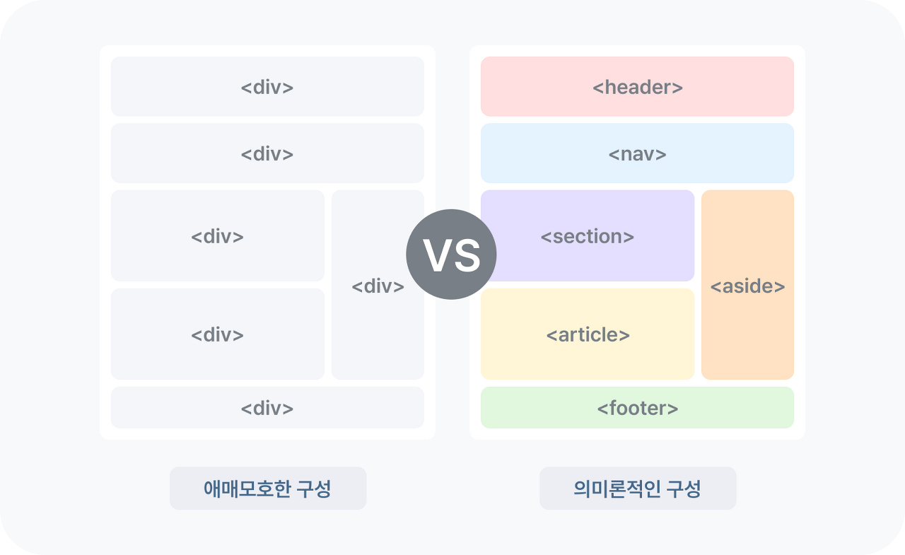

# Semantic Markup

## 정의

**시맨틱**이란 "의미론적인"이란 뜻을 가지며 **마크업**이란 HTML 태그로 문서를 작성하는 것을 말한다. 따라서, `시맨틱 마크업`이란 **의미를 잘 전달하도록 HTML 문서를 작성하는 것**을 말한다.  
   

## 작성 방법

**→ 태그를 용도에 맞게 사용하여 작성한다.**

- 헤더/푸터에 `<header>` 와 `<footer>` 사용
- 메인 컨텐츠에 `<main>` 과 `<section>` 사용
- 독립적인 컨텐츠에 `<article>` 사용
- 최상위 제목으로 `<h1>` 사용
- 순서가 없는 목록으로 `<ul>` 과 `<li>` 사용
- 내비게이션에 `<nav>` 사용
- 주요 콘텐츠 이외의 참고가 될 수 컨텐츠에 `<aside>` 사용

   

## 사용 이유

### 웹 접근성

시각 장애가 있는 사용자가 화면 판독기로 페이지를 탐색할 때 의미있는 마크업을 통해 그 의미를 더 잘 파악할 수 있다.  
  

### 코드 가독성

의미 없는 div를 전부 탐색하는 것보다 의미 있는 코드 블록을 찾는 것이 쉽고, 유지 보수가 용이하다.  
  

### 검색엔진 최적화 (SEO)

검색엔진이 시맨틱 태그를 중요한 키워드로 간주하기에 검색엔진 최적화에 유리하다.
   
